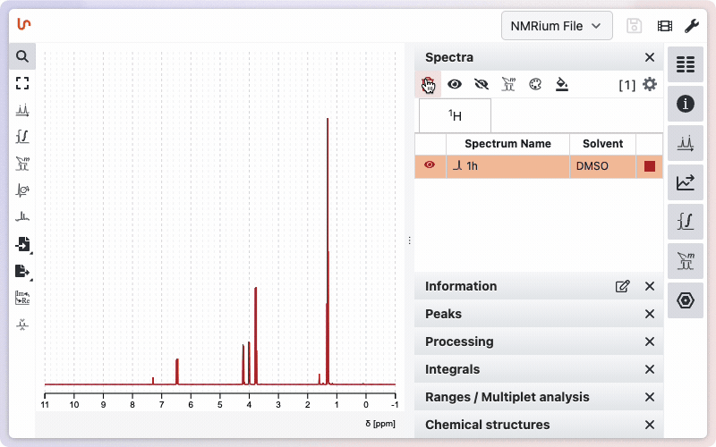
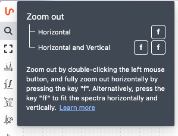
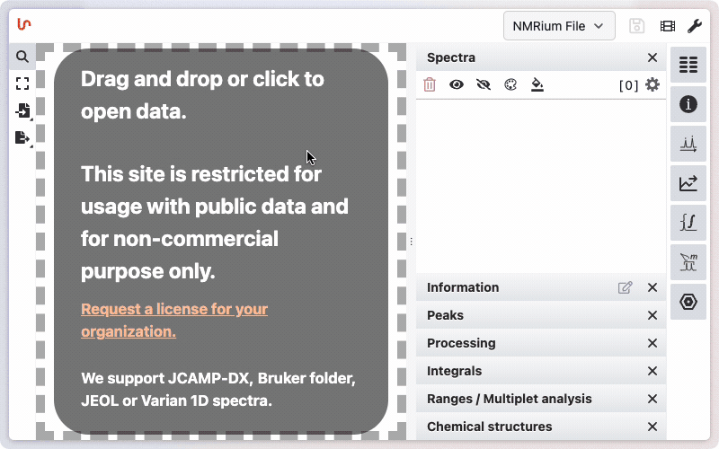
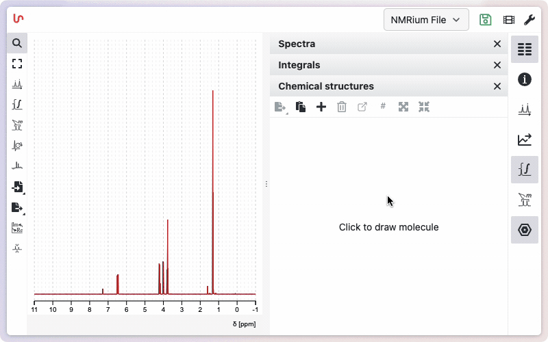
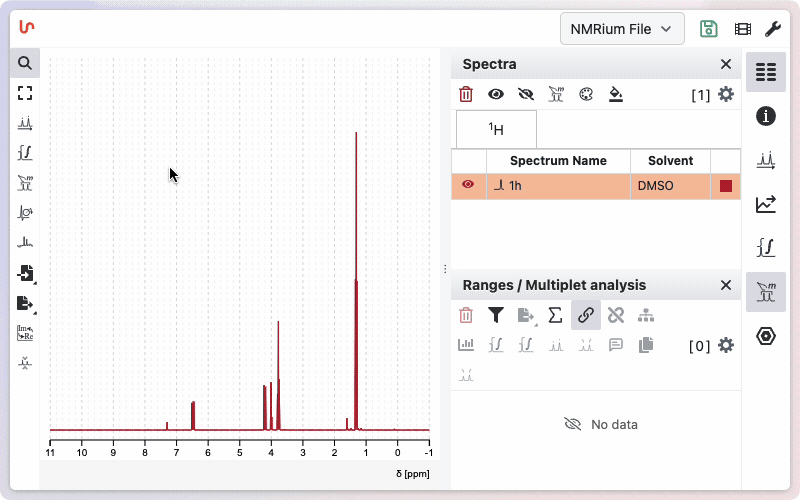
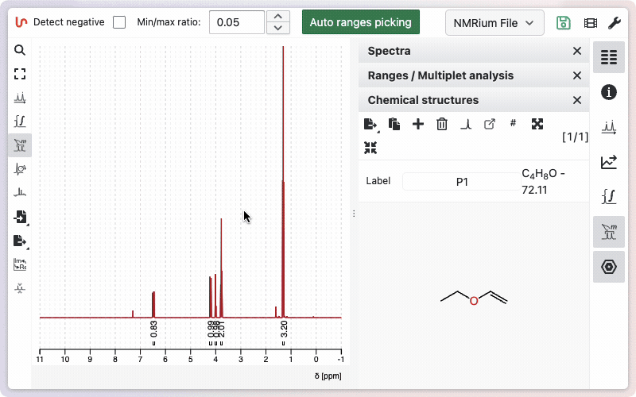
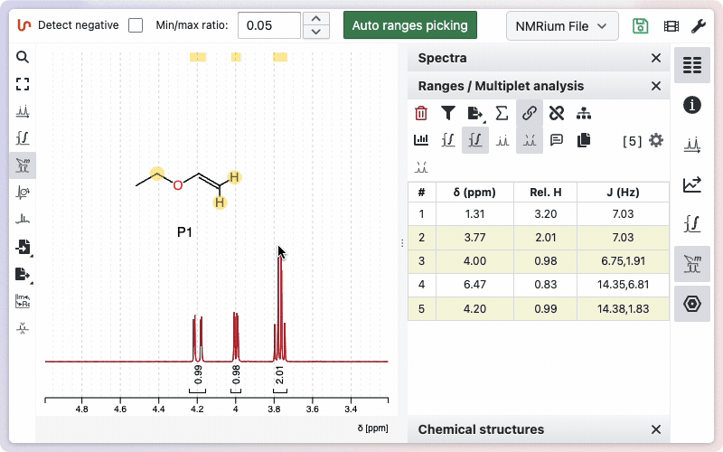

---
title: Quick Start Guide
description: A brief explanation of NMRium's most important functions
slug: /
---

To get the most out of NMRium, take a few minutes to learn the philosophy behind the program. The software is designed to be simple to use yet very powerful, and it may differ from other competing software.

Reading this quick start guide should save you time and help you fully benefit from NMRium.

**Forget about integrals and peak picking!**

For familiarity with other software, we kept the integral and peak picking tools — but they should never be used. Instead, switch directly to the **NMR spectra assignment** workspace.

:::tip How to get help

Tooltips appear when you hover over different tools, providing quick information and listing available keyboard shortcuts. Most shortcuts are single-letter keys — no need to press <kbd>Ctrl</kbd>, <kbd>Shift</kbd>, or other modifier keys. Tooltips often include direct links to more detailed documentation. You can [learn more](/help/help) about additional help resources.

:::

## Open the program

You can start using NMRium right away by clicking the link below. The application is available for immediate testing with public data and for non-commercial use.

[https://app.nmrium.com](https://app.nmrium.com)

## Loading spectra

To load your NMR data into NMRium, make sure your files are in one of the following supported formats:

- JCAMP-DX (.dx, .jdx, .jcamp)
- Bruker folder (raw or processed data)
- Jeol (.jdf)
- NMRium archive (.nmrium.zip)

You can also use zipped files containing any of the above formats.

Simply drag and drop your file(s) into the gray **Drag and drop here** box in the center of the screen.

When spectra are loaded, NMRium automatically groups them by nucleus (for 1D) or by nucleus pair (for 2D), and superimposes them by default. For 2D spectra, the traces shown at the top and left are, by default, taken from the first spectrum of the corresponding 1D nucleus. If you prefer a different trace, you can select another spectrum in the corresponding 1D tab.

:::tip Learn more

You can [learn more](/help/spectraPanel) about the spectrum panel and how to change color, delete spectra, etc.

:::

## Pan and zoom

In NMRium, you can zoom in at any time, regardless of the selected tool. To zoom in, simply click and drag with the left mouse button around the area you want to magnify, then release. To zoom out, double-click anywhere on the spectrum. To scale the spectrum vertically, use the scroll wheel.

You can also use keyboard shortcuts: press <kbd>f</kbd> to zoom out horizontally by one step, or <kbd>f</kbd><kbd>f</kbd> to fully zoom out both vertically and horizontally.

:::tip Learn more

Learn more about all the ways to zoom and pan the spectra for [1D](/help/zoom-and-scale) and for [2D](/help/zoom-2d).

:::

## Inserting a molecular structure

Like spectra, chemical structures can be added by dragging and dropping files in molfile (.mol) or SDF (.sdf) format.

You can also paste a SMILES string or molfile directly, or use the advanced structure editor to draw molecules. The editor accurately handles stereoisomers and allows custom labels for individual atoms.

:::tip Learning how to use the chemical editor

Check more [advanced information](/help/editStructure) about structure edition or [learn more](/help/ocl) how to use the chemical editor.

:::

:::note Integrated structure editor

Click on the **Chemical structures** panel on the right side of the screen and then on the **+** sign. A window opens where you can draw your molecular structure. Then click the **Save** button. The drawn molecular structure then appears in the **Chemical structures** panel, along with the molecular weight and molecular formula.

:::

## Processing of raw data

By default, NMRium automatically processes raw data. For further customization, see the page on [manual processing](/help/processing).

## Ranges and multiplet analysis

Click the **Ranges and multiplet analysis** button on the left side to define integration zones and multiplets. Alternatively, use the shortcut <kbd>r</kbd>. You can begin with an automatic analysis, which can be adjusted manually as needed.

Tips for working with ranges:

- To adjust a range, drag its boundary to the desired position.
- To delete a range, hover over it and press <kbd>Backspace</kbd>.
- To manually add a range, hold <kbd>Shift</kbd> while clicking, dragging, and releasing over the desired area.

:::note Advanced peak picking analysis

More advanced options are described on this [dedicated help page](/help/ranges).

:::

## Assignment of the molecule

The easiest way to assign a molecule is to keep it floating and create links between the integration ranges and the corresponding atoms.

Diastereotopic hydrogens can be expanded by holding <kbd>Shift</kbd> and clicking on the atom. Assigned ranges and atoms will be highlighted in light yellow.

:::tip Export the assignment

The assignment can be exported in a single click from the "Ranges / Multiplet analysis" panel.

:::

:::note Advanced assignment

More advanced options are described on the [dedicated help page](/help/assignment).

:::

## Export of assigned spectra

:::tip Copy to clipboard

Press <kbd>Ctrl</kbd>+<kbd>c</kbd> to copy the current image to the clipboard.

:::

To export the assigned spectra, click on the **Export** button to the left side of the spectrum. A field will open where you can select in which format you want to export your spectrum. You have the following options:

- Export as SVG
- Export as PNG
- Copy image to Clipboard
- Save data as `.nmrium.zip` archive

:::info

A `.nmrium.zip` file is a ZIP-based archive that preserves the original raw/processed data alongside all processing, annotations, and assignments — making it future-proof and reproducible. See [NMRium File Format](/help/nmrium_zip) for details. Depending on the number of spectra it contains, saving and reopening it can take longer.

:::
