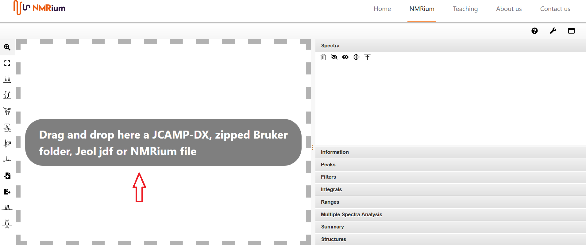
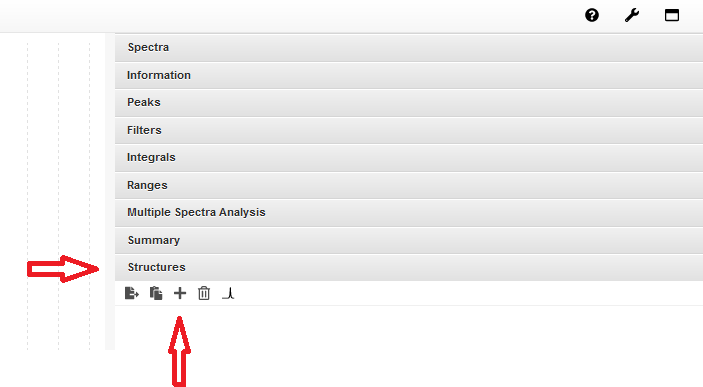
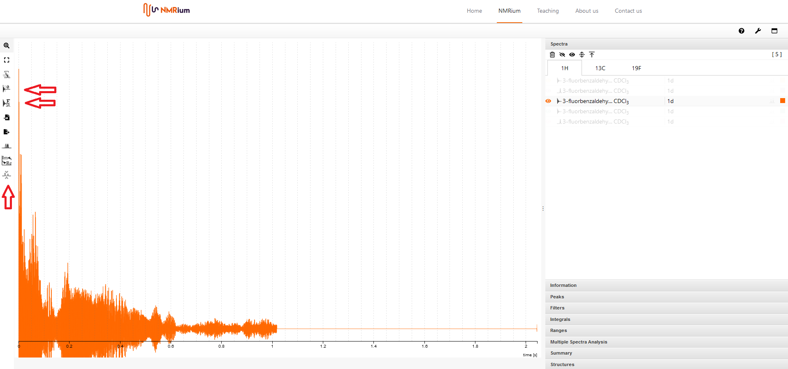
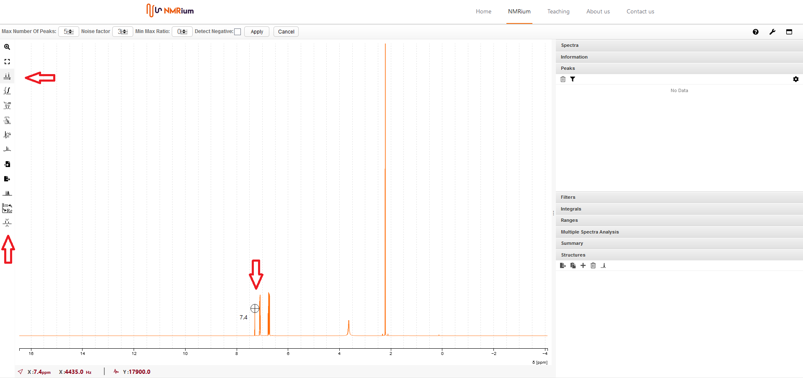
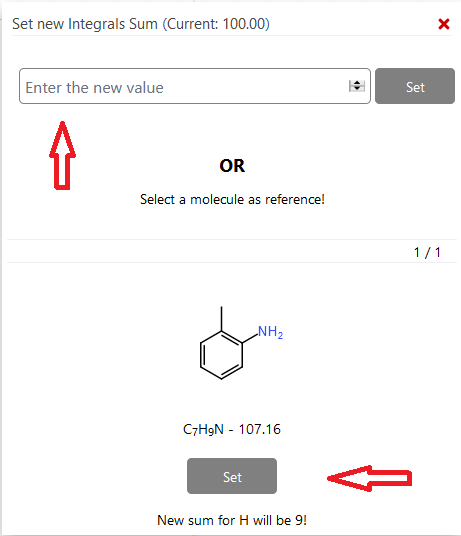
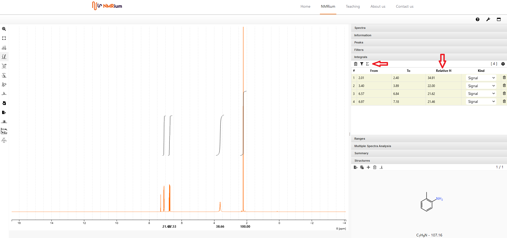
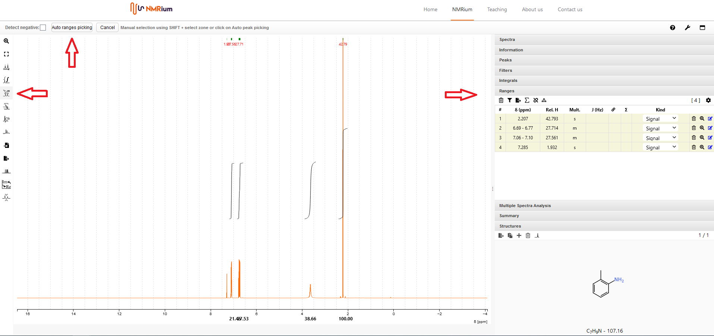
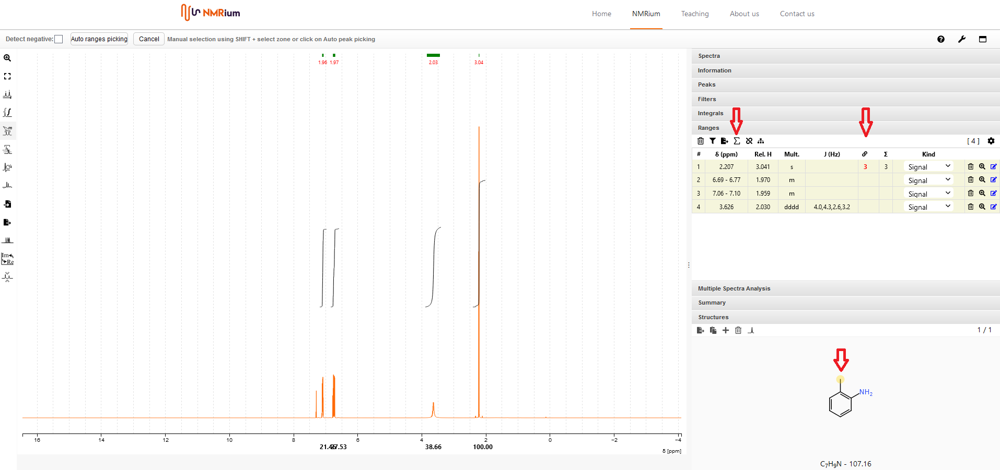

---
title: Quick Start Guide (English)
description: A brief explanation of NMRium's most important functions
slug: /
---

## 1. Open the program

Open NMRium by clicking the following link:

[https://www.nmrium.org/nmrium/](https://www.nmrium.org/nmrium/)

## 2. Open spectra

To open spectra, your data must be saved as one of the following file formats:

- JCAMP-DX (.dx, .jdx, .jcamp)
- zipped folder in Bruker format (raw data od processed)
- Jeol (.jdf)
- NMRium file (.nmrium)

Drag the file you want to open into the gray box **Drag and drop here** in the middle of the screen. You can open a set of spectra of a molecule by either dragging the spectra individually or by dragging a zip folder containing all spectra into the workspace. Also, you can open a zipped Bruker-folder file containing several spectra.

## 3. Select a spectrum

On the right side of the workspace, there is an expandable menu with several panels. Click onto the panel **Spectra**. The spectra are matched to the measured nuclei (e.g., ¹H, ¹³C, etc) which are displayed in the opened field. If you click onto a nucleus, you can find the matching spectra. To select an experiment, press the corresponding line. The spectrum appears in the workspace.

:::info Wobble curves

It is possible that your Bruker folder contains so-called **wobble curves**. It makes sense to delete these before editing the spectra. You can identify them by the name **wobble**. Click onto the corresponding spectrum with the right mouse button. In the appearing menu, click **delete** to delete the wobble curve.

:::

:::tip Changing the color of a spectrum

You can change the color of the spectrum by clicking the colored square in the line of the spectrum. In the appearing window, you can select a different color. For 2D experiments, the colors for the negative and positive cross-peaks are selectable as well.

:::

## 4. Delete a spectrum

To delete a single spectrum, right-click onto the spectrum in the panel **spectra** on the right side. Click **delete** in the appearing menu to delete the spectrum. To delete all spectra, click on the recycle bin icon on the left above the listed spectra.

## 5. Zooming in on a section

To zoom in on a section of a spectrum, move over it whilst holding down the left mouse button. You can repeat this process as often as you like. Double-click anywhere in the spectrum to undo the last zoom in. This, too, can be repeated. The intensity level of the signals can be changed using the mouse wheel. To return to the original spectrum, click onto the **Horizontal zoom out** button in the menu bar on the left side of the spectrum.

## 6. Inserting a molecular structure

There are two ways to insert a molecular structure into the program:

:::note Molfile

Drag the molfile into the workspace. The panel **Structures** appears, showing the inserted molecular structure as well as the molecular weight and the molecular formula.

:::

:::note Integrated structure editor

Click onto the panel **Structures** on the right side of the screen and then on the **+** sign. A window opens where you can draw your molecular structure. Then click on the **Save** button. In the panel **Structures**, the drawn molecular structure appears as well as the molecular weight and the molecular formula.

:::

## 7. Processing of raw data (currently only 1D)

NMRium offers the possibility to perform a Fourier transformation (FT) on the raw data of one-dimensional NMR spectra. To process an FID, open the FID by dragging it into the **Drag and drop here** box ([section 2](#2-open-spectra)).

### Fourier transformation

To prepare the FID for the Fourier transformation, click onto the **Zero Filling** icon to the left of the spectrum. Set the desired values for **Size** (zero filling) and **Line Broadening** (exponential window function) and click **Apply**. Then start the Fourier transformation by clicking on the **FFT Filter** button to the left of the spectrum.

:::tip **Size** and **LB** values

If you are unsure which values to set, you can use the following recommendations as a reference:

**Size**: Choose twice as many points as in the original FID.

**Line Broadening (LB)**: Specify 0.3 Hz for ¹H spectra and 1-3 Hz for ¹³C.

:::

### Phase correction

Click the icon **Phase correction** to the left of the spectrum. You can choose between manual and automatic phase correction.

:::note Automatic phase correction

Click the **Apply** button, the phase will be corrected automatically.

:::

:::note Manual phase correction

You can perform zero-order and first-order phase correction.

For zero-order phase correction, click and hold the green **PH0** button above the spectrum. By moving the mouse to the left or right, you can perform the phase correction until the signal is correctly phased and release the button. By double-clicking, you can move the pivot point (red line) for the first-order phase correction.

Repeat the process for the first-order phase correction by pressing **PH1** and moving the mouse. The focus should be on the signals that are furthest from the signal marked by the pivot point. Clicking the **Apply** button completes the phase correction.

:::

### Baseline correction

Click the icon Baseline correction to the left of the spectrum. You can choose between two algorithms: **polynomial** and **AIR PLS**.

- To use the algorithm **polynomial**, you may define a degree and then click **apply**.
- To apply the **AIR PLS** algorithm, you may define both a maximum iteration and a tolerance range and then click **apply**.

## 8. Referencing

Click the button **Peaks Picking** to the left of the spectrum. Then identify your solvent signal (or the reference signal). Capture it with the crosshairs and press the shift key and the left mouse button at the same time. The chemical shift of the signal will be shown both in the spectrum and in a list on the right-hand side of the spectrum in the panel  **Peaks**. Select one of the two displayed values (in the spectrum single click with the left mouse button, in the list double-click with the left mouse button) and enter the correct reference value.

## 9. Peak Picking

Click onto the button **Peaks Picking**. You can choose between automatic peaks picking and manual peaks picking.

:::note Automatic peaks picking

A list appears above the spectrum in which you can specify the maximum number of peaks, the noise factor and the minimum-maximum ratio (Min Max Ratio). Then press **Apply**. The chemical shift of the peaks is displayed both in the spectrum and in a list on the right side of the spectrum in the panel  **Peaks**.

:::

:::note Manual peaks picking

Locate a signal. When you capture it with the crosshairs, press the shift key and the left mouse button simultaneously. The value of the signal will be shown in a list both in the spectrum and on the right side of the spectrum in the panel **Peaks**.

:::

## 10. Delete peaks

If you want to delete a single peak, find the corresponding signal on the right side of the spectrum in the list in the panel **Peaks**. Click the recycle bin icon on the far right of the line. The peak will be deleted.

If you want to delete all peaks, click on the recycle bin icon located above the signal list in the panel **Peaks**. Confirm that you want to delete all peaks by clicking **Yes** in the pop-up window.

## 11. Choosing the values to display in the "Peaks" list

You can display various information in the panel **Peaks**. Open the panel **Peaks** on the right side of the spectrum. Click onto the gear wheel at the top right. All measured nuclei will be displayed. You can choose to display the following values for each nucleus:

- Peak Number
- Peak Index
- Chemical shift (ppm)
- Chemical shift (Hz)
- Width
- Intensity

Check the box next to the values you want to have displayed for the respective nucleus. Then click onto the green check mark at the top right.

## 12. Integration

Click onto the button **Integral tool** on the left side of the spectrum. To integrate a signal, hold down the shift key and move the mouse over the signal while holding down the left mouse button. Then let go of both the shift key and the left mouse button. Proceed in this way with each signal that you want to integrate. The integrals are displayed in a list on the right-hand side of the spectrum in the panel **Integrals**.

The pre-set relative number of all integrated H-atoms is 100. To change this number, click on the sum symbol above the list. A window opens where you can either enter the number of H-atoms manually and then click on **Set** or accept the number of H atoms specified by the structural formula by clicking on **Set** underneath it.

## 13. Deleting integrals

If you want to delete a single integral, find the corresponding signal on the right side of the spectrum in the list in the panel **Integrals**. Click the recycle bin icon on the far right of the line. The integral will be deleted. Alternatively, you can click onto the red field at the bottom of the spectrum that belongs to the respective integral. The corresponding integral will be deleted.

If you want to delete all integrals, click onto the recycle bin icon located above the signal list in the panel **Integrals**. Confirm that you want to delete all integrals by clicking **Yes** in the pop-up window.

## 14. Picking ranges and determination of coupling constants

Click on the **Ranges Picking** button on the left side of the spectrum to specify signal assignment ranges, for example to determine coupling constants. You have the option of either manually or automatically defining the assignment ranges:

:::note Automatic ranges picking

A list appears above the spectrum. Click on the button **Auto ranges picking**, the assignment ranges will be determined automatically and displayed both in the spectrum and in a list on the right side of the spectrum in the **Ranges** field. The corresponding coupling constants are determined automatically.

:::

:::note Manual ranges picking

Press the Shift key and move the mouse over the range you want to set. The marked assignment range is displayed both in the spectrum and in a list on the right side of the spectrum in the **Ranges** field. The corresponding coupling constants are determined automatically.

:::

## 15. Delete ranges

If you want to delete a single range, find the corresponding range on the right side of the spectrum in the list in the **Ranges** field. Click the trash icon on the far right of the line, the range will be deleted.
If you want to delete all ranges, click on the trash icon located above the signal list in the **ranges** field. Confirm that you want to delete all ranges by clicking **Yes** in the window that opens.

## 16. Assignment of signals

To assign signals, you have to define assignment ranges ([section 14](#14-picking-ranges-and-determination-of-coupling-constants)) and insert a molecular structure ([section 6](#6-insert-a-molecular-structure)). Open the **Ranges** and **Structures** fields on the right side. Specify the correct number of relative H atoms by clicking the sum icon above the **Ranges** list. In the window that opens, you can either enter the number of H atoms manually and then click on **Set** or accept the number of H atoms specified by the sum formula by clicking on **Set** in the lower area.

In the list, click the box under the link icon in the line of the signal you want to assign, . A red zero appears there. Then assign the signal by clicking on the corresponding atoms in the structural formula. Proceed in the same way with all other ranges. You can also assign several, different H atoms to a range by clicking successively on all H atoms in the structural formula that belong to the respective signal. If you want to assign diastereotopic H atoms, hold the Shift key while clicking the corresponding H atom in the structure. This makes both diastereotopic H atoms visible.

## 17. Export of assigned spectra

To export the assigned spectra, click on the **Export** button to the left side of the spectrum. A field will open where you can select in which format you want to export your spectrum. You have the following options:

- Export as SVG
- Export as PNG
- Save data
- Copy image to Clipboard

Click on **Save data** to save the assigned spectrum with all stored information and to be able to edit it later. An .nmrium file is created and offered for download.

:::info

An .nmrium file is a compressed text file containing all information of the (partially) assigned stored spectra. Depending on the number of spectra contained, saving can take longer, as can opening an .nmrium file again.

:::
