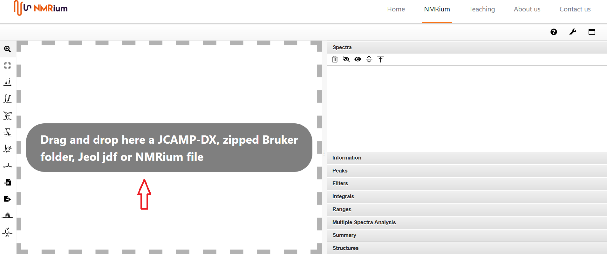
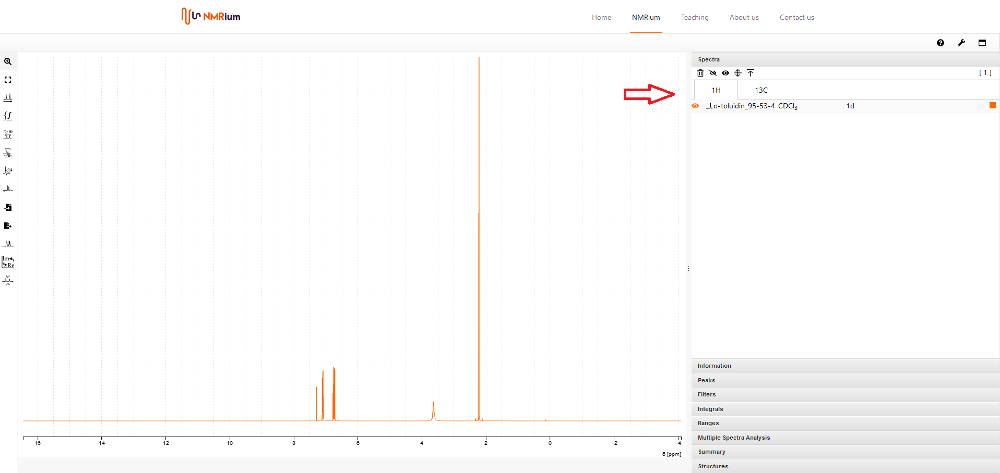
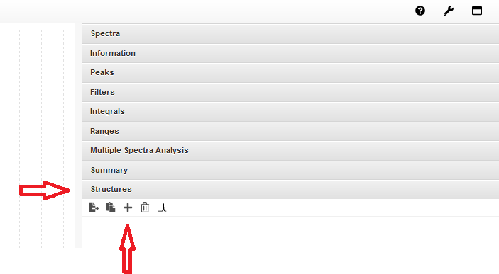
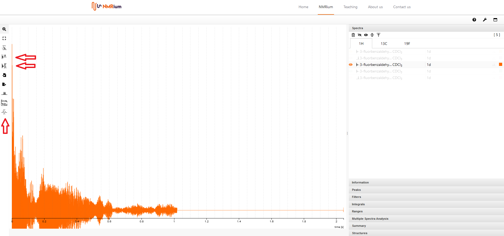
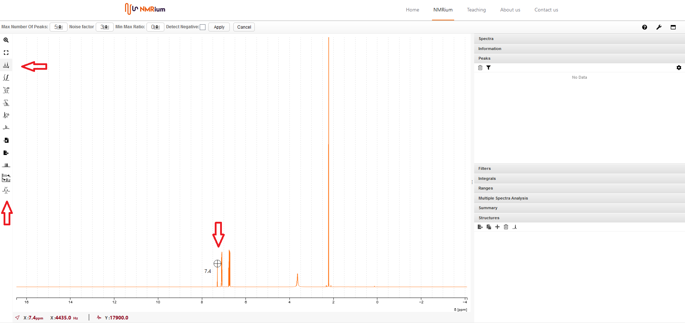
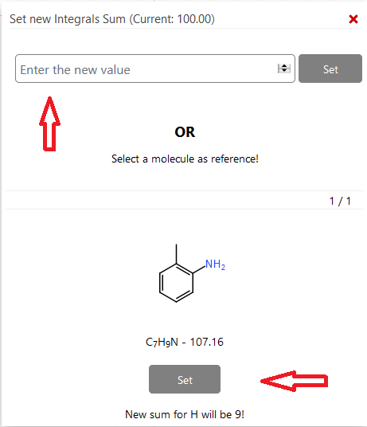
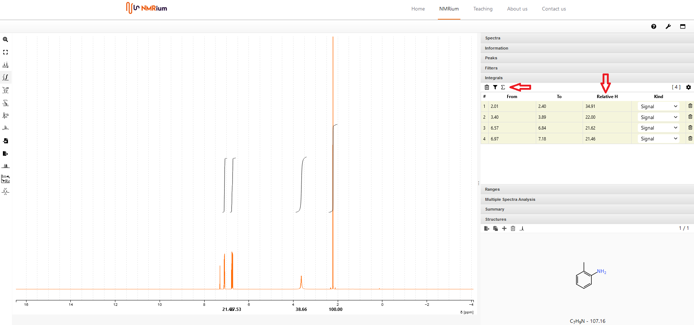
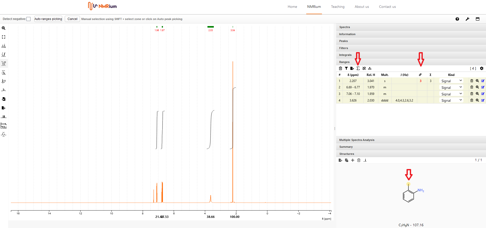

---
title: Quick Start Guide (Deutsch)
description: Eine kurze Beschreibung der wichtigsten Funktionen in NMRium
---

## 1. Öffnen des Programms

Öffnen Sie das Programm in Ihrem Browser, indem Sie auf folgenden Link klicken:

[https://www.nmrium.org/nmrium/](https://www.nmrium.org/nmrium/)

## 2. Öffnen von Spektren

Um Spektren öffnen zu können, müssen sie in einem der folgenden Dateiformate vorliegen:

- Jcamp DX (.dx, .jdx, .jcamp)
- Gezippter Ordner im Bruker-Format (Rohdaten oder prozessierte Daten)
- Jeol (.jdf)
- NMRium-Datei (.nmrium)

Ziehen Sie die Datei, die Sie öffnen wollen, mit der Maus in die graue Box **Drag and drop here** in der Mitte des Bildschirms. Sie können ein Spektrenset öffnen, indem Sie entweder die Spektren einzeln in die Arbeitsfläche ziehen oder indem Sie einen gezippten Ordner, der alle Spektren enthält, in die graue Box ziehen. Außerdem können gezippte Bruker-Ordner, die mehrere Spektren enthalten, öffnen.

## 3. Spektren auswählen

Auf der rechten Seite des Spektrums befindet sich ein aufklappbares Menu mit verschiedenen Panels. Klicken Sie das Panel **Spectra** an. Die Spektren werden den gemessenen Kernen zugeordnet, zum Beipiel 1H, 13C etc. Wenn Sie auf den entsprechenden Kern klicken, dann finden Sie die dazugehörigen Spektren. Wählen Sie ein Experiment aus, indem Sie auf die entsprechende Zeile klicken. Das Spektrum wird in der Arbeitsfläche geöffnet.

:::info Wobble Kurven

Bruker-Ordner können Dateien mit sogenannten **Wobble-Kurven** enthalten. Es ist sinnvoll, diese vor der Bearbeitung der restlichen Spektren zu löschen. Sie erkennen Sie an dem Spektrennamen **wobble**. Klicken Sie das entsprechende Spektrum mit der rechten Maustaste an. Klicken Sie **delete** in der sich öffnenden Box an, um die Wobble-Kurve zu löschen.

:::

:::tip Änderung der Spektrenfarbe

Sie können die Farbe Ihres Spektrums ändern, indem Sie auf den farbigen kleinen Kasten rechts in der Zeile Ihres Spektrums klicken. In dem sich öffnenden Fenster können Sie eine Farbe auswählen. Bei 2D-Experimenten sind die Farben für die positive und die negativen Peaks frei wählbar. 

:::

## 4. Löschen eines Spektrums

Um ein einzelnes Spektrum zu löschen klicken Sie mit der rechten Maustaste auf die entsprechende Zeile im Panel **Spectra**. Klicken Sie anschließend **delete**, um das Spektrum zu löschen. Wenn Sie alle Spektren eines Kerns löschen wollen, klicken Sie auf das Papierkorbsymbol im Panel **spectra**. Klicken Sie anschließend **yes** im sich öffnenden Fenster. 

## 5. Vergrößern eines Spektrenausschnitts

Um einen Auschnitt  des Spektrums zu vergrößern, fahren sie mit der Maus über den zu vergrößernden Ausschnitt des Spektrums und halten Sie dabei die linke Maustaste gedrückt. Beim loslassen erscheint der ausgewählte Bereich des Spektrums. Sie können diesen  Vorgang beliebig oft wiederholen.  Mit einem Doppelklick irgendwo im Spektrum können Sie die Vergrößerung rückgängig machen. To zoom a section of a spectrum, drag over it with the left mouse button. You can repeat this process as often as you like. Um zur ursprünglichen Vergrößerung zurückzugelangen, klicken sie auf den Button **Horizontal zoom out** in der Menuebar auf der linken Seite des Spektrums. 

## 6. Einfügen einer Molekülstruktur

Es gibt zwei Möglichkeiten, eine Molekülstruktur in das Programm einzufügen:

:::note Molfile

Ziehen Sie eine  Molfile-Datei mit der Maus in die Arbeitsfläche. Der Panel **Structures** wird geöffnet. Dort werden Ihnen sowohl die Molekülstruktur als auch die Summenformel und die molare Massen angezeigt.

:::

:::note Integrierter Struktur-Editor

Klicken Sie auf den Panel **Structures** auf der rechten Seite des Spektrums und dort anschließend auf den Button **+**. Es öffnet sich ein Fenster. Dort können Sie Ihre Molekülstruktur selbst zeichnen. Wenn Sie fertig sind, klicken Sie auf **Save**. Die Struktur wird im Panel *Structures** gespeichert, Sie finden Sie dort, zusammen mit der Summenformel und der molaren Masse. 

:::

## 7. Prozessierung der Rohdaten (derzeit ausschließlich 1D)

NMRium bietet die Möglichkeit, eine Fourier Tranformation (FT) der eindimensionalen Rohdaten durchzuführen. Öffnen Sie den FID, indem Sie auf die entsprechende Datei im Panel **Spectra** klicjen. 

### Fourier transformation

Bevor Sie die Fourier Transformation durchführen, klicken Sie auf den Button **Zero Filling** in der Menubar auf der linken Seite des Spektrums. Wählen Sie geeignete Werte für die Größen **Size** (Zero filling) und **Line Broading** (exponentielle Window Funktion) aus und klicken Sie **Apply**. Anschließend starten Sie die Fourier Transormation, indem Sie auf den Button **FFT Filter** in der Menubar auf der linken Seite des Spektrums klicken. 

:::tip Geeignete Werte für **Size** und **Line Broading** 

Wenn Sie sich nicht sicher sind, welche Werte Sie verwenden sollen, empfehlen wir Ihnen, folgende Größen anzugeben:

**Size**: Wählen Sie doppelt so viele Punkte, wie der originale FID hat.

**Line Broadening (LB)**: Geben Sie 0.3 Hz für ¹H-Spektren an und 1-3 Hz für ¹³C-Spektren.

:::

### Phasenkorrektur

Klicken Sie auf den Button **Phase correction** auf der linken Seite des Spektrums. Sie können dann manuelle Phasenkorrektur und automatische Phasenkorrektur auswählen. 

:::note Automatische Phasenkorrektur

Klicken Sie den Button **Apply** , die Phase wird automatisch korrigiert.
:::

:::note Manuelle Phasenkorrektur

Sie können eine Phasenkorrektur nullter Ordnung und eine Phasenkorrektur erster Ordnung durchführen.

Für die Phasenkorrektur nullter Ordnung klicken Sie den Button **PH0** mit der linken Maustaste an und halten Sie ihn gedrückt. Bewegen Sie Maus, bis die Phase korregiert ist, dann lassen Sie die linke Maustaste los. Sie können den Pivot-Punkt (rote Linie) verschieben, indem Sie einen Doppelklick auf dem entsprechenden Signal machen. 

Wiederholen Sie den Vorgang mit der Phasenkorrektur erster Ordnung, indem Sie den Button **PH1** anklicken und die Maus bewegen. Ihr Fokus sollte hierbei auf den Signalen liegen, die möglichst weit vom Pivot-Punkt entfernt sind. Abschließend klicken Sie den Button **Apply**, um die Phasenkorrektur abzuschließen.

:::

### Basislinienkorrektur

Klicken Sie auf den Button **Baseline correction**  in der Menubar auf der linken Seite des Spektrums. Sie können zwischen zwei Algorithmen wählen: **polynomial** und **AIR PLS**.

- Wenn Sie den Algorithmus **polynomial** wählen, müssen Sie einen Grad (degree) auswählen und anschließend **apply** anklicken.
- Wenn Sie den Algorithmus **AIR PLS** wählen, müssen Sie sowohl ein Maximum als auch einen Toleranzbereich auswählen und anschließend **apply** anklicken.

## 8. Festlegung des Referenzwertes

Klicken Sie den Button **Peaks Picking** auf der linken Seite des Spektrums an. Anschließend suchen Sie Ihr Lösungsmittelsignal im Spektrum mit der Maus. Wenn Sie das Signal im Fadenkreuz sehen, drücken Sie die Taste **shift** auf der Tastatur und gleichzeitig die linke Maustaste. Die chemische Verschiebung des Signals wird sowohl im Spektrum über dem Signal als auch im Panel **Spectra** auf der rechten Seite des Bildschirms angezeigt. Wählen Sie einen der beiden angezeigten Werte aus (im Spektrum klicken Sie mit der linken Maustaste auf den Signalwert, im Panel machen Sie einen Doppelklick) und geben dann den korrekten Referenzwert an. 

## 9. Peak Picking

Klicken Sie den Button **PeaksPicking** auf der linken Seite in der Menubar an. Sie können ziwschen automatischen Peaks Picking und manuellem Peaks Picking wählen. 

:::note Automatisches Peaks picking

In der Zeile oberhalb des Spektrums können Sie die maximale Anzahl an Peaks, den Rausch-Faktor und das Minimum-Maximum-Verhältnis der Peaks (Min Max Ratio) angeben Anschließend klicken Sie auf **Apply** Die chemischen Verschiebungen werden sowohl im Spektrum über den jeweiligen Signalen als auch im Panel **Peaks** auf der rechten Seite des Bildschirms in einer Liste angezeigt. 

:::

:::note Manuelles Peaks picking

Klicken Sie den Button **Peaks Picking** auf der linken Seite des Spektrums an. Anschließend suchen Sie Ihr Lösungsmittelsignal im Spektrum mit der Maus. Wenn Sie das Signal im Fadenkreuz sehen, drücken Sie die Taste **shift** auf der Tastatur und gleichzeitig die linke Maustaste. Die chemische Verschiebung des Signals wird sowohl im Spektrum über dem Signal als auch im Panel **Spectra** auf der rechten Seite des Bildschirms angezeigt.
:::

## 10. Löschen von Chemischen Verschiebungen

Wenn Sie die chemische Verschiebung eines Signals löschen woollen, wählen Sie den entsprechenden Wert im Panel **Peaks** auf der rechten Seite des Bildschirms. Klicken sie das Papierkorbsymbol auf der rechten Seite der entsprechenden Zeile an, der Wert wird gelöscht..

Wenn Sie alle Chemischen Verschiebungen löschen wollen, klicken Sie das Papierkorbsymbol oberhalb der Liste mit den Chemischen Verschiebungen im Panel **Peaks** auf der rechten Seite des Bildschirms. Bestätigen Sie, dass Sie alle chemischen Verschiebungen löschen wollen, indem Sie **Yes** im sich öffnenden Fenster anklicken. 

## 11. Auswahl der Werte, die im Panel **Peaks** angezeigt werden sollen

Sie können entscheiden, welche Werte Ihnen im Panel Peaks angezeigt werden. Öffnen Sie hierfür den Panel **Peaks** auf der rechten Seite des Bildschirms. Klicken Sie auf den Zahnrad-Button. Es werden Ihnen Auswahlmöglichkeiten für alle gemessenen Kerne angezeigt. Sie können zwischen folgenden Werten für jeden Kern auswählen:

- Peak Number (Nummer des Peaks)
- Peak Index (Index des Peaks)
- Chemical shift (Chemische Verschiebung in ppm)
- Chemical shift (Chemische Verschiebung in Hz)
- Width (Breite)
- Intensity (Intensität)

Setzen Sie bei jedem Wert, den Sie angezeigt bekommen wollen, einen Haken. Machen Sie das bei allen angezeigten Kernen. Klicken Sie anschließend auf den grünen Haken oben rechts, um Ihre Einstellungen zu speichern. 

## 12. Integration

Klicken Sie den Button **Integral Tool** auf der linken Seite des Spektrums in der Menubar an. Um ein einzelnes Signal zu integrieren, markieren Sie das Signal indem Sie mit der Maus über das Signal fahren, während Sie die Taste **Shift** auf Ihrer Tastatur drücken und gleichzeitig die linke Maustaste drücken. Machen Sie das mit jedem Signal, das Sie integrieren wollen. Eine Lsite der integrierten Signale finden Sie im Panel **Integrals** auf der rechten Seite des Bildschirms.

Es ist vorgegeben, dass die relative Anzahl an integrierten Protonen 100 beträgt. Sie können diesen Wert ändern, indem Sie auf das Summensymbol über der Liste im Panel **Integrals** klicken. Es öffnet sich ein neues Fenster. Geben Sie entweder die korrekte Anzahl an Protonen manuell ein und klicken Sie auf **Set** oder verwenden Sie die durch die Strukturformel Ihres Moleküls vorgegebene Anzahl durch Anklicken von **Set** im unteren Bereich des Fensters.

## 13. Integrale löschen

Wenn Sie ein einzelnes Integral löschen wollen, wählen Sie dieses im Panel **Integrals** auf der rechten Seite des Bildschirms aus. Klicken Sie das entsprechende Papierkorbsymbol an, das Integral wird gelöscht. Wenn Sie alle Integrale löschen wollen, klicken Sie das Papierkorbsymbol oberhal der Lsite im Panel **Integrals** an. Bestätigen Sie, dass Sie alle Integrale löschen wollen, indem Sie **Yes** im sich öffnenden Fenster anklicken. 

## 14. Bestimmung von Zuordnungsbereichen und Bestimmung von Kopplungskonstanten

Klicken Sie auf den Button **Ranges Picking** auf der linken Seite des Bildschirms in der Menubar. Sie können die Zuordnungsbereiche entweder manuell oder automatisch bestimmen:

:::note Automatische Bestimmung von Zuordnungsbereichen

Klicken Sie auf den Button **Auto ranges picking**. Die ausgewählten Bereiche werden automatisch bestimmt und sowohl im Spektrum als auch im Panel **Ranges** auf der rechten Seite des Bildschirms abgebildet. Die dazugehörigen Kopplungskonstanten werden automatisch bestimmt.

:::

:::note Manuelle Bestimmung von Zuordnungsbereichen

Drücken Sie die Shift-Taste und markieren Sie gleichzeitig mit der Maus den Bereich, den Sie als Bereich festlegen möchten. Der markierte Zuordnungsbereich wird sowohl im Spektrum als auch in einer Liste auf der rechten Seite des Spektrums im Panel **Ranges** angezeigt. Die entsprechenden Kopplungskonstanten werden automatisch ermittelt.
:::

## 15. Löschen von Zuordnungsbereichen

Wenn Sie einen einzelnen Zuordnungsbereich löschen möchten, suchen Sie den entsprechenden Bereich auf der rechten Seite des Spektrums in der Liste des Panels **Ranges**. Klicken Sie auf das Papierkorbsymbol ganz rechts in der Zeile, und der Bereich wird gelöscht.
Wenn Sie alle Zuordnungsbereiche löschen möchten, klicken Sie auf das Papierkorbsymbol oberhalb der Werteliste des Panels **Ranges**. Bestätigen Sie, dass Sie alle Bereiche löschen möchten, indem Sie in dem sich öffnenden Fenster auf **Yes** klicken.

## 16. Zuordnung von Signalen

Um Signale zuzuordnen, müssen Sie Zuordnungsbereiche definieren ([Abschnitt 14](#14-picking-ranges-and-determination-of-coupling-constants)) und eine Molekularstruktur einfügen ([Abschnitt 6](#6-insert-a-molecular-structure)). Öffnen Sie die Panels **Ranges** und **Structures** auf der rechten Seite des Bildschirms. Geben Sie die korrekte Anzahl der relativen H-Atome an, indem Sie auf das Summensymbol oberhalb der Liste **Ranges** klicken. In dem sich öffnenden Fenster können Sie entweder die Anzahl der H-Atome manuell eingeben und dann auf **Set** klicken oder die durch die Summenformel vorgegebene Anzahl der H-Atome übernehmen, indem Sie im unteren Bereich auf **Set** klicken.

Klicken Sie in der Liste in der Zeile des Signals, das Sie zuordnen möchten, auf das Kästchen unter dem Verknüpfungssymbol. Dort erscheint eine rote Null. Ordnen Sie dann das Signal zu, indem Sie die entsprechenden Atome in der Strukturformel anklicken. Verfahren Sie auf die gleiche Weise mit allen anderen Bereichen. Sie können einem Bereich auch mehrere, unterschiedliche H-Atome zuordnen, indem Sie nacheinander alle H-Atome in der Strukturformel anklicken, die zu dem jeweiligen Signal gehören. Wenn Sie diastereotopische H-Atome zuordnen wollen, halten Sie die Shift-Taste gedrückt, während Sie das entsprechende H-Atom in der Struktur anklicken. Dadurch werden beide diastereotopischen H-Atome sichtbar.

## 17. Export von zugeordneten Spektren

Um die zugeordneten Spektren zu exportieren, klicken Sie auf die Buton **Export** in der Menubar auf der linken Seite des Spektrums. Es öffnet sich ein Feld, in dem Sie auswählen können, in welchem Format Sie Ihr Spektrum exportieren möchten. Sie haben die folgenden Optionen:

- Export as SVG
- Export as PNG
- Save data
- Copy image to Clipboard

Klicken Sie auf **Save data**, um das zugeordnete Spektrum mit allen ausgewerteten Informationen zu speichern und es später bearbeiten zu können. Es wird eine NMRium-Datei erstellt und zum Download angeboten.
:::info

Eine NMRium-Datei ist eine komprimierte Textdatei, die alle Informationen der (teilweise) zugeordneten gespeicherten Spektren enthält. Je nach Anzahl der enthaltenen Spektren kann das Speichern länger dauern, ebenso das erneute Öffnen einer NMRium-Datei.

:::
