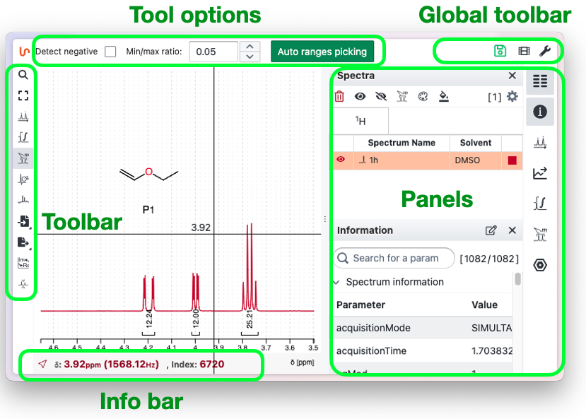

# Introduction to NMRium

NMRium is a web-based platform for NMR data processing and analysis, designed with the needs of both novice and expert users in mind. The interface supports intuitive and efficient workflows, and can be customized by streamlining toolbars and panels.

## Main Layout

The NMRium interface is divided into five key areas: **Left**, **Top**, **Central**, **Right**, and **Bottom**.

- **Left Sidebar (Toolbar):** Contains context-sensitive tools such as peak picking, integration, and annotation. The available tools change depending on the current mode or selection.

- **Top Area:**

  - **Tool Options Bar:** Changes dynamically and displays options and settings specific to the currently selected tool, allowing for quick parameter adjustments.
  - **Global Toolbar:** Provides access to general actions like file import/export, undo/redo, application settings, and links to video tutorials.

- **Central area:** The main area where spectra are visualized and analyzed.

- **Right Sidebar (Panels):** Displays contextual information about the current spectra, including ranges, integrals, structures, and other relevant data.

- **Bottom bar:** Shows detailed information related to the current cursor position or selected elements, providing additional context during analysis.

This layout keeps all essential functionalities within reach, so you can focus on spectral analysis with minimal distraction.

## The panels

Click a panel icon to open the corresponding panel; several panels can be open at the same time. Click the icon again to close the panel. If several panels are open and you want to keep only one, <kbd>Shift</kbd>-click its icon to close all the others.
