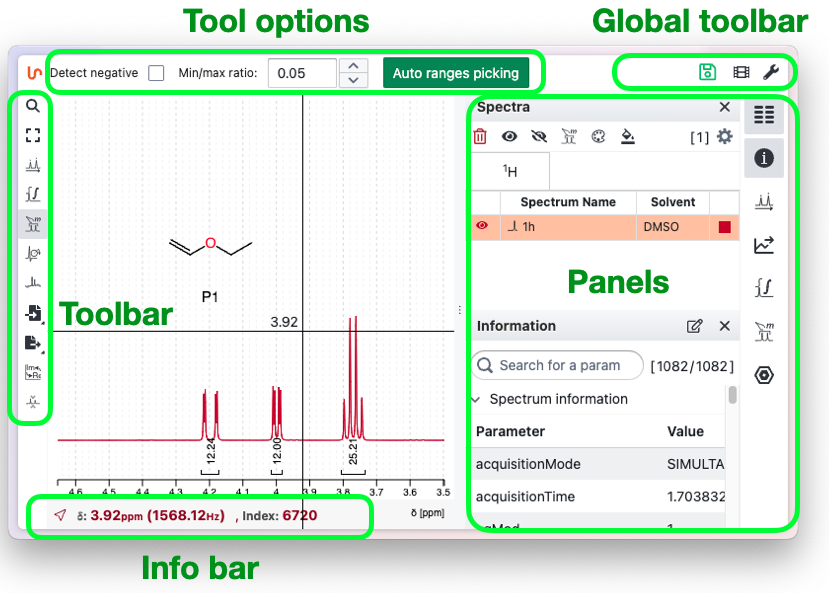

# Introduction to NMRium

NMRium is a web-based platform for NMR data processing and analysis. NMRium is designed for intuitive and efficient workflows and data interpretation. The  user interface is designed to with the needs of both novice and expert users in mind, allowing customization and streamlining of toolbars and panels.

## Main Layout

The NMRium interface is divided into four key areas: Left - Top - Central - Right.

- **Left Sidebar (Toolbar):** Contains context-sensitive tools such as peak picking, integration, and annotation. The available tools change depending on the current mode or selection.

- **Top Area:**

  - **Tool Options Bar:** changes dynamically and displays options and settings specific to the currently selected tool, allowing for quick parameter adjustments.
  - **Global Toolbar:** provides access to general actions like file import/export, undo/redo, application settings, and links to video tutorials.

- **Central area:** The main area where spectra are visualized and analyzed.

- **Right Sidebar (Panels):** Displays contextual information about the current spectra, including ranges, integrals, structures, and other relevant data.

- **Bottom bar:** Shows detailed information related to the current cursor position or selected elements, providing additional context during analysis.

This layout ensures that all essential functionalities are easily accessible, enabling users to focus on spectral analysis with minimal distraction.

## The panels

When you click on a panel, it opens. You can open several panels at the same time. To close a panel, click on the corresponding panel again. If several panels are open and you want to close all but one panel, <kbd>Shift</kbd> click onto the corresponding panel.
