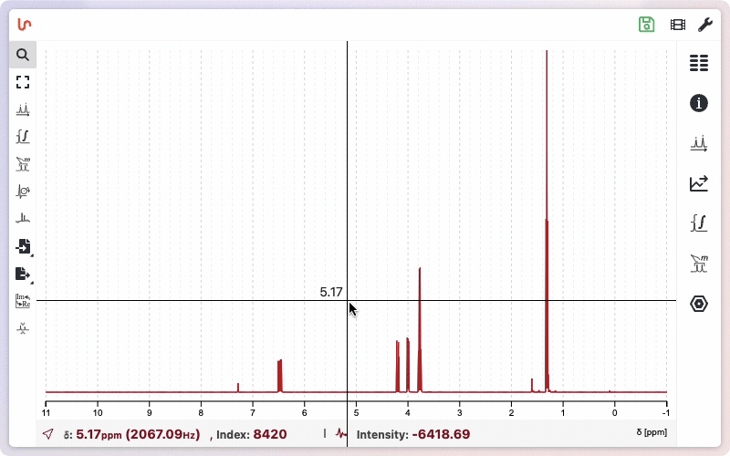
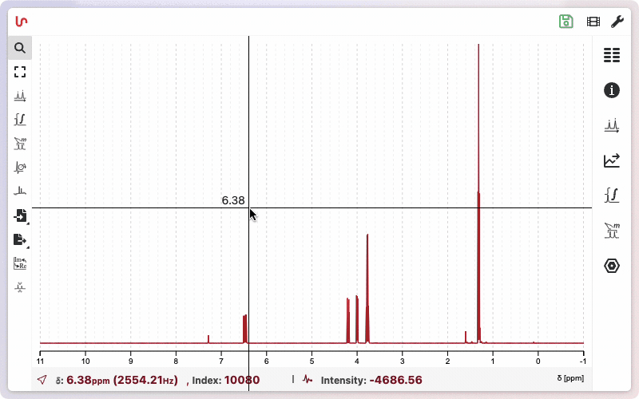
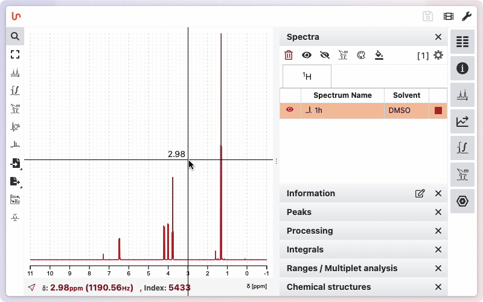
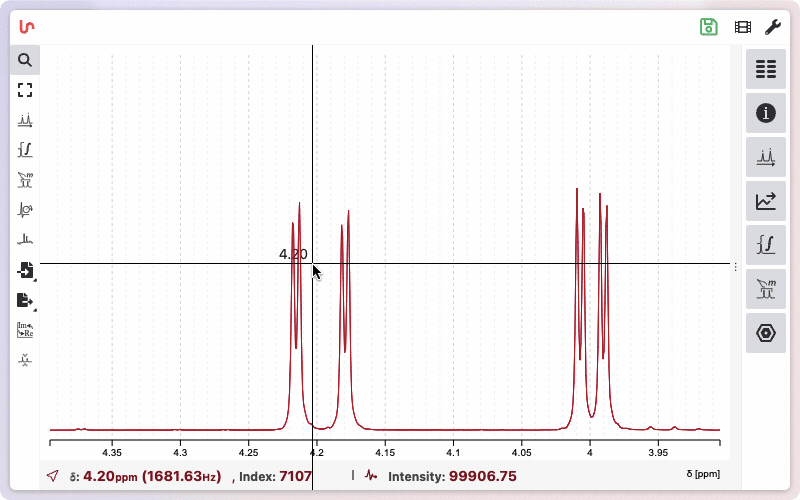
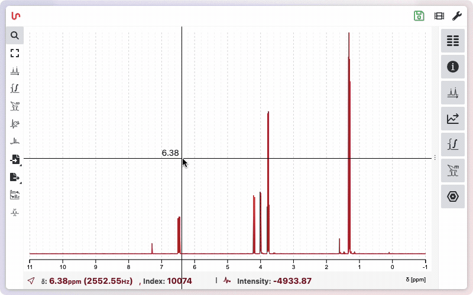
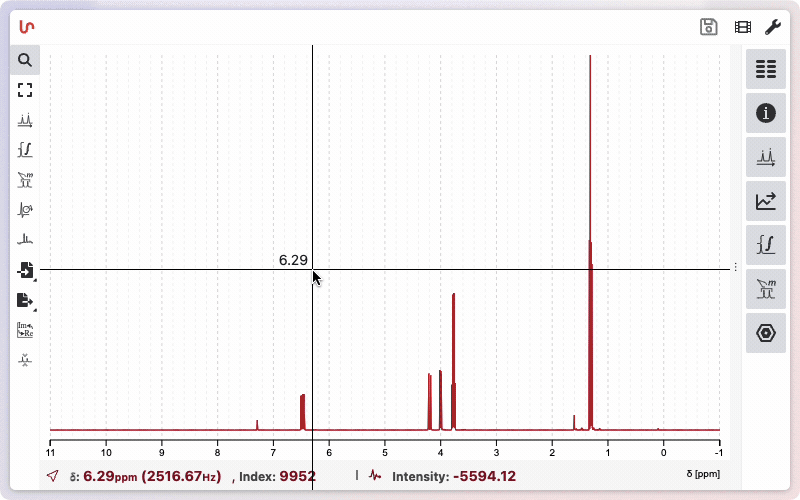
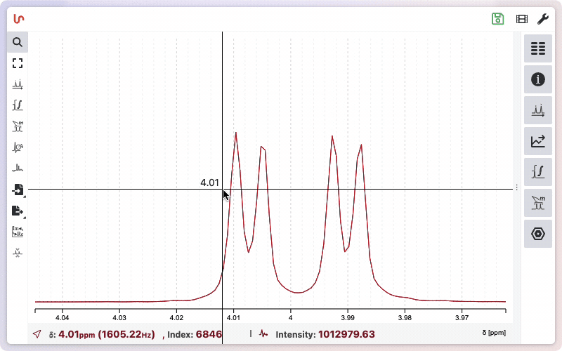

# Zoom Functionality

The zoom functionality is accessible in all tools. This means that even if you select tools like peak picking or integration, the same commands will allow you to zoom in and out of the spectrum.

To zoom in on the spectrum, click and hold the left mouse button, drag to highlight the desired section, and release the mouse button. You can repeat this process to zoom in further.

Double-click to return to the previous zoom level. Double-click again to return to the full spectrum. NMRium remembers all zoom levels.

To zoom out horizontally, press <kbd>f</kbd> or click the corresponding icon. Press <kbd>f</kbd> twice (<kbd>ff</kbd>) to zoom out both horizontally and vertically. Clicking the "zoom out" icon once zooms out horizontally; clicking it twice zooms out both horizontally and vertically.

## Basic Zoom Controls

- **Vertical Zoom:** Use the scroll wheel to zoom vertically.
- **Horizontal Zoom:** Hold <kbd>Shift</kbd> and use the scroll wheel to zoom horizontally.
- **Click and Drag:**
  - Click, drag, and release horizontally to zoom in on a horizontal region.
  - Click, drag, and release both horizontally and vertically to select and zoom into a specific area.

## Other Zoom Controls

- **Panning:** Right-click and drag horizontally to pan the view.

- **Advanced Zoom:** Hold <kbd>Ctrl</kbd> and press the mouse button.
  - Move the mouse vertically to zoom vertically.
  - Move the mouse horizontally to zoom horizontally.

:::tip Saving zoom levels

To quickly navigate between different zoom levels and nuclei, you can use the number keys on your keyboard. The first time you press a number key (such as <kbd>1</kbd>, <kbd>2</kbd>, etc.), NMRium saves the current zoom parameters to that number. Pressing the same number key again will instantly recall the saved zoom level and nucleus selection. If you want to update or replace the saved zoom for a specific number, hold <kbd>Shift</kbd> and press the desired number key (<kbd>Shift</kbd> + <kbd>number</kbd>). This makes it easy to switch between your favorite views during analysis.

:::

## Esc to select zoom tool

Press <kbd>Esc</kbd> to unselect your current tool and select the zoom too.

## Display Chemical Shift and Intensity of a Peak

In zoom mode, moving the mouse over the spectrum displays a crosshair. Hovering over a signal shows the chemical shift in ppm. At the bottom of the spectrum, you can see the chemical shift in ppm and Hz, as well as the intensity of the signal.

## Measuring Distances and Coupling Constants

With the zoom tool active, you can measure the distance between two peaks—useful for determining coupling constants.

To do this:

1. Hold down <kbd>Shift</kbd>.
2. Click and hold the left mouse button on the first signal.
3. Drag the mouse to the second signal and release.

At the bottom of the spectrum, you will see:

- The mean chemical shift of the selected signals
- Their intensities
- The distance between them (in ppm and Hz), which corresponds to the coupling constant

This feature helps you quickly analyze multiplet splittings and coupling patterns.

