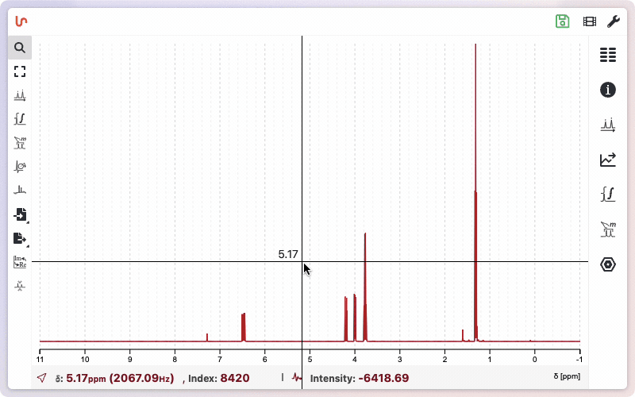
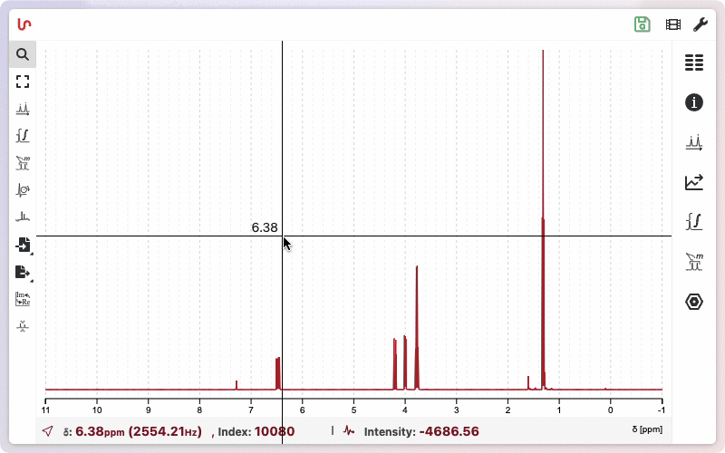
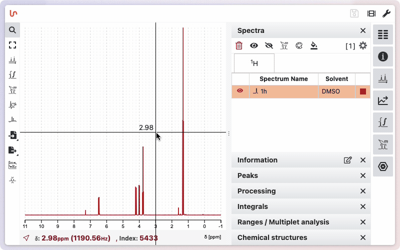
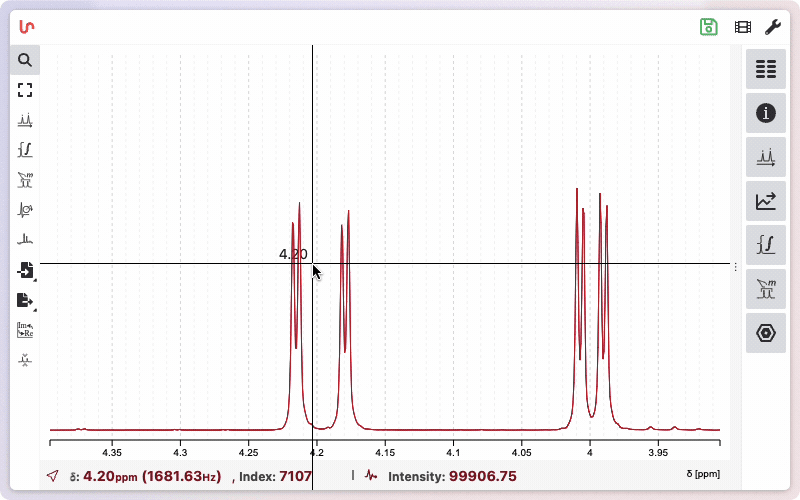
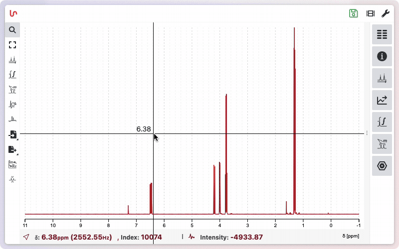
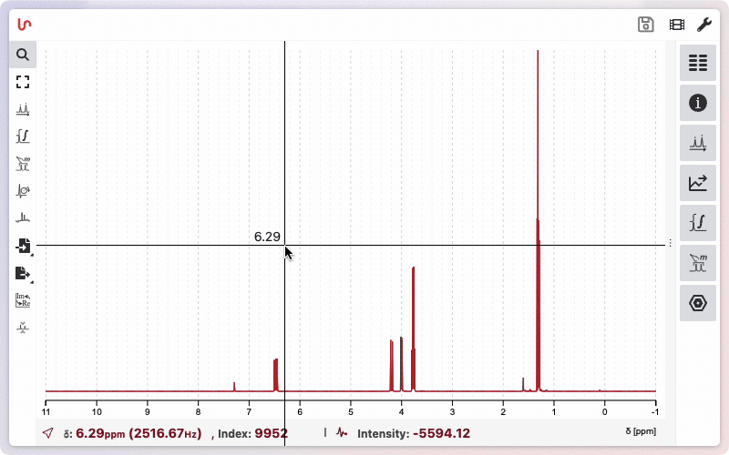
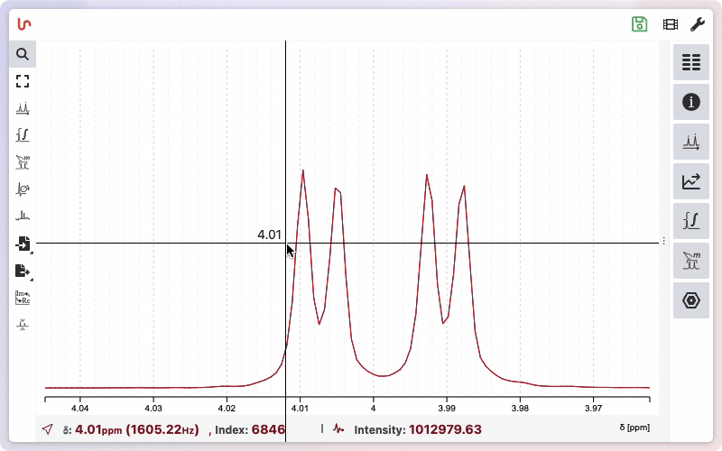

# Zoom Mode

Zoom is available in every tool — even when peak picking, integration, or another tool is active, the same shortcuts and mouse actions zoom in and out of the spectrum.

To zoom in, click and hold the left mouse button, drag to highlight the desired section, and release. Repeat to zoom in further.

Double-click anywhere to step back to the previous zoom level; repeat double-clicks to walk back through your zoom history. NMRium remembers all zoom levels.

To zoom out horizontally, press <kbd>f</kbd> or click the "zoom out" icon. Press <kbd>f</kbd> twice (<kbd>ff</kbd>), or click the icon twice, to zoom out both horizontally and vertically.

## Basic Zoom Controls

- **Vertical Zoom:** Use the scroll wheel to zoom vertically.
- **Horizontal Zoom:** Hold <kbd>Shift</kbd> and use the scroll wheel to zoom horizontally.
- **Click and Drag:**
  - Drag horizontally to zoom in on a horizontal region.
  - Drag diagonally to select a rectangular area and zoom into it.

## Other Zoom Controls

- **Panning:** Right-click and drag horizontally to pan the view.

- **Advanced Zoom:** Hold <kbd>Ctrl</kbd> and press the mouse button.
  - Move the mouse vertically to zoom vertically.
  - Move the mouse horizontally to zoom horizontally.

:::tip Saving zoom levels

To quickly navigate between different zoom levels and nuclei, you can use the number keys on your keyboard. The first time you press a number key (such as <kbd>1</kbd>, <kbd>2</kbd>, etc.), NMRium saves the current zoom parameters to that number. Pressing the same number key again will instantly recall the saved zoom level and nucleus selection. If you want to update or replace the saved zoom for a specific number, hold <kbd>Shift</kbd> and press the desired number key (<kbd>Shift</kbd> + <kbd>number</kbd>). This makes it easy to switch between your favorite views during analysis.

:::

## Switch to the Zoom Tool with Esc

Press <kbd>Esc</kbd> to deselect the current tool and switch back to the zoom tool.

## Display Chemical Shift and Intensity of a Peak

In zoom mode, moving the mouse over the spectrum displays a crosshair. Hovering over a signal shows the chemical shift in ppm. At the bottom of the spectrum, you can see the chemical shift in ppm and Hz, as well as the intensity of the signal.

## Measuring Distances and Coupling Constants

With the zoom tool active, you can measure the distance between two peaks—useful for determining coupling constants.

To do this:

1. Hold down <kbd>Shift</kbd>.
2. Click and hold the left mouse button on the first signal.
3. Drag the mouse to the second signal and release.

At the bottom of the spectrum, you will see:

- The mean chemical shift of the selected signals
- Their intensities
- The distance between them (in ppm and Hz), which corresponds to the coupling constant

This feature helps you quickly analyze multiplet splittings and coupling patterns.

