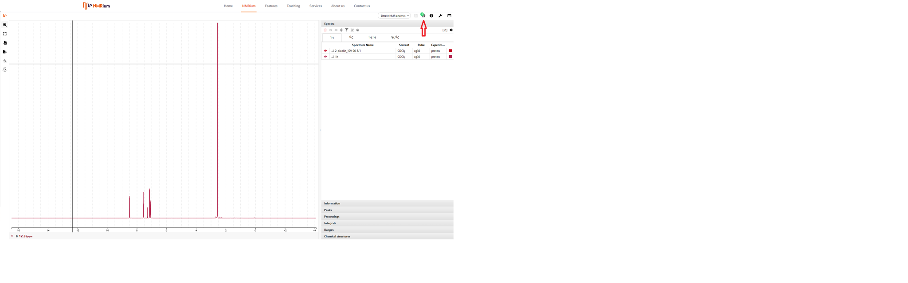
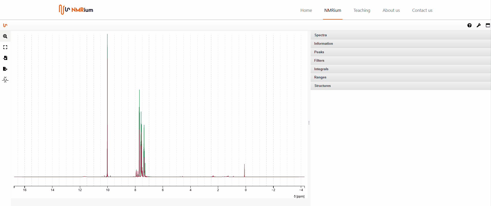
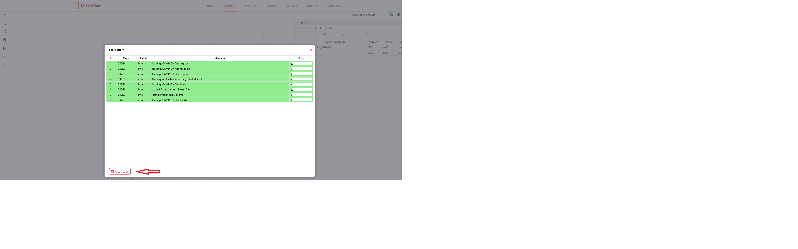
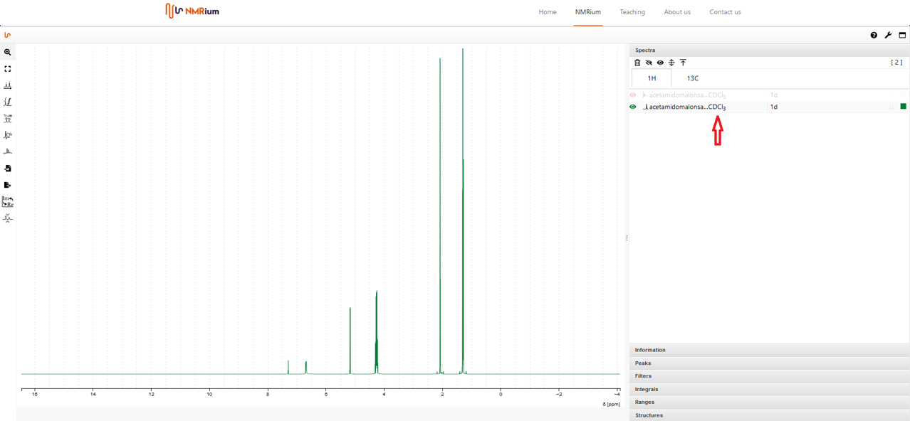

# List of Spectra

On the right side of the workspace, various areas are available in an expandable menu. Click onto the field Spectra. The measured nuclei (e.g. ¹H, ¹³C, etc) are displayed in the opened field. The spectra are grouped in nuclei. Click on a nucleus to find the 1D and 2D experiments associated with it. 

Above the spectra panel you can find a button that displays the number of displayed spectra. In the example shown, 8eight spectra have been loaded. If this button is highlighted in green, all spectra have been uploaded correctly. If the button is highlighted in red, one or more spectra have not been uploaded correctly. 

Click on the button. A list of the loaded spectra is displayed. The list indicates the time at which the spectrum was uploaded. Spectra that have not been uploaded correctly are highlighted in red. In this case, the Error column indicates the error. All correctly uploaded spectra are highlighted in green. If you click on the Clear Logs button, all listed spectra in the list will be deleted. The spectra are not deleted in NMRium. 

To hide all spectra press the icon "hide all spectra". To show all spectra, press the icon "**show all spectra**". 

To show one, two or more spectra in the workspace, press the icon for each spectrum. 

In each line of the spectrum, you find general information about the solvent.

To delete a spectrum, right-click onto the corresponding line in the panel Spectra. A small window opens. Then press delete with the left mouse button. The corresponding spectrum will be deleted. If you want to delete all spectra of a nucleus, open the list of the corresponding nucleus in the panel Spectra by clicking the nucleus with the left mouse button. Then click onto the recycle bin icon on the left above the list. Another window will open. Verify that you want to delete all spectra by clicking on Yes. All spectra of the nucleus will be deleted.

