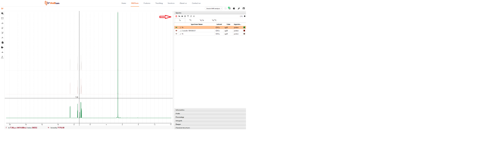

# List of Spectra

On the right side of the workspace, various areas are available in an expandable menu. Click onto the field Spectra. The measured nuclei (e.g. ¹H, ¹³C, etc) are displayed in the opened field. The spectra are grouped in nuclei. Click on a nucleus to find the 1D and 2D experiments associated with it. 

Above the spectra panel you can find a button that displays the number of displayed spectra. In the example shown, eight spectra have been loaded. If this button is highlighted in green, all spectra have been uploaded correctly. If the button is highlighted in red, one or more spectra have not been uploaded correctly. 

Click on the button. A list of the loaded spectra is displayed. The list indicates the time at which the spectrum was uploaded. Spectra that have not been uploaded correctly are highlighted in red. In this case, the **Error** column indicates the error. All correctly uploaded spectra are highlighted in green. If you click on the **Clear Logs** button, all listed spectra in the list will be deleted. The spectra are not deleted in NMRium. 

To hide all spectra press the icon **hide all spectra**. To show all spectra, press the icon "**show all spectra**". 

To show one, two or more spectra in the workspace, press the icon for each spectrum. 

In each line of the spectrum, you find general information about the solvent.

To delete a single spectrum, click on the corresponding line. Then click on the red trash icon above the list of measured spectra. A box will open. Click yes if you want to delete the selected spectrum. The spectrum will be deleted.

# Mode selection

You can choose between different modes of how you want to analyze your spectra: **Simple NMR analysis**, **1D multiple spectra analysis** and **NMR spectra assignment**. 

With the mode **Simple NMR analysis**, you can analyse chemical shifts of the signals with the help of peaks picking and integrate the signals. There is also the possibility to analyse the spectrum with the help of ranges and to do a multiple spectrum analysis. You can select the individual functions and process the spectrum by yourself.

If you have several 1D spectra of a substance and you want to analyse them at the same time, you can choose the mode **1D multiple spectra analysis**. NMRium is able to analyse multiple spectra of a substance. You can make corrections by yourself.

If you have one or more spectra of a compound, NMRium is able to assign these spectra for you. To use this, select the function **NMR spectra assignment**. NMRium analyses the ranges. It determines the integral or the relative H part of a range. It also does a multiplet analysis and a calculation of the coupling constants.  Finally, you can also make corrections by yourself.

Click above the panels on the right side on the red marked button and select the corresponding function. You have to activate it by clicking on a spectrum or a nucleus in the Spectra panel. Afterwards, the selected mode will be available.

