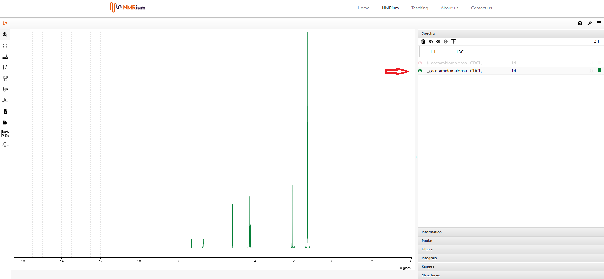

# List of Spectra

On the right side of the workspace, various areas are available in an expandable menu. Click on the Spectra field. The measured nuclei (e.g. ¹H, ¹³C, etc) are displayed in the opened field. Click on a nucleus to find the experiments associated with it. 

To hide all spectra press the icon "hide all spectra". 

To show all spectra, press the icon "show all spectra". 

To show one or to spectra in the workspace, press the icon for each spectrum. 

In each spectrum line you find general information about the solvent.

