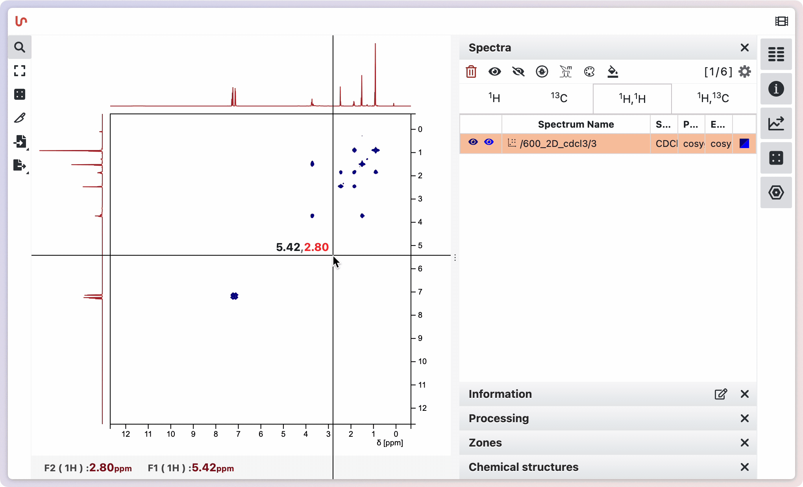
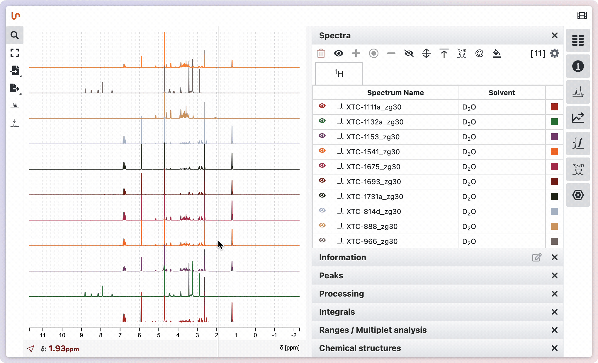
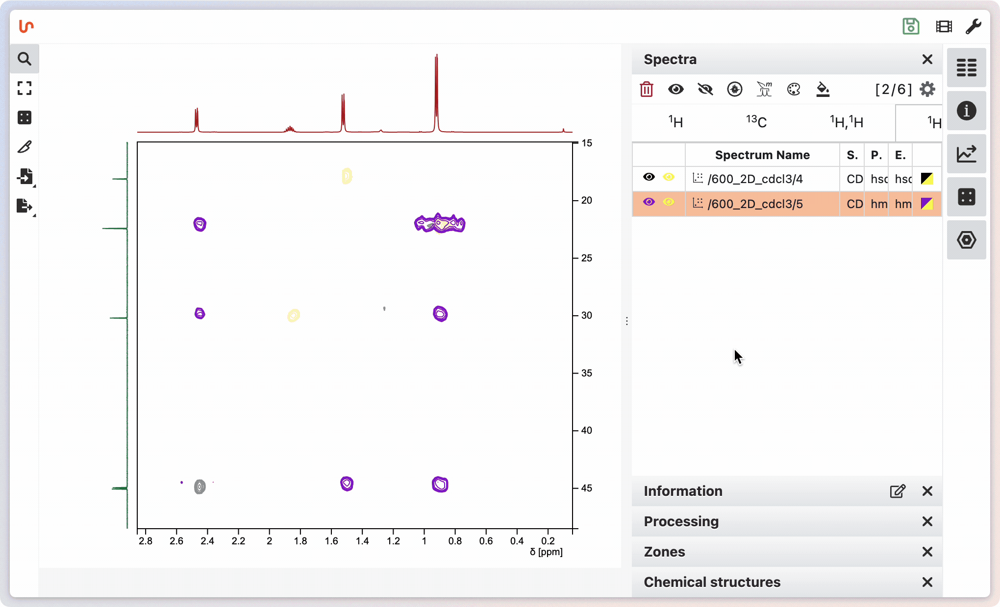

# List of Spectra

When loading spectra in NMRium, they are automatically grouped by nucleus (e.g., ¹H, ¹³C) or group of nuclei. 1D and multidimensional spectra are organized accordingly. Selecting a 2D spectrum links its side spectra to those selected in the 1D tab.

On the right, expand the **Spectra** panel to view loaded nuclei and their associated 1D/2D experiments.

Above the panel, a button shows the total number of loaded spectra.

If there are event logs generated during the import process or other actions in NMRium, a badge will appear on the bug icon in the global toolbar. Click this icon to display a list of logged events. The list shows the as well as the event. Errors will be highlighted in pink, warning in yellow and information in green. Clicking the **Clear Logs** button will remove all entries from the log list.

You can select spectra directly from the spectra display by clicking on the baseline of a spectrum. To select multiple spectra, use Shift + Click on the last spectrum in a range to select all spectra between the first and last clicked. Alternatively, you can cherry-pick individual spectra by holding CMD (or Ctrl on Windows) + Click on each desired spectrum.

Once selected, you can perform actions such as hiding the selection, adding it to the displayed spectra, focusing on it, and more. Spectra can also be selected from the spectra panel, offering another way to manage your selections.

# Color spectra

By default, when loading spectra, colors are assigned according to your general preferences. You can also set a custom color for each spectrum. For 2D spectra, you can choose separate colors for positive and negative contours.

Spectra can also be colored based on a specific property. For example, if your spectra have a property with categories such as Pre, w2, w6, and w8, you can click the header of this meta information to color spectra by their distinct values. You can also reset the colors or apply a new color to all spectra at once.

# Mode selection

You can choose between different modes of how you want to analyze your spectra: **Simple NMR analysis**, **1D multiple spectra analysis** and **NMR spectra assignment**.

With the mode **Simple NMR analysis**, you can analyse chemical shifts of the signals with the help of peaks picking and integrate the signals. There is also the possibility to analyse the spectrum with the help of ranges and to do a multiple spectrum analysis. You can select the individual functions and process the spectrum by yourself.

If you have several 1D spectra of a substance and you want to analyse them at the same time, you can choose the mode **1D multiple spectra analysis**. NMRium is able to analyse multiple spectra of a substance. You can make corrections by yourself.

If you have one or more spectra of a compound, NMRium is able to assign these spectra for you. To use this, select the function **NMR spectra assignment**. NMRium analyses the ranges. It determines the integral or the relative H part of a range. It also does a multiplet analysis and a calculation of the coupling constants. Finally, you can also make corrections by yourself.

Click above the panels on the right side on the red marked button and select the corresponding function. You must activate it by clicking on a spectrum or a nucleus in the panel **Spectra**. Afterwards, the selected mode will be available.
