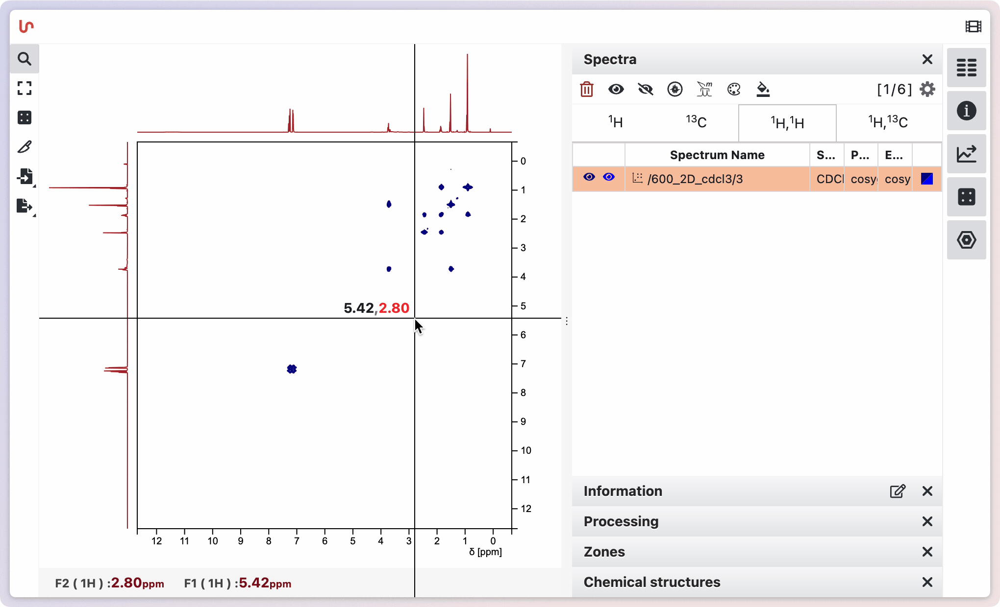
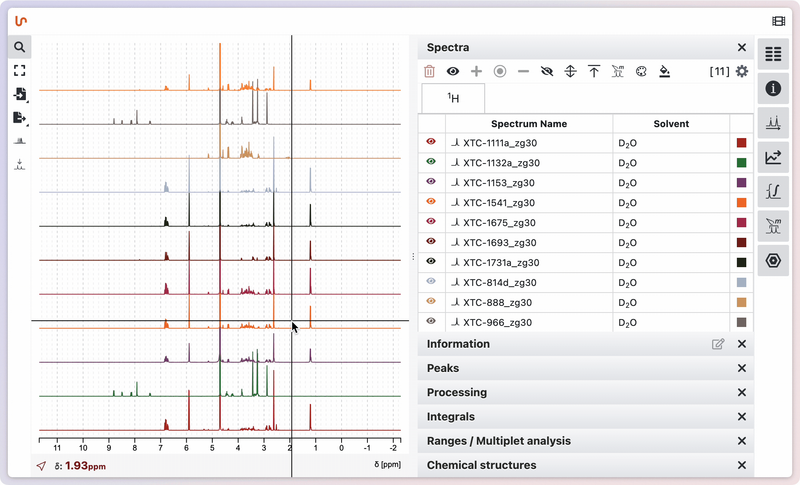
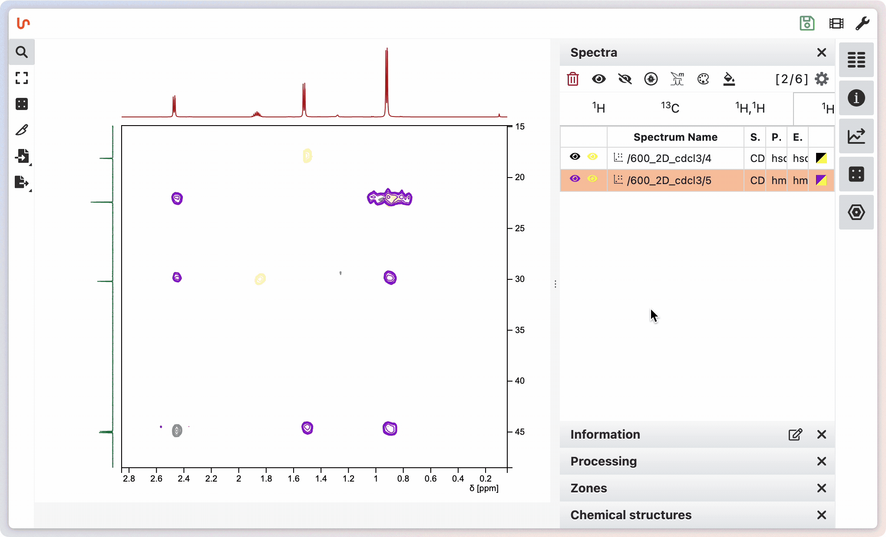

# Spectra panel

When loading spectra in NMRium, they are automatically grouped by nucleus (e.g., ¹H, ¹³C) or group of nuclei. 1D and multidimensional spectra are organized accordingly. Selecting a 2D spectrum links its side spectra to those selected in the 1D tab.

On the right, expand the **Spectra** panel to view loaded nuclei and their associated 1D/2D experiments.

Above the panel, a button shows the total number of loaded spectra.

If event logs are generated during the import process or other actions in NMRium, a badge appears on the bug icon in the global toolbar. Click this icon to display the list of logged events. Each entry shows the time and a description of the event: errors are highlighted in pink, warnings in yellow, and info messages in green. Click **Clear Logs** to remove all entries from the list.

You can select spectra directly from the spectra display by clicking on the baseline of a spectrum. To select a range of spectra, <kbd>Shift</kbd>-click the last spectrum to select everything between the first and last clicked. To cherry-pick individual spectra, hold <kbd>Cmd</kbd> (or <kbd>Ctrl</kbd> on Windows) while clicking each one.

Once selected, you can perform actions such as hiding the selection, adding it to the displayed spectra, focusing on it, and more. Spectra can also be selected from the spectra panel, offering another way to manage your selections.

## Color spectra

By default, when loading spectra, colors are assigned according to your general preferences. You can also set a custom color for each spectrum. For 2D spectra, you can choose separate colors for positive and negative contours.

Spectra can also be colored based on a specific property. For example, if your spectra have a property with categories such as Pre, w2, w6, and w8, you can click the header of this meta information to color spectra by their distinct values. You can also reset the colors or apply a new color to all spectra at once.

## Mode selection

You can choose between three analysis modes: **Simple NMR analysis**, **1D multiple spectra analysis**, and **NMR spectra assignment**.

- **Simple NMR analysis** lets you analyze chemical shifts via peak picking, integrate signals, define ranges, and run a basic multiple-spectrum analysis. You drive each step manually.
- **1D multiple spectra analysis** is intended for several 1D spectra of the same substance that you want to analyze together. NMRium handles the multi-spectrum analysis, and you can refine the results manually.
- **NMR spectra assignment** uses NMRium to assign one or more spectra of a compound for you: it analyzes the ranges, determines the integral (or the relative number of H atoms), performs the multiplet analysis, and computes the coupling constants. You can still refine any of these manually.

To switch modes, click the highlighted button above the panels on the right side and pick the desired mode. Activate it by clicking a spectrum or a nucleus in the **Spectra** panel — the selected mode then becomes available.
