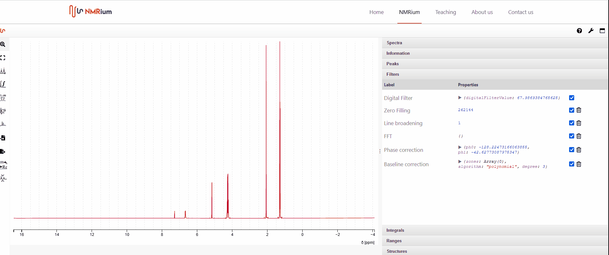

# Processings

To see all processing steps that were applied, e. g. base line correction or phase correction, click onto  **Processings** in the expandable panel. 

To hide a filter, the corresponding filter must be deactivated. Remove the check mark in the corresponding line. To reactivate the filter, press the check mark again. You can deactivate several filters at the same time by removing several checkmarks. 

To delete a filter, click onto the corresponding recycle bin icon. A window will open. Click onto **yes**, if you just want to delete the filter for the opened spectrum or click onto **yes, for all spectra** to delete the filter for all spectra. If you want to cancel the action, press **no**.

