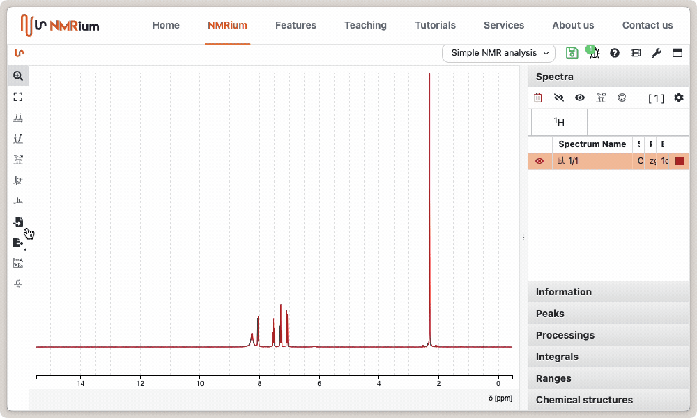
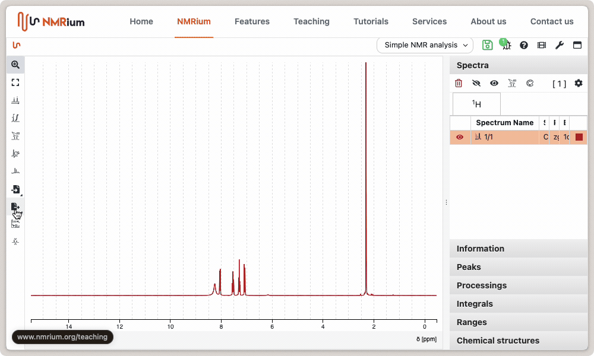

# Save and Export

## Save Data

The analyzed spectra can be saved as a NMRium file (text file) for further processing. Click the export button and then select the **save as** (NMRium) button. There are several possibilities to choose how to save the data:

- compressed
- pretty format
- include data

Select the desired settings and click save.

## Save as an Image

NMRium allows to save the analyzed spectra as images using either the [PNG (Portable Network Graphics)](https://en.wikipedia.org/wiki/PNG) format or the [SVG (Scalable Vector Graphics)](https://en.wikipedia.org/wiki/SVG). SVG is the best format for publications and can be further reprocessed using application like the free application [Inkscape](https://inkscape.org/).

In order to export as PNG, click on the export button and then select the `Export as PNG` option in the drop-down menu. A new window will appear. Depending on your preferences, you will be prompted for a destination or your image will be saved directly to the disk. This PNG can be directly imported into your reports or presentations.

In a similar way you can save as SVG.

## Copy directly to the clipboard

The fastest way to create your reports is to copy the PNG image directly to the clipboard. This can be achieved through the export menu by selecting the option `Copy image to clipboard`.

:::tip Copy to clipboard using shortcuts

If your mouse pointer is over the spectrum, you can simply press <kbd>CTRL</kbd> + <kbd>c</kbd> to copy it as a PNG image and paste it into other software. Please note that this functionality is only available in Chrome and Edge.

:::
