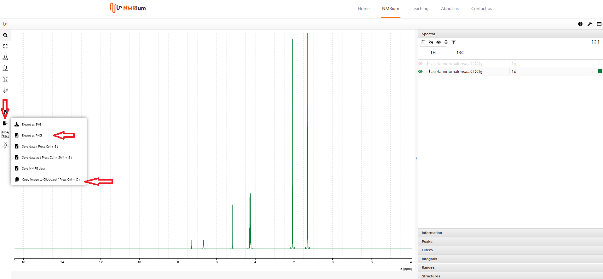
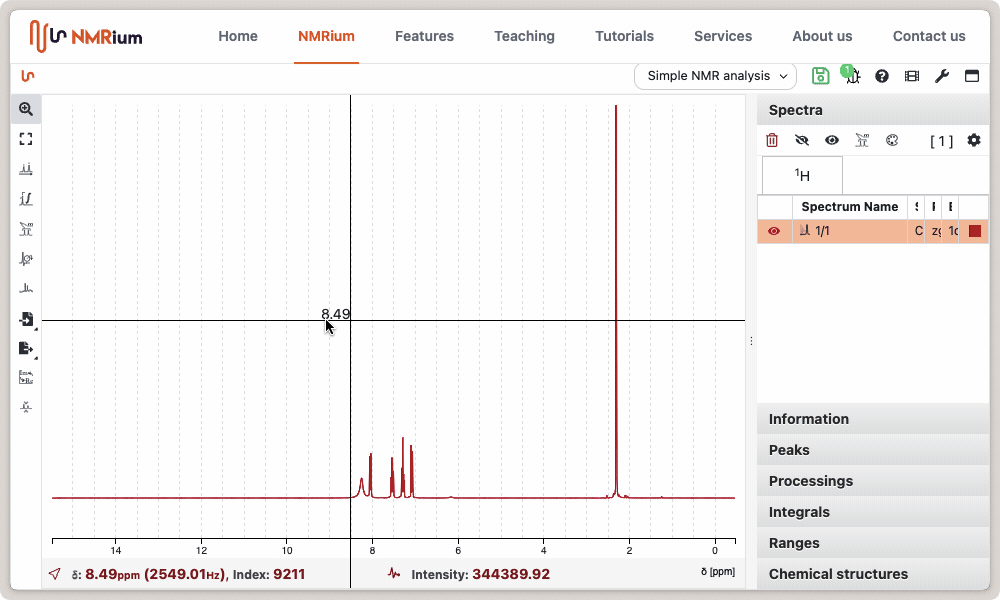
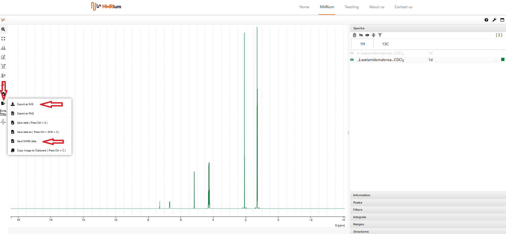

# Save and Export

## Save Data

The analyzed spectra can be saved as NMRium file (text file) for further processing. Click the export button and then select the save as (NMRium) button. There are several possibilities to choose how to save the data:

- compressed
- pretty format
- include data

Select the desired settings and click save.

## Save an Image

The analyzed spectra can be saved as an image file (png). Click the export button and then select the export as png button in the opening window. A new box will appear. Click **ok**, if you want to continue the process. The spectrum is opened as a png file which you which you can afterwards save on your computer. You can also click copy image to clipboard. An image file will also be saved to the clipboard. Afterwards, you can paste the image into a Word document, for example.

## Export

There are two possibilities to save the data. One possibility is to save the spectrum as an svg file in vectorial format. This format allows to save the spectrum in a high resolution. Click the export button and then select the export as svg button in the opening window.
Another possibility is to save an analyzed spectrum as NMReDATA. To do this, also click the export button and select the save NMRE data button.

