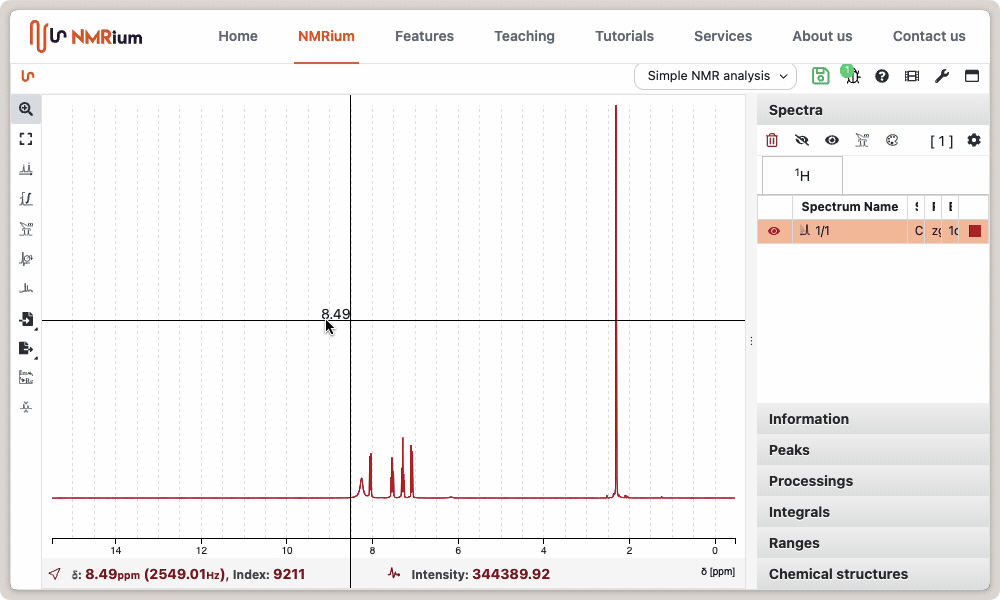
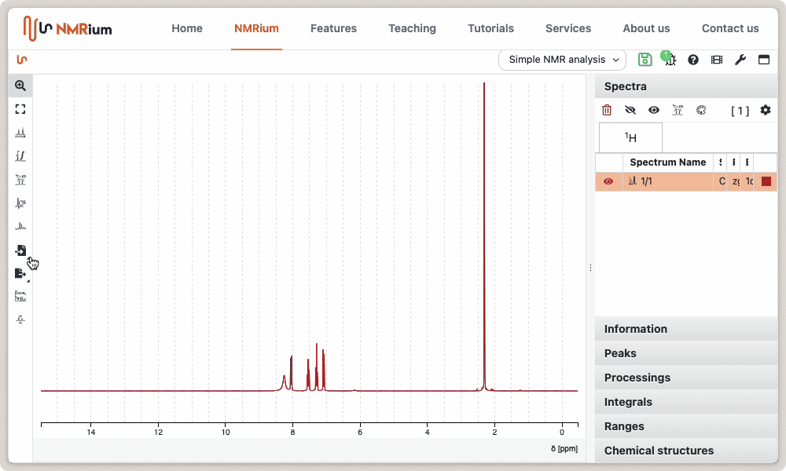
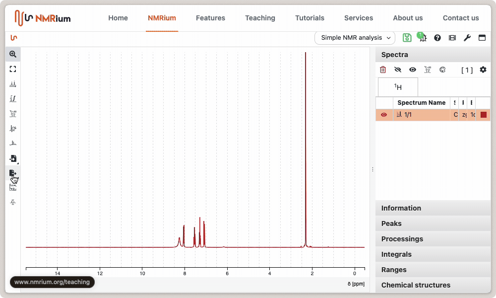

# Save and Export

## Save Data

Analyzed spectra can be saved as an NMRium archive (`.nmrium.zip`) for further processing. The archive is a ZIP-based container that preserves the original data along with all processing and annotations — see [NMRium File Format](/help/nmrium_zip) for details. Click the export button and then select the **Save as** (NMRium) option. Several settings control how the data is saved:

- compressed
- pretty format
- include data

Select the desired settings and click **Save**.

## Save as an Image

NMRium can save the analyzed spectra as images in either [PNG (Portable Network Graphics)](https://en.wikipedia.org/wiki/PNG) or [SVG (Scalable Vector Graphics)](https://en.wikipedia.org/wiki/SVG) format. SVG is the best format for publications and can be further edited with tools such as the free [Inkscape](https://inkscape.org/).

To export as PNG, click the export button and select **Export as PNG** in the drop-down menu. A new window appears. Depending on your preferences, you will be prompted for a destination, or the image will be saved directly to disk. The resulting PNG can be inserted directly into your reports or presentations.

Saving as SVG works the same way.

## Copy directly to the clipboard

The fastest way to create your reports is to copy the PNG image directly to the clipboard. This can be achieved through the export menu by selecting the option `Copy image to clipboard`.

:::tip Copy to clipboard using shortcuts

When the mouse pointer is over the spectrum, press <kbd>Ctrl</kbd> + <kbd>c</kbd> to copy it as a PNG image and paste it into other software. This shortcut is currently available only in Chrome and Edge.

:::
