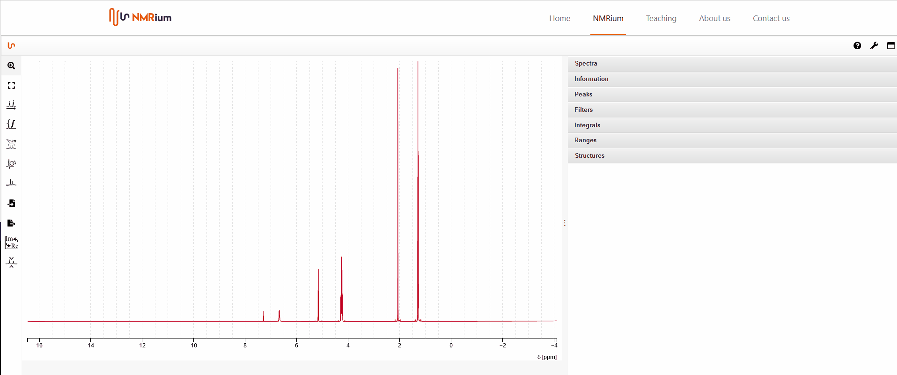

# Change the Colors

If you want to change the color of a spectrum, click on the panel **spectra** in the expandable menu. You can change the color of the spectrum by clicking the colored square in the line for the spectrum. In the appearing window, you can select a different color. To finish the process, click with the mouse anywhere on the workspace. For 2D spectra, you have the option to change both the colour of the positive part and the colour of the negative part. 

