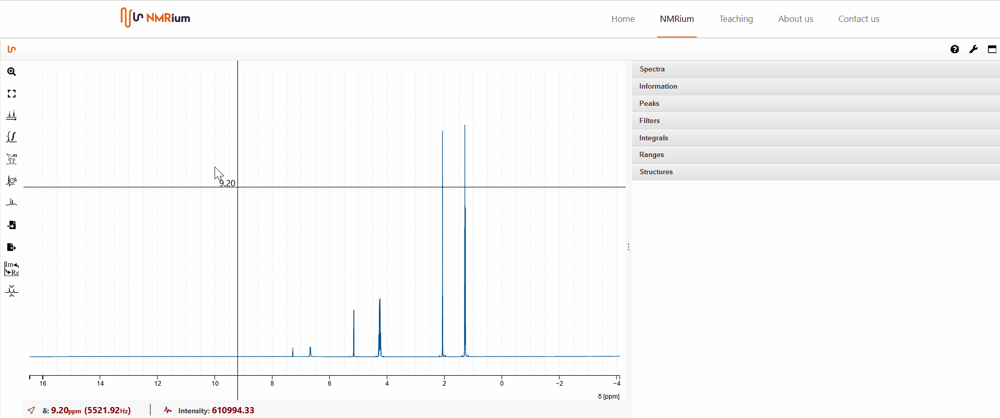
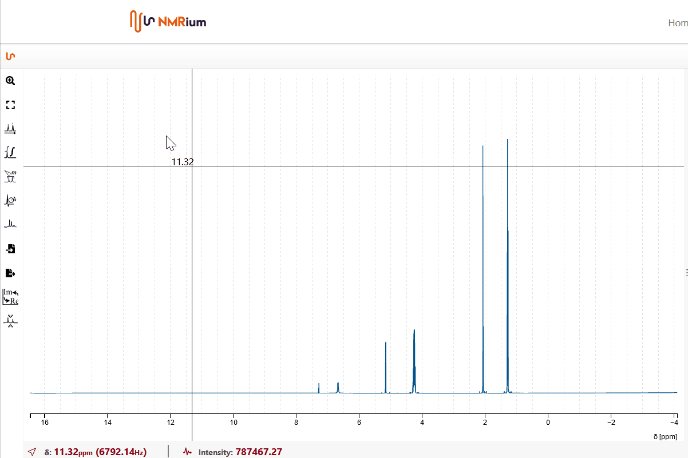
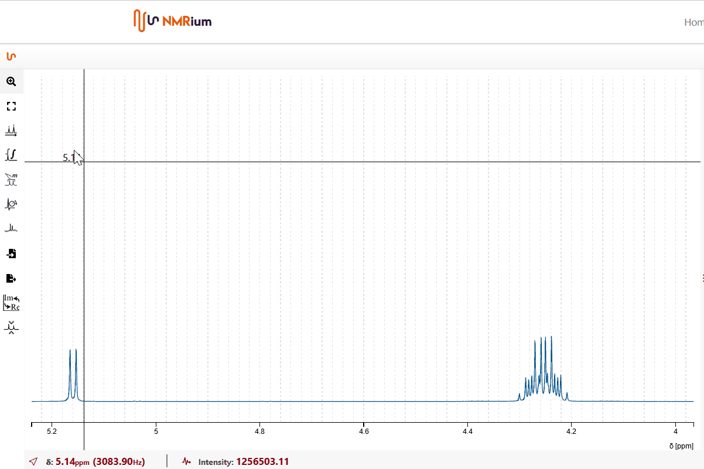

# Zoom Mode

## Screen

When you open the software, the left side of the screen shows the workspace where you can see and edit the spectra. On the right side of the screen, you will see the panels. The panels disappear when you click twice onto their frame. To make the panels reappear, double-click onto the frame of the workspace.

When you click on a panel, it opens. You can open several panels at the same time. To close a panel, click on the corresponding panel again. If several panels are open and you want to close all but one panel, click twice onto the corresponding panel.

## General Zoom

### Zoom in and out

To zoom in on the spectrum, activate **zoom** by clicking onto the zoom button in the toolbar on the left-hand side. Click onto the section with the left mouse button, drag the mouse to highlight the section and release the mouse button. To zoom in on the spectrum again, click on the section with the left mouse button, drag the mouse to highlight the section and let go of the mouse button.

By double-clicking, you will return to the previous zoom. If you double-click again, you will return to the full spectrum. NMRium remembers all zoom levels.

If you click onto the icon "zoom out" once, the horizontal scaling is zoomed out. If you click on the icon "zoom out" twice, the horizontal and vertical scaling will be zoomed out.

### Esc to go back to zoom

If you press **esc** on the keyboard the program goes back to the zoom. 

### Scroll wheel

If you use the scroll wheel of your mouse in zoom mode, you change the amount of your signals (vertical zoom).

## Display Chemical Shift and Intensity of a Peak

If you are in zoom mode and moving the mouse over the spectrum, you will see a crosshair. If you move it over a signal, the chemical shift is displayed in ppm. At the bottom of the spectrum, you can see the chemical shift in ppm and Hz and the intensity of the signal. 

## Determination of the Distance between two Peaks

Coupling constants can be determined by moving the mouse to a signal in zoom mode. Press the left mouse button and the shift key at the same time, keep both pressed and move the mouse to a second signal. At the bottom of the spectrum, in addition to the mean chemical shift of both signals and the intensity, the coupling constants are displayed in ppm and Hz. 

