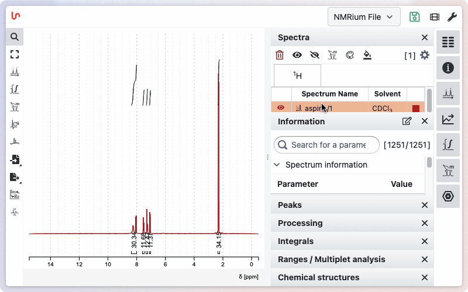

# Workspaces

Not every user needs the same functionalities in **NMRium**.  
Some may simply want a quick look at a spectrum, while others may need to:

- Fully assign a new molecule
- Determine the kinetics of a reaction
- Perform qNMR
- Analyze metabolomics NMR spectra
- Search in a reference database
- Conduct quality control (QC)

Each use case requires different tools. To avoid overwhelming users, NMRium introduces the concept of a **workspace** — a customizable set of preferences that controls which features are visible or enabled.

Workspaces can adjust settings such as:

- Available tools
- Number of displayed digits
- Copy/export resolution
- Presence of a title block
- Visible columns in panels

Settings can be customized for each panel using the graphical interface (such as resizing the column dedicated to panels), as well as from the general preferences, where you can define which panels are visible and which tools are available.

Panels have 4 options:

Panel visibility can be customized with four options:

- **Hidden**: The panel is completely inaccessible in this workspace.
- **Available**: The panel is hidden by default, but an icon appears in the right toolbar to toggle it on.
- **Visible**: The panel is present but closed; users can open it as needed.
- **Open on load**: The panel is immediately visible and open when the workspace loads.

You can also select which tools are available in your workspace, tailoring the interface to your needs.

## Default workspaces

By default, NMRium provides three ready-to-use workspaces:

1. **Simple NMR Analysis**  
   Useful for teaching and explaining principles such as integration and peak identification.

2. **1D Multiple Spectra Analysis**  
   Designed to compare and superimpose multiple spectra simultaneously.

3. **NMR Spectra Assignment**  
   Optimized for structure assignment.

## Customizing Workspaces

When you change settings, a **green save icon** will appear.  
This indicates that modifications were made compared to the current workspace.

- If the workspace is **custom**, you can save changes directly.
- If it is a **default workspace**, you must save it under a **new name**.

:::info

All workspaces are saved **locally in your browser**. However it is possible to save and share workspace

:::

## Workspace Management

From the **General Preferences** menu, you can:

- Reset to the currently saved settings
- Rename a workspace
- Suppress a workspace

## Saving and sharing workspaces with colleagues

Workspaces can also be exported using **Save As**.  
If you select **Include workspace** (while avoiding data inclusion), you can generate a shareable file containing your workspace preferences.
