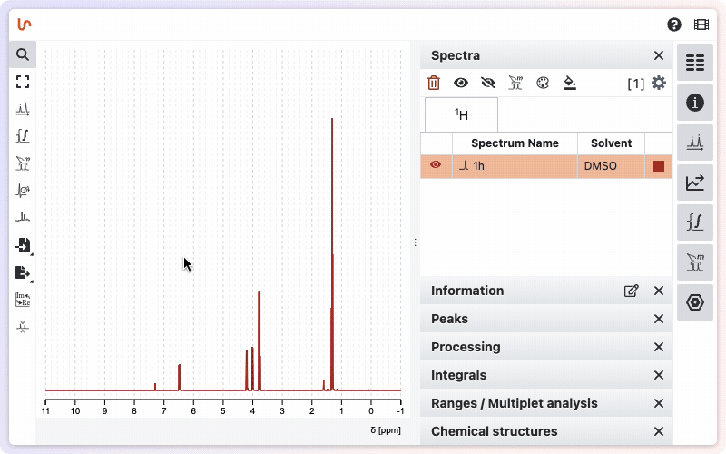

# Help

NMRium offers several ways to get help and learn about its features:

- Contextual tooltips provide quick guidance throughout the application. Many of them contain a direct link to more detailed explanations.
- Click the question mark icon on the right side of the screen to open the documentation in a new tab.
- For video tutorials, press the movie icon to visit our YouTube channel with detailed guides and feature explanations.

