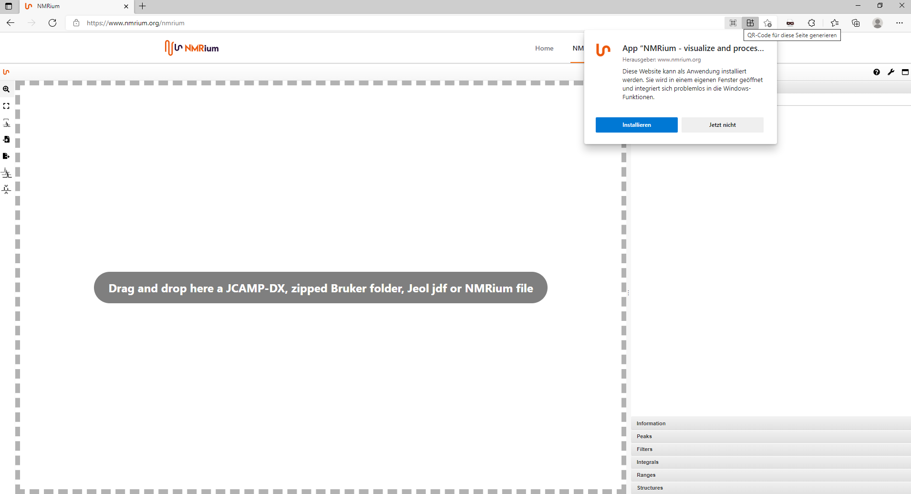

# Local Installation

NMRium can be saved as a local program on the computer. This function is only possible with the Edge or Chrome browsers. To download the app, open the NMRium page. To the right of the address bar you can click the **Create QR Code** button. The app will be installed directly on your local computer. You can edit and save your spectra offline with this app. 

          
