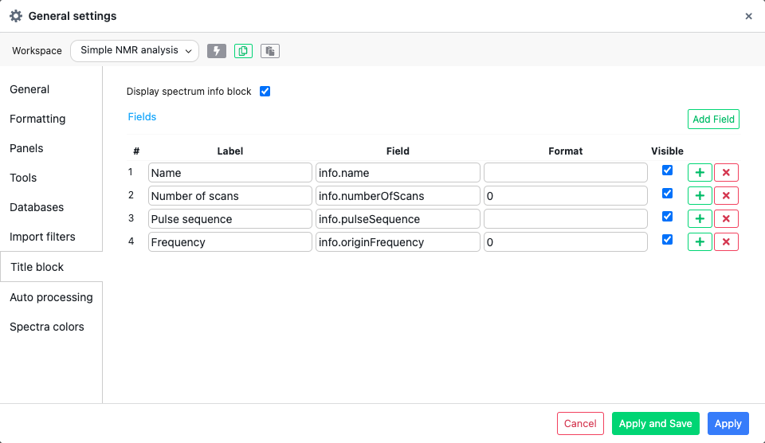
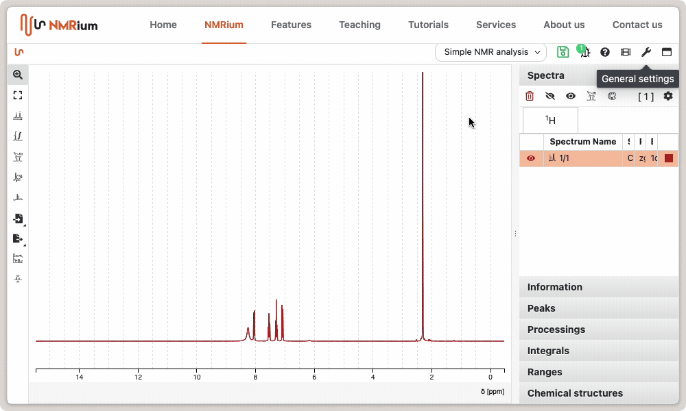

# Title Block

Sometimes, it may be required to display the acquisition parameters directly on the spectrum. This can be achieved through the `General settings`.

Select the `Title Block` tab and check the box `Display spectrum info`.

You are also able to fully customize the fields you would like to display.

This involves adding any parameter present in the experiment, such as solvent, pulse sequence, etc.
