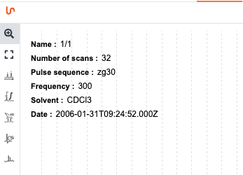
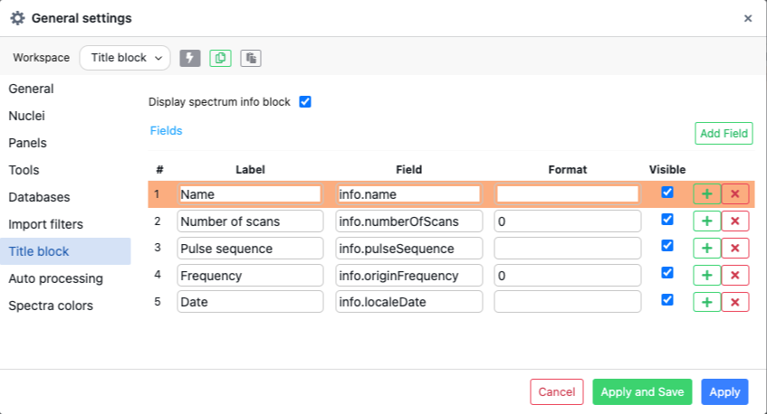
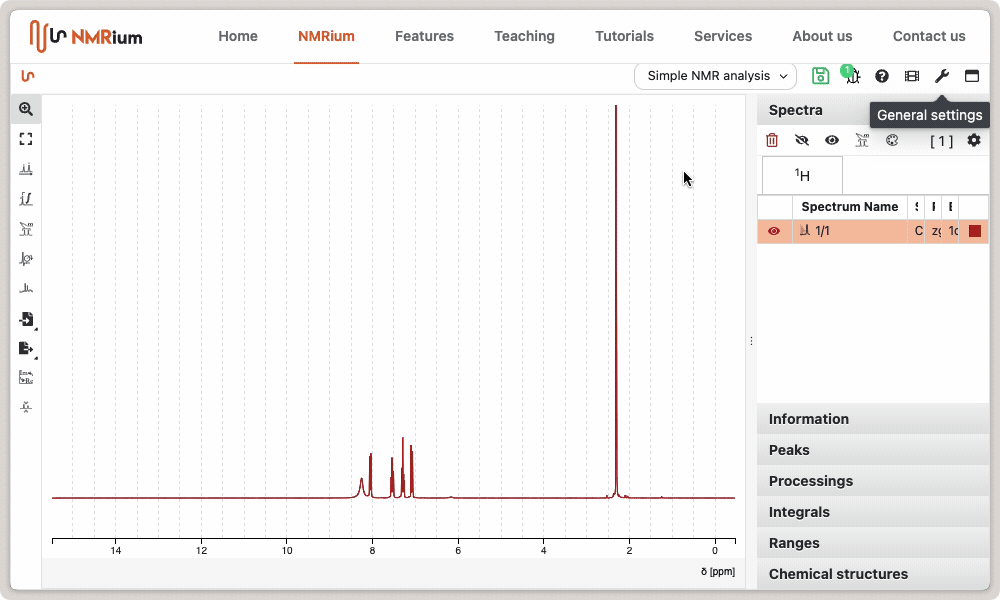
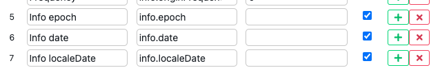
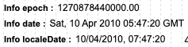
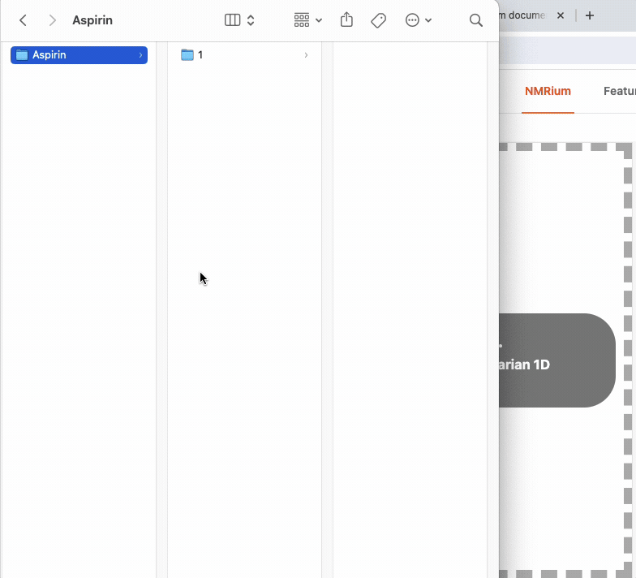

# Title Block

Sometimes, it may be required to display the acquisition parameters directly on the spectrum. This can be achieved through the `General settings`.

Select the `Title Block` tab and check the box `Display spectrum info`.

You are also able to fully customize the fields you would like to display.

This involves adding any parameter present in the experiment, such as solvent, pulse sequence, etc.

:::tip Various dates

In the field `info` we have 3 different dates:

- `info.localeDate`, the representation of the date based on your local preferences
- `info.date`, the GMT date
- `info.epoch`, the number of elapsed milliseconds since January 1, 1970

Here is an example on how those 3 fields are rendered:

:::

## Getting the name correct

The `info.name` is extracted from the filename that is being loaded in NMRium. If you have Bruker folder you should not drag / drop the folder containing the experiment (like `1` for example) but the parent folder of the experiment.

