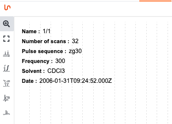
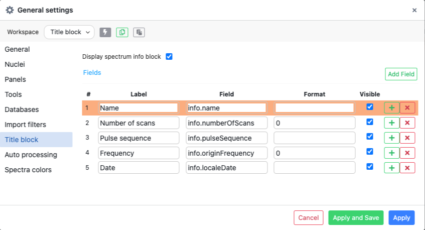
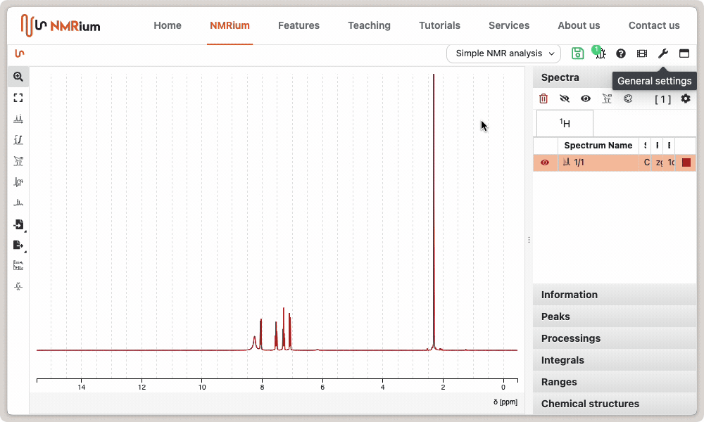
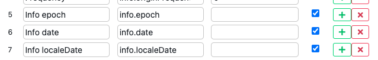
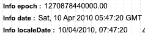
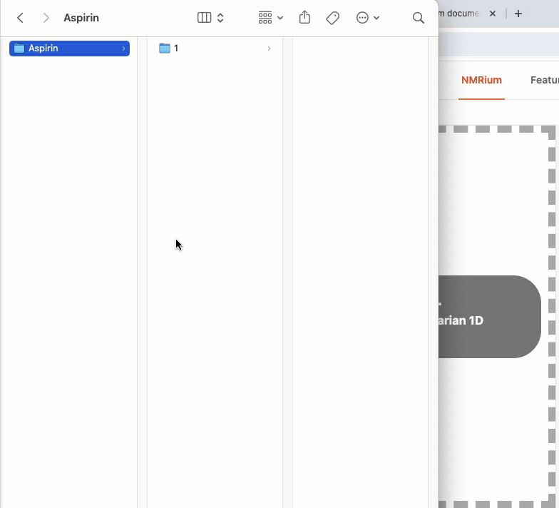

# Title Block

Sometimes, it may be required to display the acquisition parameters directly on the spectrum. This can be achieved through the `General settings`.

Select the `Title Block` tab and check the box `Display spectrum info`.

You are also able to fully customize the fields you would like to display.

This involves adding any parameter present in the experiment, such as solvent, pulse sequence, etc.

:::tip Various dates

The `info` field contains three different dates:

- `info.localeDate` — the date formatted according to your local preferences
- `info.date` — the GMT date
- `info.epoch` — the number of milliseconds elapsed since January 1, 1970

Here is an example of how those three fields are rendered:

:::

## Getting the name correct

The `info.name` is extracted from the filename being loaded into NMRium. For Bruker folders, do not drag and drop the folder containing the experiment (e.g. `1`) — drag and drop its parent folder instead.

