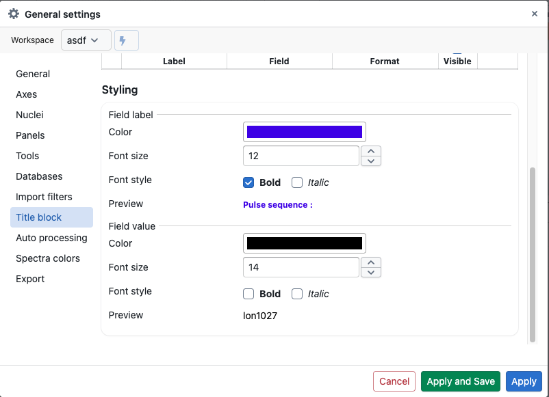

# Title Block

Sometimes, it may be required to display the acquisition parameters directly on the spectrum. This can be achieved through the `General settings`.

Select the `Title Block` tab and check the box `Display spectrum info`.

You are also able to fully customize the fields you would like to display.

This involves adding any parameter present in the experiment. Commonly used fields include:

- `info.nucleus` — observed nucleus (e.g. `1H`, `13C`)
- `info.frequency` — spectrometer frequency in MHz
- `info.name` — sample name derived from the filename
- `info.experiment` — experiment type (e.g. `COSY`, `HSQC`)
- `info.solvent` — solvent used
- `info.pulseSequence` — pulse sequence name

:::tip Various dates

The `info` field contains three different dates:

- `info.localeDate` — the date formatted according to your local preferences
- `info.date` — the GMT date
- `info.epoch` — the number of milliseconds elapsed since January 1, 1970

Here is an example of how those three fields are rendered:

:::

## Styling

The **Styling** section in **General settings → Title block** lets you control the appearance of both the field labels and the field values independently.

| Property | Field label | Field value |
|----------|-------------|-------------|
| Color | Yes | Yes |
| Font size | Yes | Yes |
| Bold | Yes | Yes |
| Italic | Yes | Yes |

A live **Preview** is shown for each group, so you can judge the result before clicking **Apply**.

## Getting the name correct

The `info.name` is extracted from the filename being loaded into NMRium. For Bruker folders, do not drag and drop the folder containing the experiment (e.g. `1`) — drag and drop its parent folder instead.

