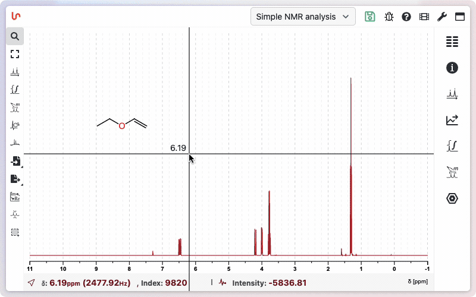

# Display Customization

NMRium provides fine-grained control over the visual appearance of spectra, making it possible to produce publication-ready exports directly from the interface — no post-processing in a graphics editor required.

All options described on this page are available from the **General settings** panel.

## Axis

### Typography

You can set the font size and toggle bold and italic independently for each axis. This lets you match the typographic requirements of a specific journal, conference poster, or institutional template before exporting.

- **Font size** — set the point size for axis labels and tick values
- **Bold** — apply bold weight to axis text
- **Italic** — apply italic style to axis text

Changes are reflected instantly in the spectrum view and carried through to every export (SVG, PNG, or clipboard).

### Grid lines

Major and minor grid lines can each be shown or hidden separately. When enabled, each grid level can be customized for both 1D spectra and 2D contour maps:

| Option | Major grid | Minor grid |
|---|---|---|
| Show / hide | Yes | Yes |
| Color | Yes | Yes |
| Line width | Yes | Yes |
| Line style | Yes | Yes |