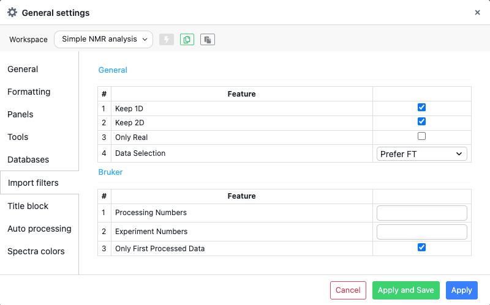
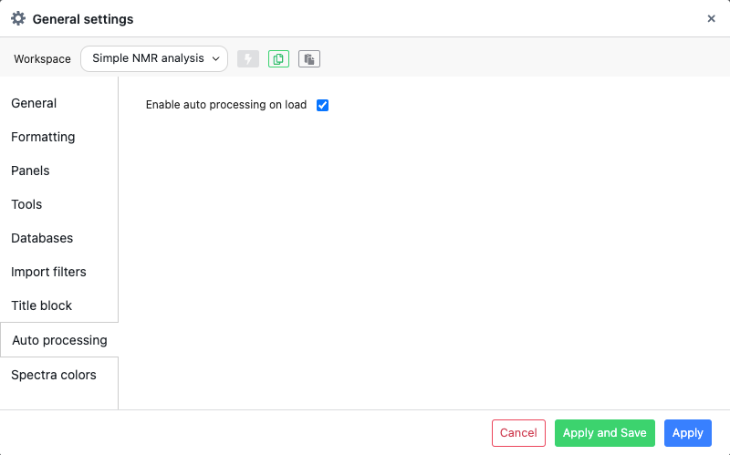
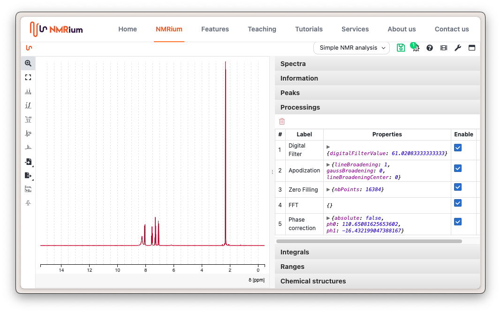

# Loading a Spectrum

Spectra can be loaded by either drag and drop or by opening a file from the file system. <kbd>CTRL</kbd><kbd>o</kbd>

## Supported file formats

The following formats are currently supported:

| Format       | Extension |
| ------------ | --------- |
| JCAMP-DX     | .jdx, .dx |
| Bruker files |           |
| Jeol files   | .jdf      |
| Varian       |           |
| molfile      | .mol      |

Drag the file you want to open into the grey box **Drag and drop here** in the middle of the screen. You can open a set of spectra of a molecule by either dragging the spectra individually or by dragging a folder containing all spectra into the workspace. `.zip` or `.gz` files will automatically be decompressed and loaded.

You can load a spectrum by clicking the button **Import** on the toolbar on the left side of the workspace. Then click **Import from file system**. The folder will open. Search for the file you want to open and click on it. Then click the button **Open**. The files will be opened.

## Autoprocessing

By default NMRium will keep all the 1D and 2D spectra. In case both FID and after FT spectra are available, NMRium will load by default the spectrum after FT. This can be change at the level of the general preferences.

If the spectrum is a FID and if auto processing is enabled in the General Preferences, NMRium will try to process FID.

For 1D spectra spectrum it implies:

- Apodization
- Zero filling
- Fourier transofrm
- Phase correction

:::tip Automatic phase correction

When loading an FID, sometimes processing parameters are available. For instance, in the case of a Bruker experiment,
a `pdata` folder may be available, but the `1r` and `1i` files may not be. NMRium will, in this case, try to extract
PH0 and PH1. If those values are not available or both equal to 0, automatic phase correction will be applied. Otherwise, the stored values will be applied.

:::
