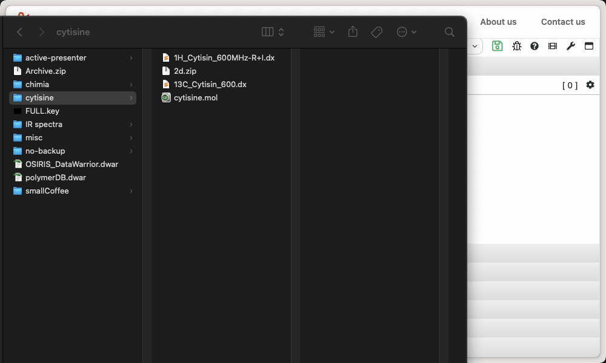

# Loading a Spectrum

Spectra can be loaded either by drag and drop a file on NMRium or by opening a file from the
file system <kbd>CTRL</kbd><kbd>o</kbd>

## Supported file formats

The following formats are currently supported:

| Format       | Extension | Remarks                               |
| ------------ | --------- | ------------------------------------- |
| JCAMP-DX     | .jdx      |
| Bruker files | .zip      | The full folder need to be compressed |
| Jeol files   | .jdf      |
| NMReData     |           |

Drag the file you want to open into the gray box **Drag and drop here** in the middle of the screen. You can open a set of spectra of a molecule by either dragging the spectra individually into the workspace or by dragging a zip folder containing all spectra. Also, you can open several spectra at once in the Bruker folder structure as a zip file.

