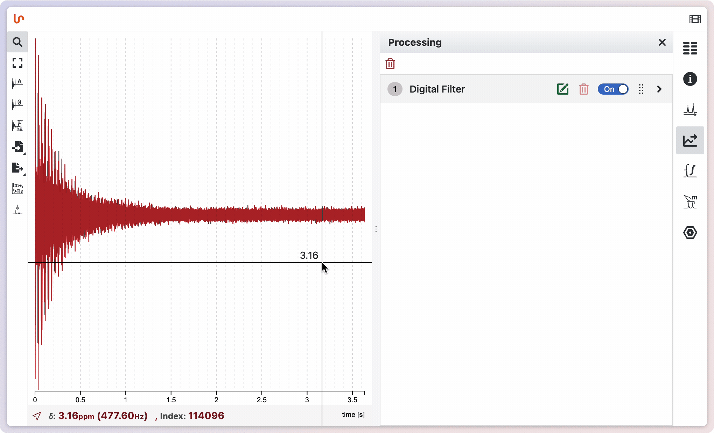

# Apodization

To perform apodization in NMRium, press the shortcut key <kbd>a</kbd> to open the Apodization / Window Functions Editor. By default, you’ll see an option at the top of the screen to set line broadening. A green line will display the apodization function that will be applied to the FID. You can choose to preview the processed FID by toggling the checkbox labeled Preview.

