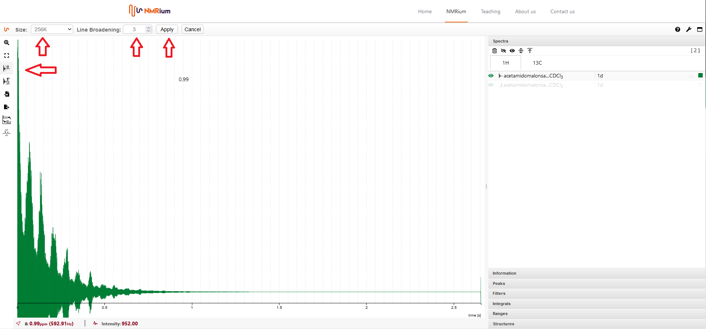

# Preprocessing the FID

## Zero filling

To prepare the FID for the Fourier transformation, click the zero filling icon to the left of the spectrum. You can choose the number of points and the filter line broadening. Then press the apply button.

