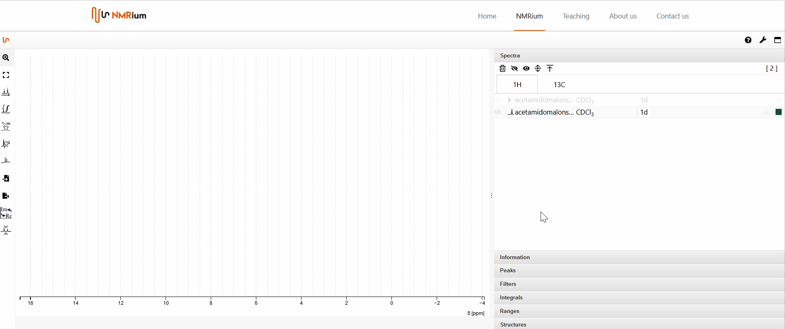

title: Preprocessing the FID

# Preprocessing the FID

## Zero filling

To prepare the FID for the Fourier transformation, click the button **Zero Filling** to the left of the spectrum. You can choose the number of points (**Size**) and the filter **Line broadening**. Then press the button **Apply**.

:::tip **Size** and **LB** values

If you are unsure which values to set, you can use the following recommendations as a reference:

**Size**: Choose twice as many points as in the original FID.

**Line Broadening (LB)**: Specify 0.3 Hz for ¹H spectra and 1-3 Hz for ¹³C.

:::

