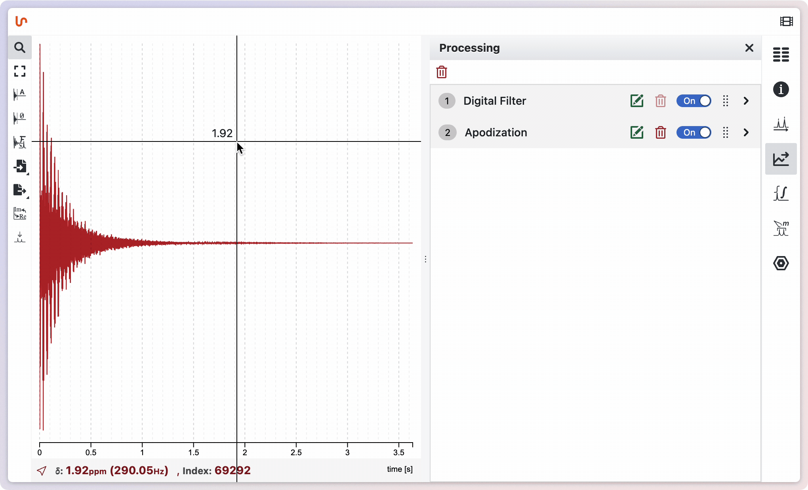

# Zero filling

To prepare the FID for Fourier transformation using zero filling, click the Zero Filling button located to the left of the spectrum. You can specify the number of points to extend the FID size. Once configured, click Apply to perform zero filling.

:::tip **Size** and **LB** values

If you are unsure which values to set, you can use the following recommendations as a reference:

**Size**: Choose twice as many points as in the original FID.

**Line Broadening (LB)**: Specify 0.3 Hz for ¹H spectra and 1-3 Hz for ¹³C.

:::
