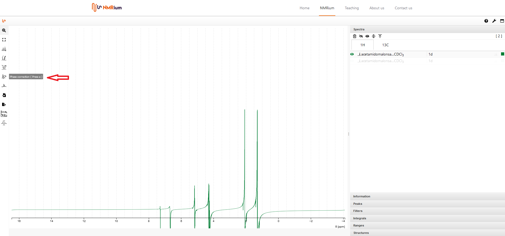

# Phase Correction

Click the Phase correction icon to the left of the spectrum. You can choose between manual, absolut and automatic phase correction.

## Manual

You can perform zero-order and first-order phase correction.

For zero-order phase correction, move the pivot point (red line) by one click anywhere in the spectrum and select the highest peak. Then click and hold the green PH0 button above the spectrum. By moving the mouse to the left or right, you can perform phase correction until the signal is correctly phased and release the button.

The first order phase correction is performed analogously by pressing PH1. The focus should be on the signals that are as far away as possible from the signal under the pivot point. Clicking the Apply button completes the phase correction.

:::tip **Size** and **LB** values

If you are not sure which values to set, you can use the following recommendations as a reference:

**Size**: Choose twice as many points as in the original FID.

**Line Broadening (LB)**: Specify 0.3 Hz for ¹H spectra and 1-3 Hz for ¹³C.

:::

## Automatic

Select the Automatic Phase Correction and click the Apply button, the phase will be corrected automatically.

## Absolute Value

Select the Absolut Phase Correction and click the Apply button, the phase will be corrected automatically.
