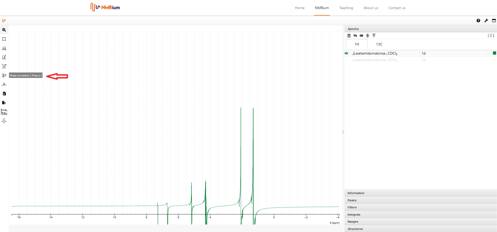
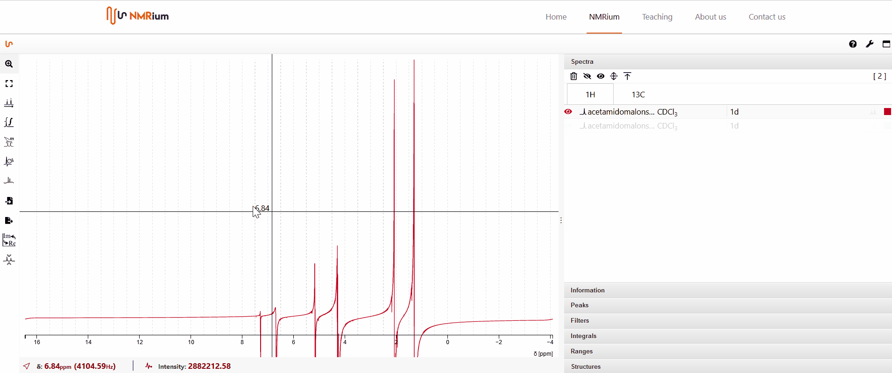

# Phase Correction

Click the **Phase correction** icon to the left of the spectrum. You can choose between **manual**, **absolut** and **automatic** phase correction.

## Manual

You can perform zero-order and first-order phase correction.

For zero-order phase correction, move the pivot point (red line) by one click anywhere in the spectrum and select the highest peak. Then click and hold the green **PH0** button located above the spectrum. By moving the mouse to the left or right, you can perform phase correction until the signal is correctly phased. Then let go of the button.

The first order phase correction is performed in an analogous manner by pressing  **PH1**. The focus here should be on the signals furthest away from the signal under the pivot point. Clicking the Apply button completes the phase correction.

## Automatic

Select the **Automatic** Phase Correction and click the green **Apply** button. The phase will be corrected automatically.

## Absolute Value

Select the **Absolut** Phase Correction and click the green **Apply** button. The phase will be corrected automatically.
