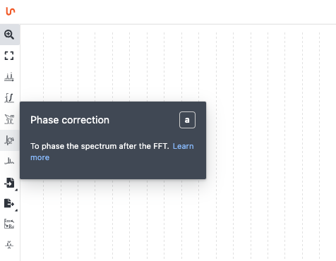
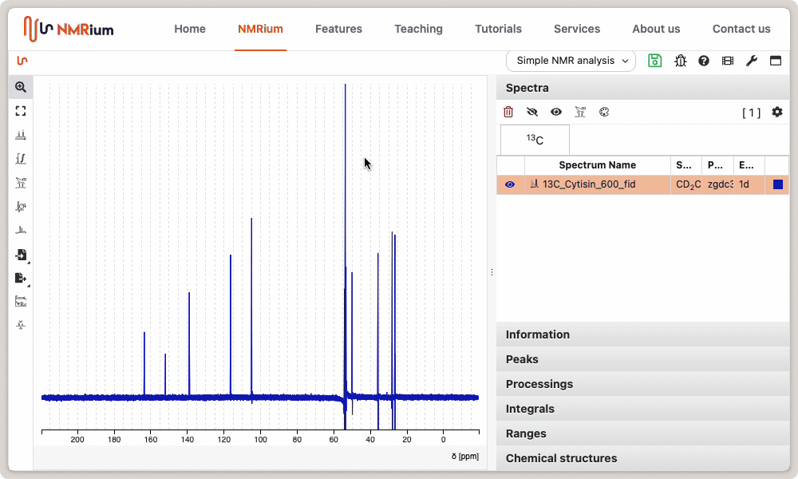
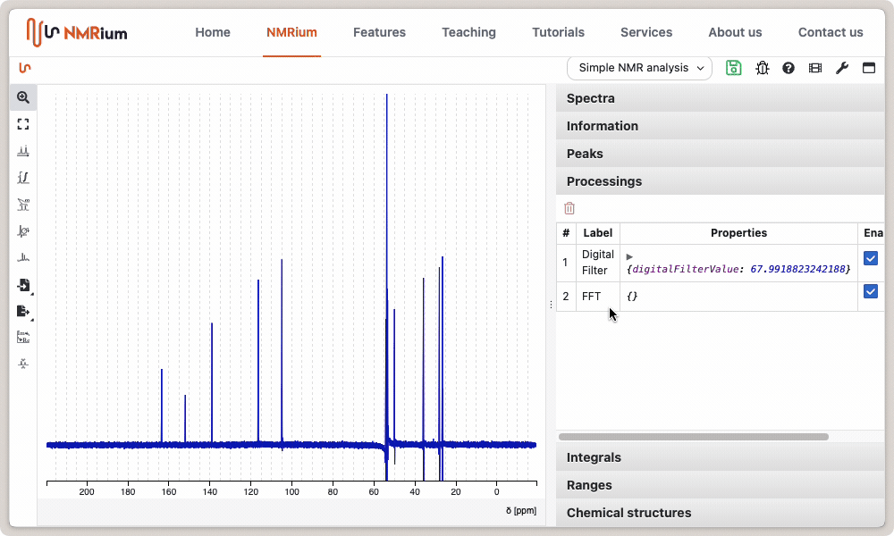

# Phase Correction

Click the **Phase correction** icon to the left of the spectrum. You can choose between **manual**, **absolut** and **automatic** phase correction.

## Manual

You can perform zero-order and first-order phase correction.

Generally, you will select a pivot point (red line) by holding SHIFT and clicking on a peak. Most of the time, you will select a large peak on an extremity of the spectrum.

For zero-order phase correction, click and hold the green **PH0** button located above the spectrum. By moving the mouse to the left or right, you can perform phase correction until the signal at the level of the pivot is correctly phased.

First-order phase correction is performed in an analogous manner by pressing **PH1**. The focus here should be on the signals furthest from the signal under the pivot point.

Clicking the Apply button completes the phase correction.

## Automatic

Select the **Automatic** Phase Correction and click the green **Apply** button. The phase will be corrected automatically. It case it fails you can still correct it manually.

## Absolute Value

Select the **Absolute** Phase Correction and click the green **Apply** button.
