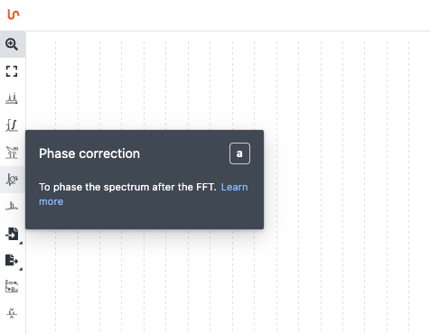
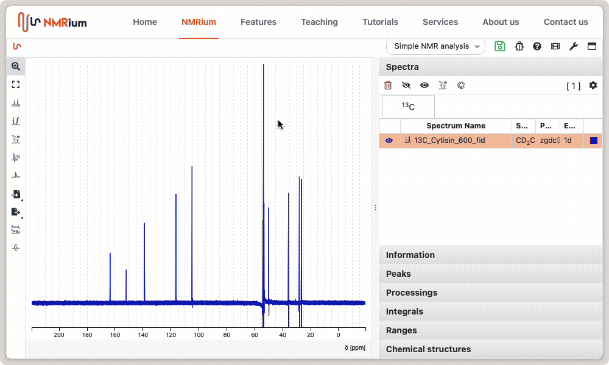
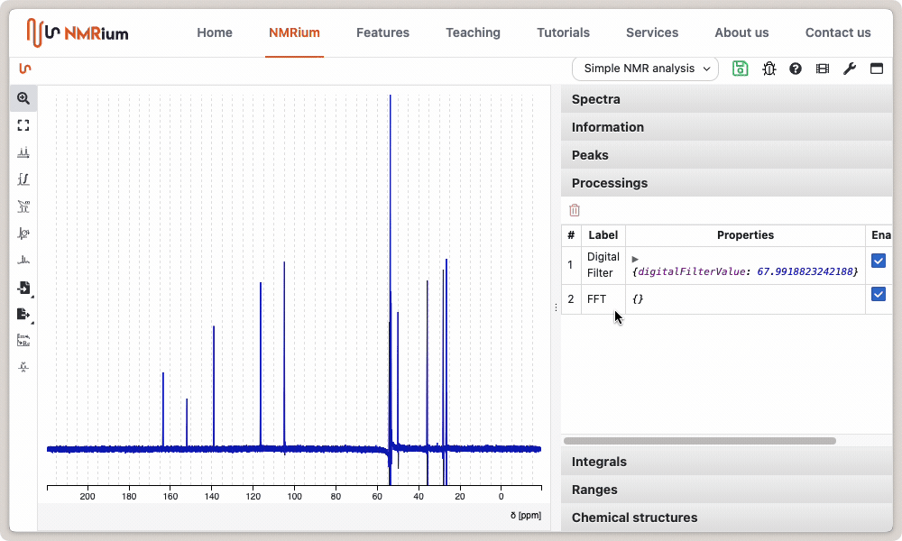

# Phase Correction

Click the **Phase correction** icon to the left of the spectrum. You can choose between **manual**, **absolute**, and **automatic** phase correction.

## Manual

You can perform zero-order and first-order phase correction.

Start by selecting a pivot point (red line) — hold <kbd>Shift</kbd> and click on a peak. Usually you pick a large peak at one extremity of the spectrum.

For zero-order phase correction, click and hold the green **PH0** button located above the spectrum. Move the mouse left or right until the signal at the pivot is correctly phased.

First-order phase correction works the same way via the **PH1** button. Focus on the signals furthest from the pivot point.

Click **Apply** to complete the phase correction.

## Automatic

Select **Automatic** phase correction and click the green **Apply** button. The phase will be corrected automatically. If it fails, you can still correct it manually.

## Absolute Value

Select the **Absolute** Phase Correction and click the green **Apply** button.
