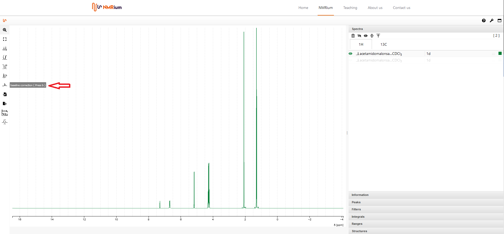
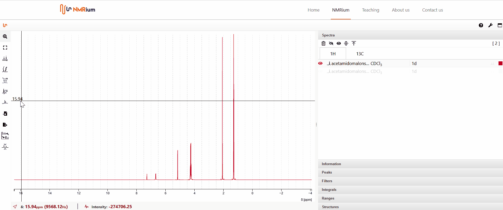
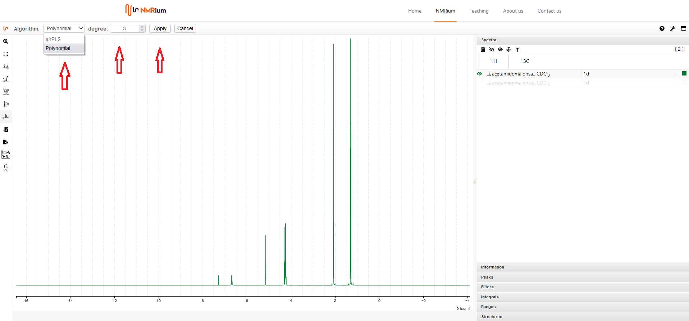

# Baseline Correction

Click the Baseline correction icon to the left of the spectrum. You can choose between two possible algorithms: **polynomial** and **AIR PLS**.

## Polynomial

To use the algorithm **polynomial**, you may define a degree and then click **apply**.

## airPLS

To apply the **airPLS** algorithm, you may define both maximum iteration and a tolerance range and then click **apply**.

