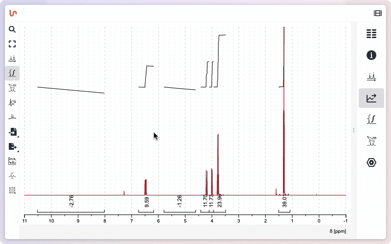

# Baseline Correction

Click the **Baseline correction** button to the left of the spectrum to enter baseline correction mode. Select one of five algorithms from the **Algorithm** dropdown, then place anchor points to define the noise regions before clicking **Apply**.

## Algorithms

| Algorithm | Description |
|-----------|-------------|
| **Cubic** *(default)* | Cubic spline through the anchor points |
| **Polynomial** | Polynomial fit through the anchor points |
| **Whittaker** | Whittaker smoother-based correction |
| **Bernstein** | Bernstein polynomial fit |
| **airPLS** | Adaptive iterative reweighted penalized least squares |

## Anchor points

Anchor points mark regions of the spectrum that contain only noise (i.e. no signal). The algorithm uses them to estimate the baseline.

| Action | How |
|--------|-----|
| Add an anchor point | Click anywhere on the spectrum |
| Move an anchor point | Click and drag it |
| Delete an anchor point | Hover over it, then press <kbd>Backspace</kbd> |

Place anchor points in flat, signal-free regions distributed across the spectral width to get an accurate baseline estimate.

## Centering the view

When you scale the spectrum vertically to inspect fine baseline details, press <kbd>c</kbd> to center the spectrum around zero. This makes it easy to see both the target zero level and the current estimated baseline together.

## Applying the correction

Once your anchor points are placed, click **Apply** to subtract the estimated baseline from the spectrum. Click **Cancel** to exit without making changes.
