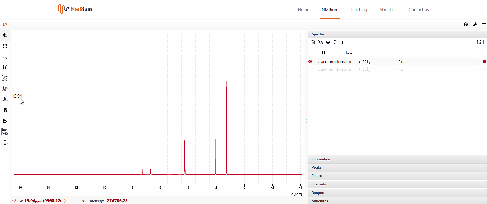
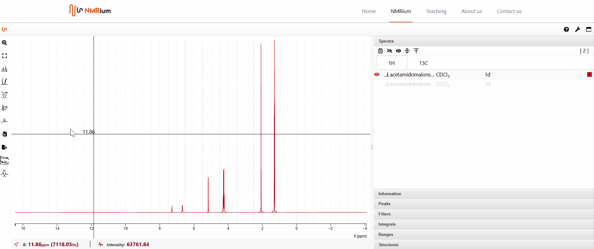

# Baseline Correction

Click the **Baseline correction** button to the left of the spectrum. You can choose between two algorithms: **polynomial** and **airPLS**.

## Polynomial

For the **polynomial** algorithm, define a degree and click **Apply**.

## airPLS

For the **airPLS** algorithm, define both a maximum iteration count and a tolerance range, then click **Apply**.

