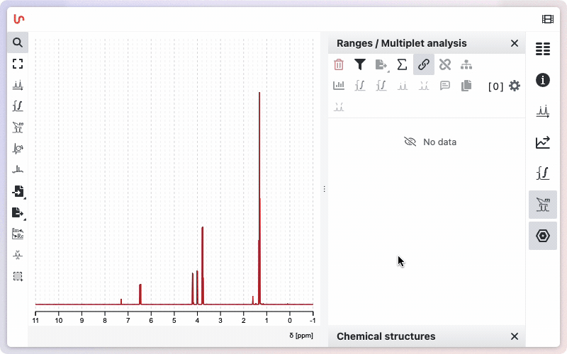
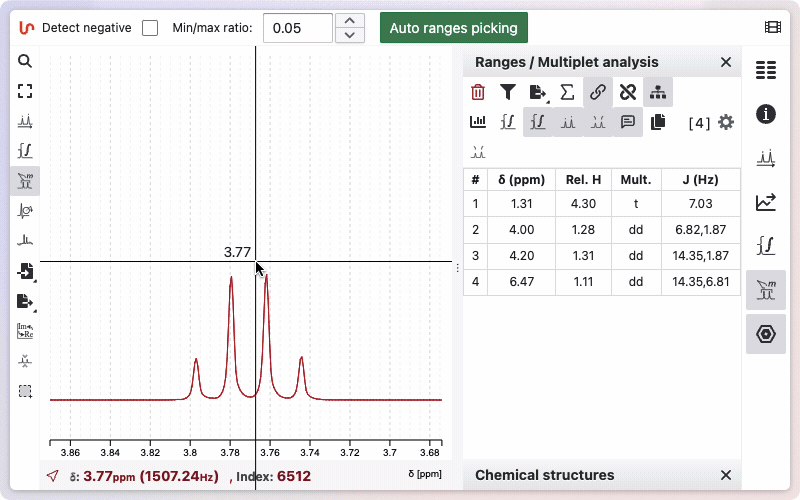
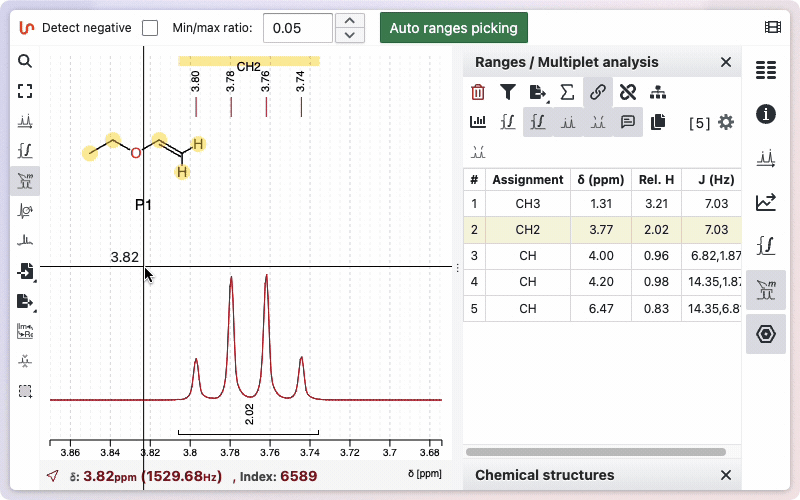
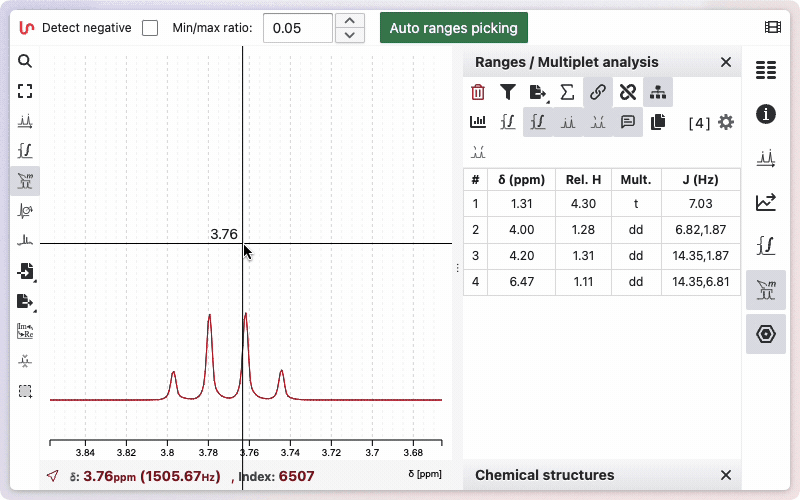
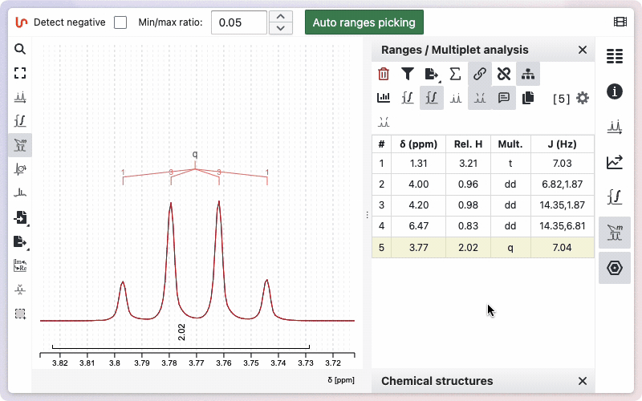
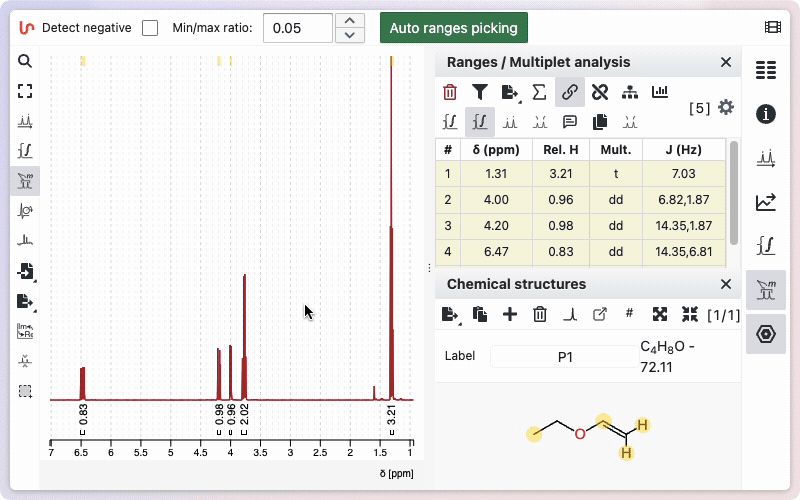
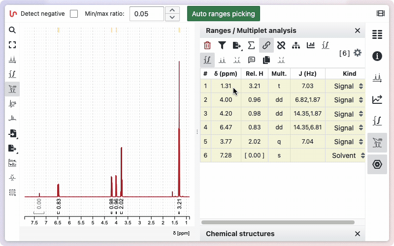
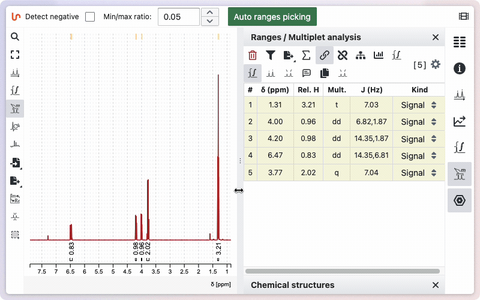
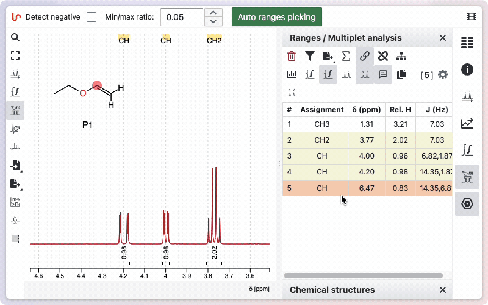

# Ranges / Multiplets / Peaks

For the analysis of NMR peaks, NMRium uses three levels. The top level is a **range** which corresponds to an integration zone and may contain one or more multiplets (**signals**). Each multiplet includes coupling constants and multiplicity information and is further associated with **peaks**.

## Auto ranges picking

NMRium can automatically detect integration zones (ranges) and determine their multiplicities.

- Open the Ranges Picking tool.
- If your spectrum contains negative signals, select the Detect negative checkbox.
- (Optional) Adjust the Min/Max ratio value to fine-tune the sensitivity of the detection.
- Click the Auto ranges picking button.

The detected ranges will appear in the Ranges panel on the right side of the workspace.

## Manual range picking

In some cases, you may prefer to perform manual **Range Picking**. After selecting the appropriate tool, draw a zone manually while holding down the Shift key. The system will then apply an internal algorithm that initially considers every multiplet as a doublet of doublets of doublets, and subsequently merges doublets if their coupling constants are sufficiently similar.

To delete a range, the fastest way is to hover over it and press the `Backspace` key. Alternatively, you can click the trash icon on the corresponding line in the range panel.

If you would like to see how the multiplicity was determined, hold the `Alt` key while drawing the zone. A new window will appear, displaying the different steps involved in removing doublets to determine the final multiplicity.

## Edit multiplets manually

While we continously improve the multiplicty analysis there are always some situation in which the multipliicty could not be accurately determined. In those cases you always have the possibility to manually edit the multiplicity. Editing manually is a little bit more challenging but you should be able to deal with all the situations.

### Multiplicity was not determined correctly

### There are overlapping multiplet (signals)

## Set the reference

There are several ways to set the reference in NMRium:

1. Using the range picking tool: Display the peaks, then double-click on a peak to assign a new reference value.
2. Using the range panel: Double-click on the reference value in the panel to edit and set a new value.

## Specify the sum of integrated protons

If a molfile exists, the default proton integration will correspond to the number of protons in the molecular formula. If no molecule is defined, the default sum is 100.

To change this sum manually, click on the sum symbol in the ranges panel. A window will open, giving you two options: enter the number of protons manually, or use the value from the sum formula. To enter the number manually, click the **Manual** button.

Type the desired number of protons in the corresponding field, then click **Set** to save. To use the number of protons from the sum formula, click the **Auto** button. The calculated value will be displayed; click **Set** to apply it.

To change the integration value for a specific range:

Open the ranges panel. Double-click on a relative integral to enter a new value. The total sum of protons will be updated accordingly.

## Range kind

Sometimes your sample may contain impurities or residual solvent. If you integrate these signals, their values will be included in the total sum of protons, which can affect the relative integrals of other ranges. To avoid this, you can specify the kind for a particular range. When marked as impurity or residual solvent, the integral value will appear in square brackets and will not be included in the calculation of the total sum of integrals.

## The toggles

Various toggle buttons are available to display integrals, peaks, the multiplicity tree, and other features.

### Multiplicity Tree

You can view the multiplicity trees of the signals. To use this function, click the "Show Multiplicity Tree in Spectrum" button. If you do not want the multiplicity tree to be displayed, click the button again.

### J-Graph

J-Graphs provide a visual representation of the coupling network between protons in an NMR spectrum. Based on the work of Damien Jeanneret, the J Graph displays each coupling constant (J value) of a signal as a node. If two multiplets share the same coupling constant, a horizontal line links them. The tolerance for matching coupling constants is specified in the settings of the range panel and is set to 0.2 Hz by default.

To view the J Graph for your signals, click the "Show J Graph" button. The graph will appear above the spectrum, with nodes representing signals and lines representing the coupling constants. If you do not want the J Graph to be displayed, click the button again to hide it.

This visualization is especially useful for understanding the structure of spin systems and for assigning signals in crowded regions of the spectrum.

### Show Integral

Two toggle buttons are available: one displays the integration as a line drawn on the spectrum, and the other shows the relative values below the spectrum.

You can view the integrals of the signals by clicking the "Show Integrals" button. Click the button again to hide the integrals if you do not want them displayed.

### Displaying peaks

Two toggle buttons control how peak values are displayed: one shows the peak values at the top of the spectrum, while the other displays them directly above each peak. This allows you to choose the most convenient visualization for your analysis, making it easier to identify and compare peak positions.
