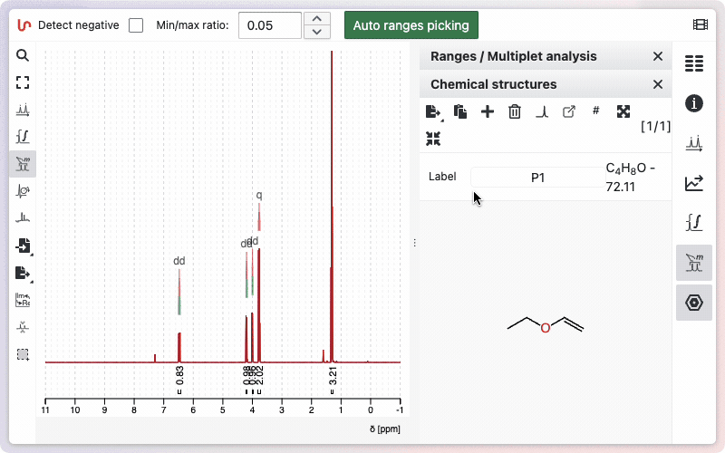
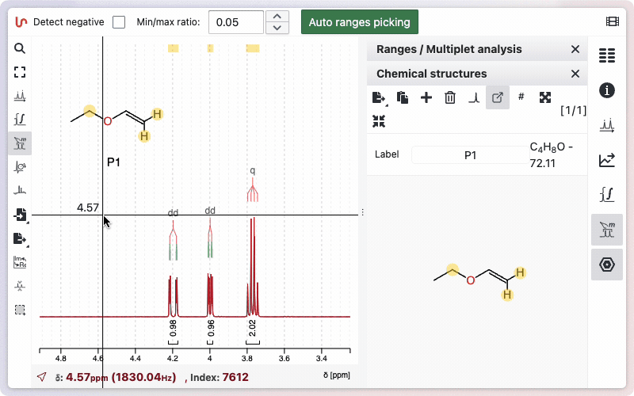
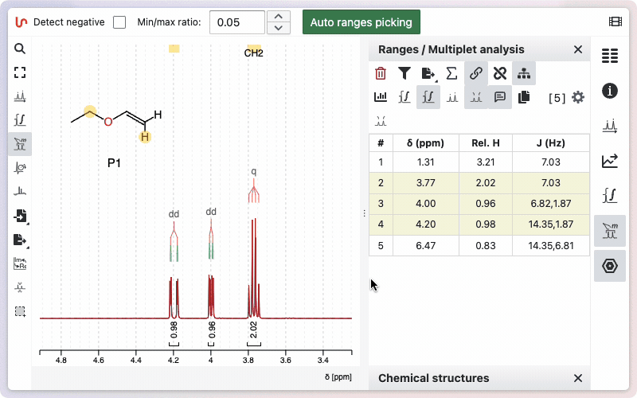

# Simple 1D assignment

In publications, assignments of proton and carbon 1D spectra are most commonly reported. 1D spectra offer better resolution, which is useful for determining coupling constants. Nevertheless, 2D spectra are essential for establishing connectivity and correctly assigning the molecule. NMRium allows you to assign 1D spectra directly from the 2D spectrum using traces.

This guide focuses on the process of assigning 1D spectra in NMRium.

To assign molecules in NMRium, follow these steps:

1. **Multiplet (Ranges) Analysis**:  
   Start by analyzing the spectrum to identify multiplets (ranges). Press <kbd>r</kbd> and click the **Auto Ranges Picking** button, as described in a separate help section.

2. **Load the Molecular Structure**:  
   Import or draw your molecule. The structure will appear over the spectrum.

3. **Assigning Ranges to Atoms**:
   - Hover over a range to display a link icon. Click the icon to assign the range, or use the link in the ranges panel.
   - Next, click on the atom(s) in the structure that correspond to the selected range.
   - To expand diastereotopic atoms for selective assignment, hold <kbd>SHIFT</kbd> and click the atom.

## Edition of the assignment and label

You can unlink an assigned range by clicking the red unlink icon. You can also add an assignment label either directly on the range in the spectrum or in the ranges table.

## Visual Feedback

- Atoms and ranges with a yellow background are assigned.
- Clicking on an assigned atom or range highlights the corresponding assignment across all panels.

