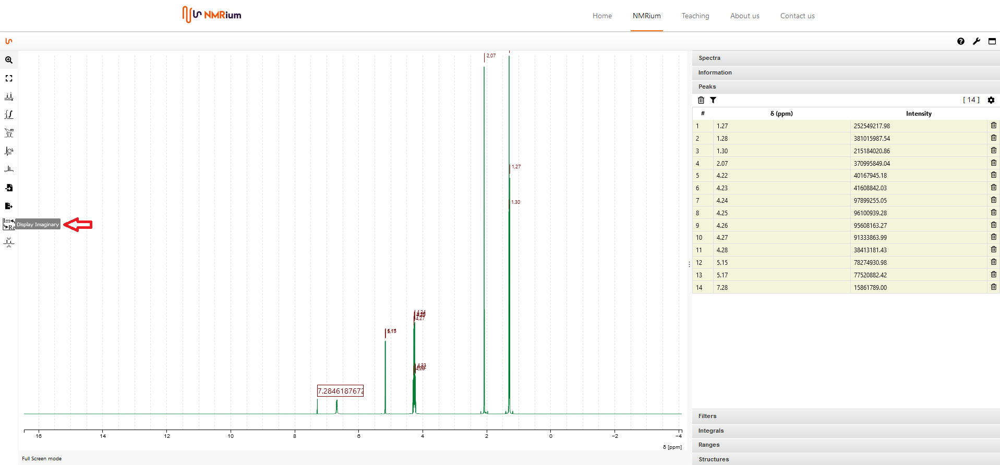
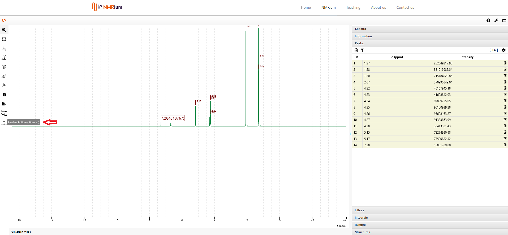
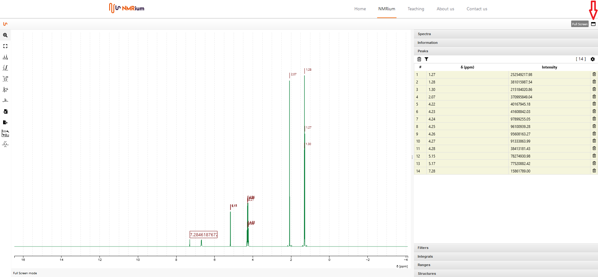
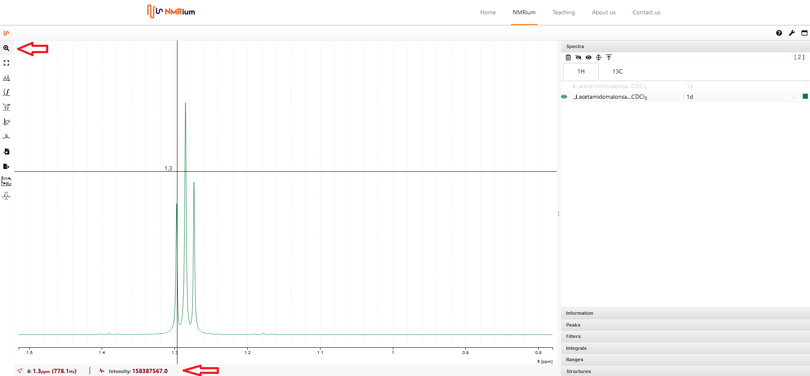
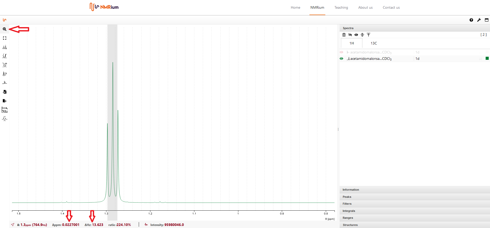

# Views

## Real / Imaginary Spectrum

You can view the imaginary part of the spectrum by clicking on the Display imaginary button. To return to the real part, click the button again.

The baseline can be displayed in the center of the screen as well as at the bottom of the screen. To change the view, click the Baseline button.

## Full Screen Mode

To work in full screen mode, click the Full Screen button at the top right. To exit full screen mode, press the escape key on the keyboard (esc).

## Cursor in the zoom and determination of coupling constants

If you have activated the zoom by clicking on the zoom button, you can see both the chemical shift and the intensity of a peak at the bottom of the screen. Move the cursor to a signal and read the two values.

With this function you can determine coupling constants. Press and hold the shift key. Then click on a peak of your multiplet and move the cursor to the second peak. At the bottom of the screen you can read the coupling constant in Hz and ppm.

