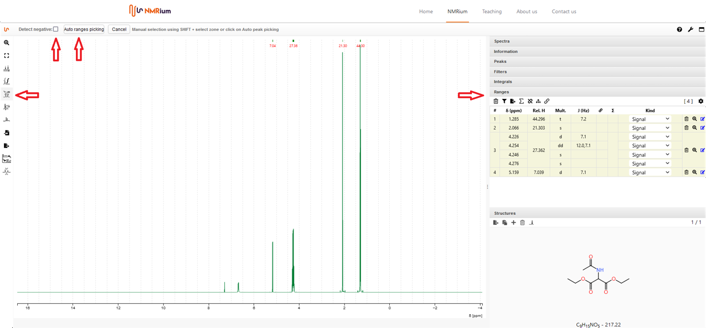
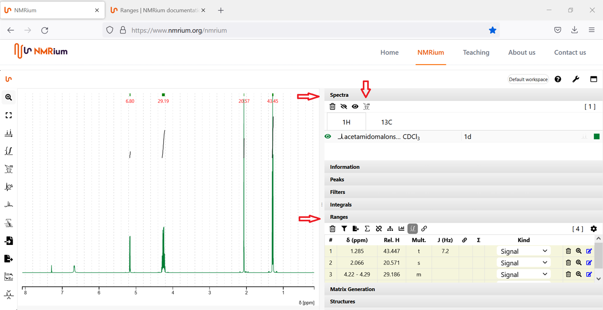
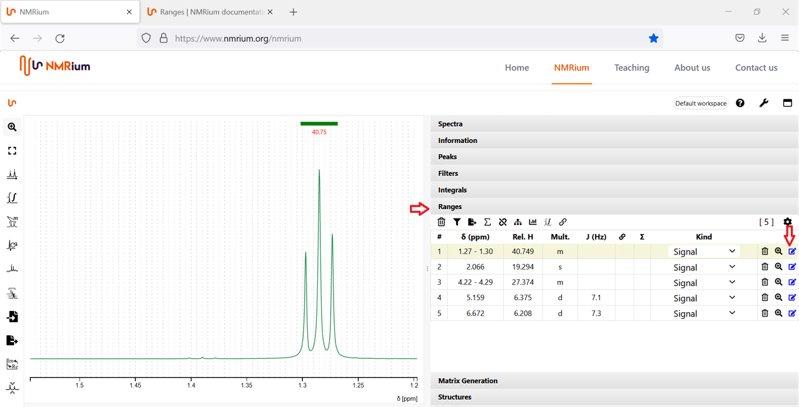
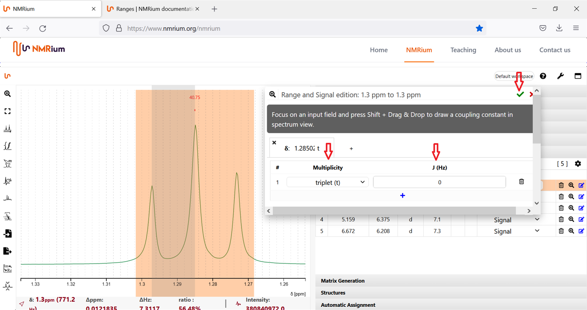
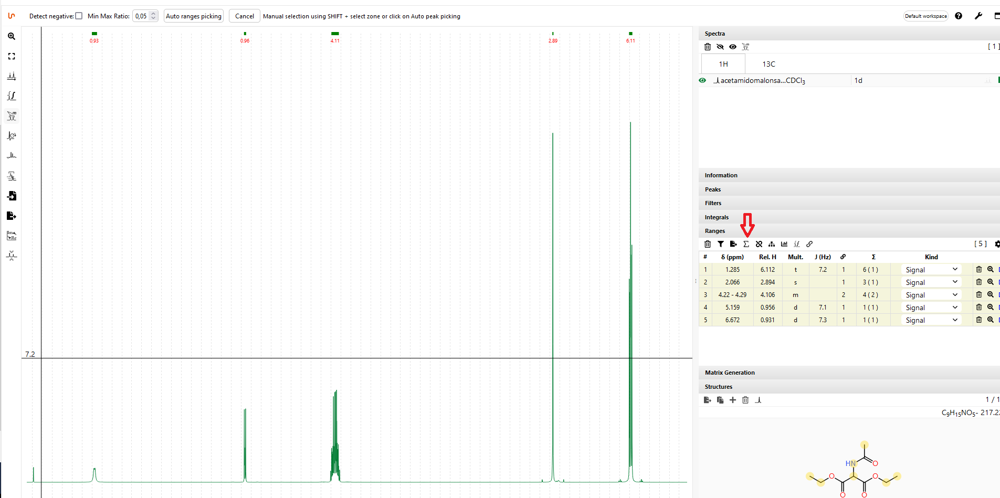
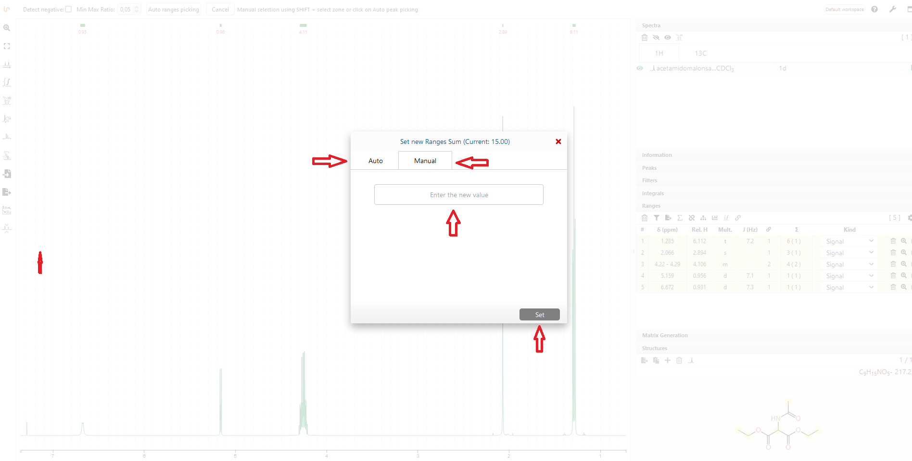
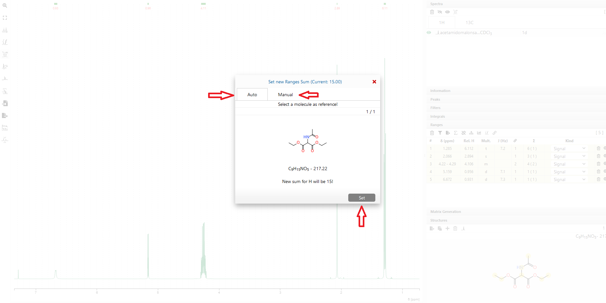
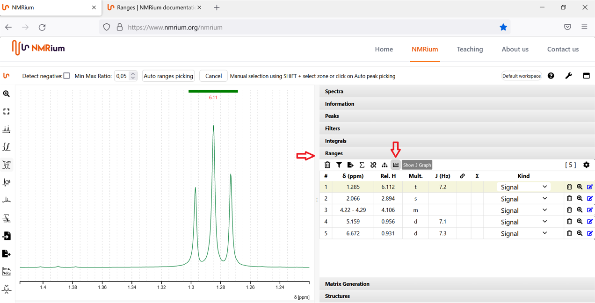
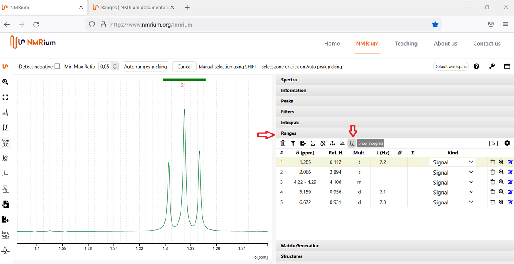
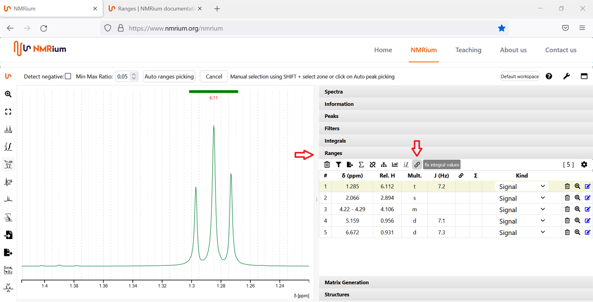

# Ranges

NMRium differentiates between peaks and ranges. A range can contain overlapped signals and can be used for assignments. It is possible to define several individual signals in a group of overlapping lines. Ranges deliver a combination of signal intensity, center of frequency range (in case of multiplets) and coupling analysis. Peaks only define individual lines.

## Auto ranges picking

NMRium tries to find out what the zones are that should be integrated and the multiplicity of each of the zones. For negative signals, the detect negative option needs to be checked. Click the **Ranges Picking** button. If your spectrum contains negative signals, set a check mark in the box **Detect negative**. Then press the **Auto ranges picking** button. The ranges found by NMRium are listed in the **Ranges** panel on the right side of the workspace.

 
You can get further information about the selected ranges by opening the **Ranges** panel. Then press shift and alt on the keyboard simultaneously and drag a zone in the spectrum. NMRium shows you the deby information of the coupling constants. 

You can also automatically determine the ranges in the panel **Spectra**. To use this feature, open the panel **Spectra** on the right side of the workspace and select a core. Click the button **Automatic Ranges/Zones picking for all spectra**. The ranges will be determined automatically for all stored spectra of the core. You can find the ranges determined by NMRium in the panel Ranges on the right side of the workspace.

 
## Correction by hand

To manually add ranges not specified by NMRium, click the button **Ranges Picking** on the left side of the workspace. Move the cursor over the signal you want to mark as a range while holding down the shift key on the keyboard and the left mouse button at the same time. The range will be selected by NMRium. You can find it in the list in the panel Ranges. 

To correct the selected ranges, open the panel Ranges. Then press the shift key and drag a zone. The system shows the selected zone in the panel and analyses it. 

## Edit multiplets manually

You can manually correct or add the multiplicity to a signal. To do this, zoom in on the corresponding signal in the workspace and open the panel **Ranges**. Click the blue edit icon on the far right of the line of the signal you want to edit. 

A box will open. First click on the Multiplicity field and select the correct multiplicity to your signal. Then, with the left mouse button, click the field where the coupling constant should be displayed. In the workspace, select the signals corresponding to the multiplicity by moving the mouse over the corresponding range whilst holding down the shift key and the left mouse button. The coupling constant is determined. Finally, click onto the green check mark in the upper right corner of the box. Your determined coupling constants will be used by NMRium.

If you want to define another coupling constant for the same signal, click on the plus sign in the box below the first coupling constant. Then proceed according to the first coupling constant.

## Set a reference

Click the **Peaks Picking** button to the left of the spectrum. Find your solvent signal (or the reference signal). When you capture it with the crosshairs, press the shift key and the left mouse button at the same time. The value of the signal will be shown both in the spectrum and in a list on the right side of the spectrum in the field Peaks. Select one of the two displayed values (in the spectrum single click with the left mouse button, in the list double click with the left mouse button) and enter the correct reference value.

## Specify the sum of integrated protons

The default sum of all integrated protons is 100. To change this sum, click onto the sum symbol on the panel ranges.

A window will open. You have the option of either entering the number of protons manually, or you can assume the number of protons from the sum formula. If you want to enter the number of protons manually, click on the button **Manuel**.

Enter the desired number of protons in the corresponding field. Then click on **Set**. The number of protons will be saved. If you want to take over the number of protons from the sum formula, click on the **Auto** button first. The number of protons will be displayed. Click on **Set**, the number is assumed. 

## Change the value of integration for individual signals

Open the panel ranges. Click **rel H** for the interested proton. Then add the new value and press enter. The values of all the other protons also change. 

## More functions

### Multiplicity Tree

You can view the multiplicity trees of the signals. To use this function, click the "Show Multiplicity Tree in Spectrum" button. If you do not want the multiplicity tree to be displayed, click the button again.

### J Graph

You can view the J graphs of the signals. To use this function, click the "Show J Graph" button. If you do not want the J graph to be displayed, click the button again.

### Show Integral

You can view the integrals of the signals. To use this function, click the "Show Integrals" button. If you do not want the integrals to be displayed, click the button again.

### Fix integral values

You can fix an integral value by clicking the button "fix integral values". You can undo the action by clicking the button once again.

