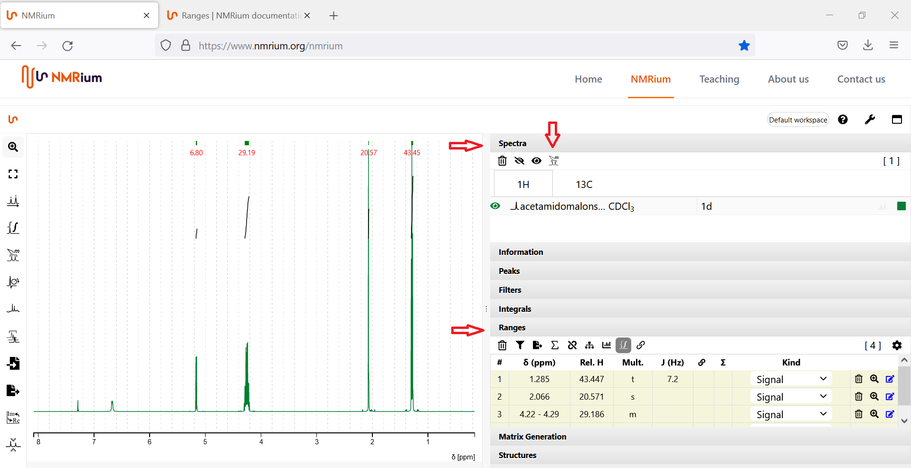
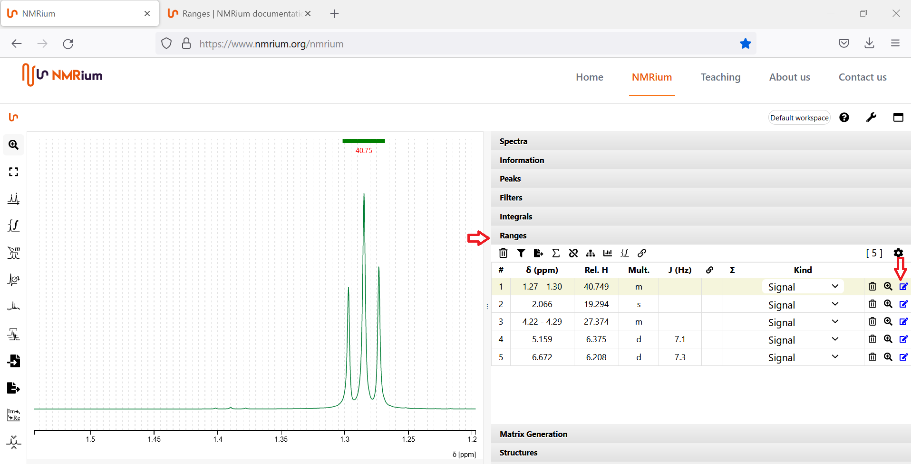
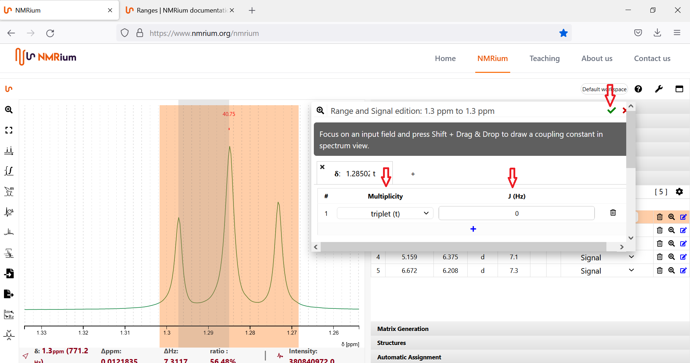
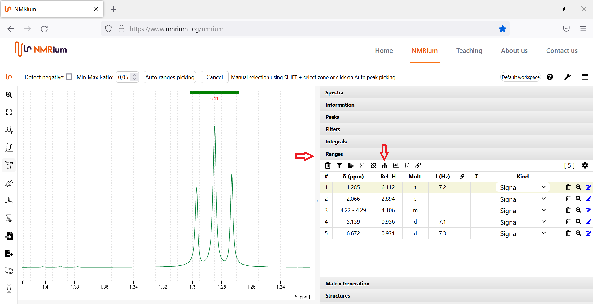

# Ranges

NMRium differentiates between peaks and ranges. A range can contain overlapped signals and can be used for assignments. It is possible to define several individual  signals in a group of overlapping lines. Ranges deliver a combination of signal intensity, center of frequency range (in case of multiplets) and coupling analysis. Peaks only define individual lines.

## Auto ranges picking

NMRium try to find out what are the zones that should be integrated and the multiplicity of each of the zones. For negative signals, the detect negative option needs to be checked. 
Click the Ranges picking button. If your spectrum contains negative signals, set a check mark in the box Detect negative. Then press the Auto ranges picking button. The ranges found by NMRium are listed in the Ranges panel on the right side of the workspace.

 
You can get further information about the selected ranges by opening the panel ranges. Then press shift and alt on the keyboard simultaneously and drag a zone in the spectrum. NMRium shows you the deby information of the coupling constants. 

You can also automatically determine the ranges in the panel Spectra . To use this feature, open the panel Spectra on the right side of the workspace and select a core. Click the button "Automatic Ranges/Zones picking for all spectra". The ranges will be determined automatically for all stored spectra of the core. You can find the ranges determined by NMRium in the Ranges panel on the right side of the workspace.

 
## Correction by hand

To add ranges not specified by NMRium manually, click the Ranges picking button on the left side of the workspace. Move the mouse cursor over the signal you want to mark as a range while holding down the Shift key on the keyboard and the left mouse button at the same time. The range will be selected by NMRium. You can find it in the list in the Ranges panel.

To correct the selected ranges, open the ranges panel. Then press shift on the keyboard and drag a zone. The system shows the selected zone on the panel and analyses it. 

## Edit multiplets manually

You can manually correct or add the multiplicity to a signal. To do this, zoom in on the corresponding signal in the workspace and open the Ranges panel. Click the blue edit icon on the far right of the line of the signal you want to edit. 

A box will open. First click on the Multiplicity field and select the correct multiplicity of your signal. Then click with the left mouse button in the field where the coupling constant should be displayed. In the workspace, select the signals corresponding to the multiplicity by moving the mouse over the corresponding range while holding down the Shift key and the left mouse button. The coupling constant is determined. Finally, click on the green check mark in the upper right corner of the box. Your determined coupling constants will be used by NMRium.

If you want to define another coupling constant for the same signal, click on the plus sign in the box below the first coupling constant. Then proceed analogously to the first coupling constant.

## Set a reference

Click the Panel button to the left of the spectrum. Find your solvent signal (or the reference signal). When you point at it with the crosshairs, press the shift key and the left mouse button at the same time. The value of the signal will be shown both in the spectrum and in a list on the right side of the spectrum in the Peaks field. Select one of the two displayed values (in the spectrum single click with the left mouse button, in the list double click with the left mouse button) and enter the correct reference value.

## Specify the sum of integrated protons

The default sum of all integrated protons is 100. To change this sum, click on the sum symbol on the ranges panel. A grey box appears. Enter the total number of integrated protons and click "Set". In the list on the right side, the relative number of protons for the respective integral is indicated.

## Change the value of integration for individual signals

Open the panel ranges. Click rel H for the interessted proton. Then add the new value and press enter. The values of all the other protons also change. 

## More functions

### Multiplicity Tree

You can view the multiplicity trees of the signals. To use this function, click the "Show Multiplicity Tree in Spectrum" button. If you do not want the multiplicity tree to be displayed, click the button again.

### J Graph

### Show Integral

### Fix integral values
