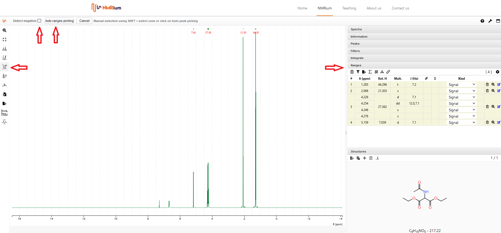

# Ranges

NMRium differentiates between peaks and ranges. A range can contain overlapped signals and can be used for assignments. It is possible to define several individual  signals in a group of overlapping lines. Ranges deliver a combination of signal intensity, center of frequency range (in case of multiplets) and coupling analysis. Peaks only define individual lines.

## Auto ranges picking

NMRium try to find out what are the zones that should be integrated and the multiplicity of each of the zones. For negative signals, the detect negative option needs to be checked. 
Click the Ranges picking button. If your spectrum contains negative signals, set a check mark in the box Detect negative. Then press the Auto ranges picking button. The ranges found by NMRium are listed in the Ranges panel on the right side of the workspace.

          
## Correction by hand

## Edit multiplets manually

## Set a reference

## Specify the sum of integrated protons

## Change the value of integration for individual signals

## Further information
