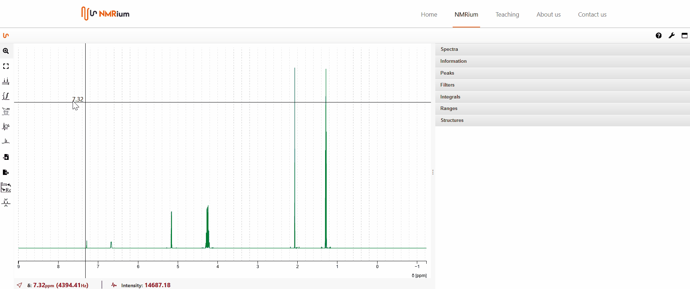
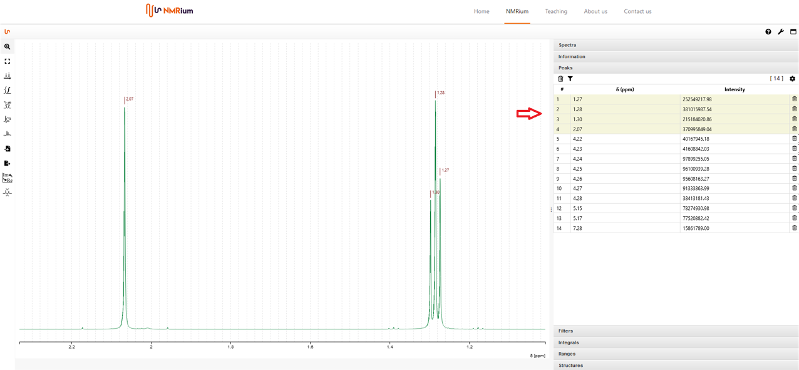
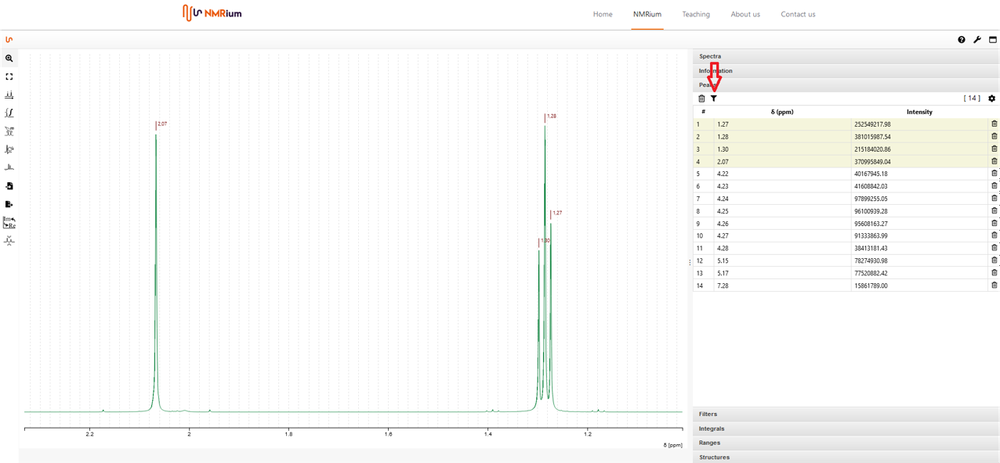
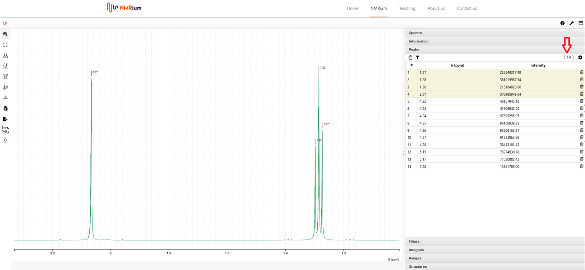
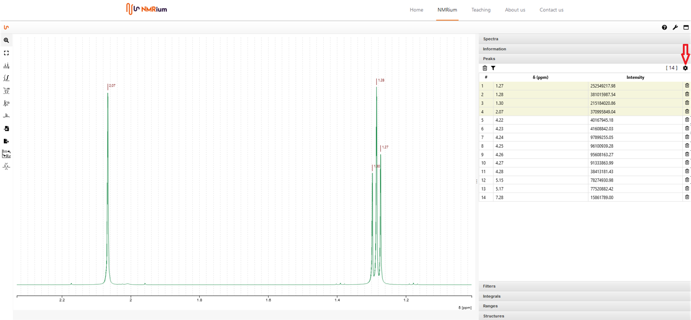
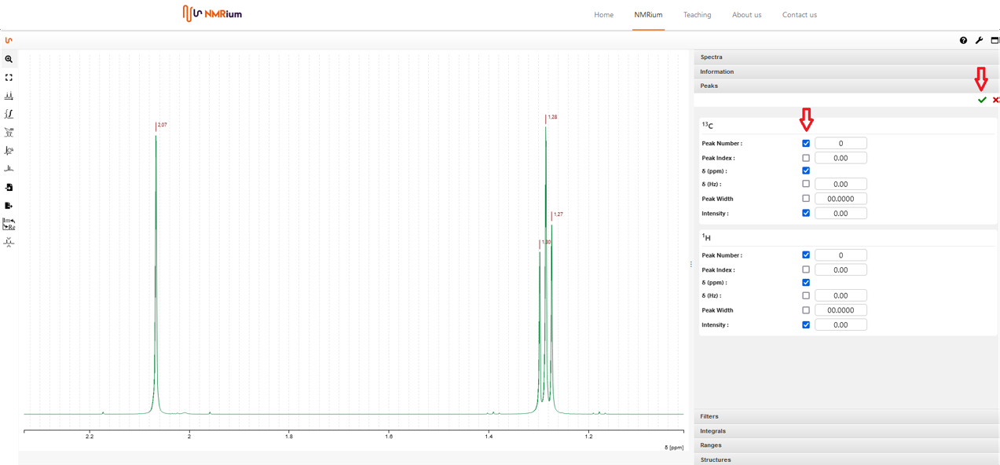
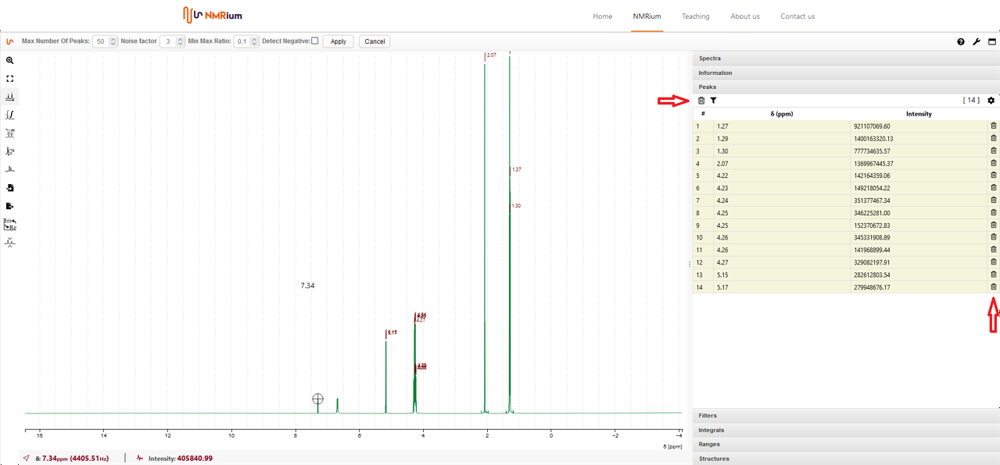

# Peaks and Reference

## Peak Picking

### Select a single signal

To select a single signal, click the **Peaks Picking** button on the left of the workspace. Move the mouse over the signal you want to mark while holding down the left mouse button and the <kbd>Shift</kbd> key. The peak shift appears above the signal. Once you release the key and button, the chemical shift of the signal appears. On the right side of the screen, under the **Peaks** panel, a list of all selected signals is shown. Hover over a shift in the spectrum to highlight the corresponding row in the list, and vice versa.

The chemical shift is shown at the signal in ppm to one decimal place. For more decimal places, click the ppm value in the workspace — the chemical shift will then be shown to 12 decimal places.

### Automatic peaks picking

You can automatically detect all peaks. Click the **Peaks Picking** button on the left side of the workspace. Above the workspace you can set the maximum number of peaks, the noise factor, and the min/max ratio. Tick the corresponding box if you want to detect negative signals. Then click **Apply** above the workspace. All detected peaks are listed in the **Peaks** panel.

## Panel "Peaks"

All signals are shown in the **Peaks** panel. The signals highlighted in yellow can be observed in the section of the spectrum shown. The signals highlighted in white are not visible in the screen section. If you switch off zoom by double-clicking, the signals of the whole shown spectrum are highlighted in yellow.

If you click on the funnel button, only the signals shown on screen are listed. To see all signals in the list again, press the funnel button a second time.

On the right side of the panel, the total number of listed signals is shown in a square bracket.

You can display various information in the peaks panel. Click on the gear wheel at the top right.

All measured nuclei will be displayed. You can choose to display the following values for each nucleus:

- Peak Number
- Peak Index
- Chemical shift (ppm)
- Chemical shift (Hz)
- Width
- Intensity

Place a check mark next to the values that you want to have displayed for the respective nucleus. Then click on the green check mark at the top right.

## Set a Reference

Click the **Peaks Picking** button to the left of the spectrum. Find your solvent signal (or the reference signal). When you have captured it with the crosshairs, press the <kbd>Shift</kbd> key and the left mouse button at the same time. The value of the signal will be shown both in the spectrum and in a list on the right side of the spectrum in the field Peaks. Select one of the two displayed values (in the spectrum single click with the left mouse button, in the list double click with the left mouse button) and enter the correct reference value.

## Remove Peaks

### Delete all peaks

To delete all signals, move the mouse to the **Peaks** panel and click the recycle-bin icon on the left side above the list. A red confirmation box appears. Click **Yes**, and all signals are deleted.

### Delete the chemical shift of a single peak

To delete the chemical shift of one signal, move the mouse to the list and select a signal. Press the recycle bin icon on the right side of the line of the signal. The chemical shift of this peak is deleted.
