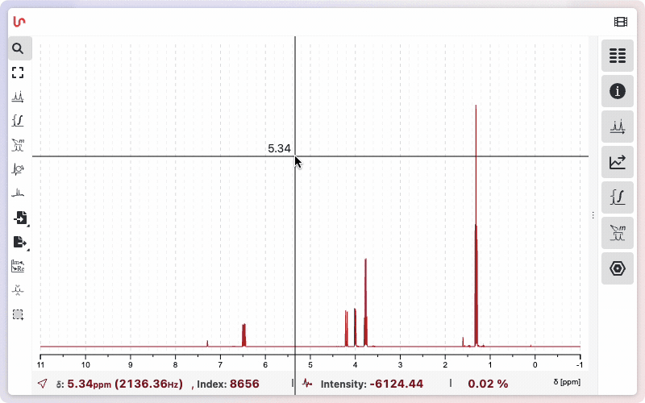
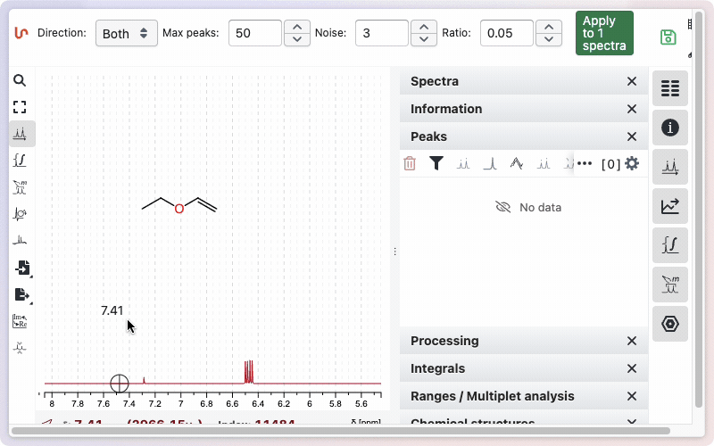
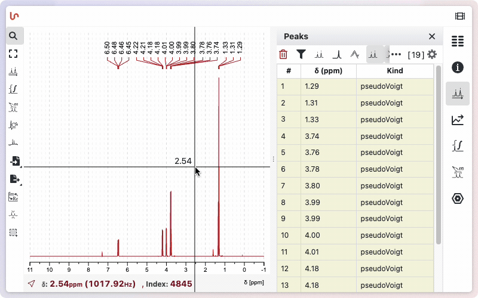
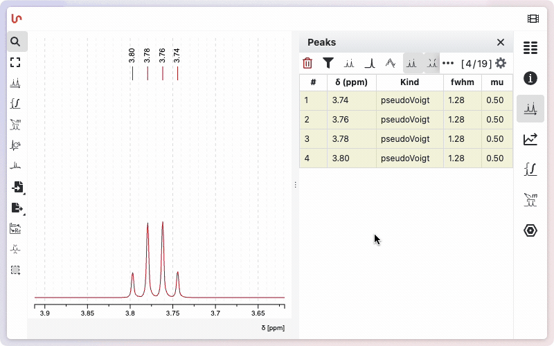

# Peaks and Reference

:::warning Prefer Ranges / Multiplet analysis
For routine work, use **[Ranges / Multiplet analysis](/help/ranges)** instead of peak picking. Range picking integrates each signal, extracts its multiplicity and coupling constants, and still keeps the underlying peaks. Plain peak picking should normally only be used for peak-shape analysis (deconvolution), described below.
:::

## Peak Picking

Click the **Peaks picking** button on the left of the workspace, or press <kbd>p</kbd>, to enter peak picking mode. You can then let NMRium detect peaks automatically or add them manually. All picked peaks are listed in the **Peaks** panel on the right.

:::info Simple click, no <kbd>Shift</kbd>
With the tool active you add peaks with a plain click or click-drag-release — no <kbd>Shift</kbd> needed. This depends on the **Invert actions** preference; see [Tool actions and zoom](/help/zoom-and-scale#tool-actions-and-zoom). The interactions below assume the default setting.
:::

### Automatic peak picking

To detect all peaks at once, open the options bar above the workspace and set the detection parameters:

| Option        | Meaning                                        |
| ------------- | ---------------------------------------------- |
| **Direction** | Detect `Both`, positive, or negative signals   |
| **Max peaks** | Maximum number of peaks to return              |
| **Noise**     | Noise factor used to reject small fluctuations |
| **Ratio**     | Minimum relative intensity a peak must reach   |

Click **Apply to _N_ spectra** to run the detection. The same parameters are applied to every displayed spectrum at once — _N_ is the number of spectra currently loaded — so you can peak pick a whole set in a single step. Every detected peak is labelled on its spectrum and added to the **Peaks** panel. To restrict detection to one region, drag over it first, then apply.

### Manual peak picking

With the peak picking tool active you have two ways to add a single peak:

- **Click** on the spectrum — adds a peak exactly at the pointer position.
- **Drag** over a range — adds a peak at the maximum found within that range.

As you move the pointer, the current chemical shift is shown above the trace and the live readout at the bottom of the workspace reports the shift in ppm and Hz together with the intensity. Click the ppm value shown next to a peak to edit it — the inline field reveals the chemical shift to full precision.

## Panel "Peaks"

Every picked peak is listed in the **Peaks** panel with its number, chemical shift **δ (ppm)** and shape **Kind**. The toolbar at the top of the panel controls the list and how peaks are drawn:

| Button                                | Action                                                                                                       |
| ------------------------------------- | ------------------------------------------------------------------------------------------------------------ |
| Recycle bin                           | Delete all peaks                                                                                             |
| Funnel                                | Toggle between all peaks and only those in the displayed region — the counter shows `[ visible / total ]`    |
| Show / hide peaks                     | Show or hide the peak markers on the spectrum                                                                |
| Top of the spectrum / Top of the peak | Choose where the chemical-shift labels are drawn — aligned near the top of the plot, or just above each peak |
| Copy as TSV                           | Copy the peak list to the clipboard as tab-separated values                                                  |
| Gear                                  | Open the display settings to choose which columns appear (for example the **mu** factor)                     |

## Set a Reference

Referencing means giving a known signal its correct chemical shift; the whole spectrum is then shifted accordingly. Pick the solvent or reference signal, then set its value in one of two ways:

- **From the label** — click the peak's ppm label in the spectrum and type the correct value.
- **From the table** — double-click the **δ (ppm)** cell of its row in the **Peaks** panel and type the correct value.

NMRium recalibrates the spectrum so that peak lands on the value you entered (see the manual peak picking animation above).

You can also set the reference from a range or multiplet — see [Set the reference](/help/ranges#set-the-reference) on the Ranges page.

## Peak Shapes and Deconvolution

NMRium can deconvolute the spectrum to analyze the shape of each peak. Every peak has a shape **Kind** — **Gaussian**, **Lorentzian**, or **pseudo-Voigt** (which mixes Gaussian and Lorentzian through the **mu** factor). Enable the **fwhm** (width) and **mu** columns from the panel settings (gear) to inspect the fitted values.

Click **Optimize peaks** in the panel toolbar to fit the peak shapes to the experimental data. Two display toggles then let you inspect the result:

- **Show peaks sum** — the reconstructed trace (blue) obtained by summing all fitted peaks, overlaid on the experimental spectrum.
- **Show peaks shapes** — the individual fitted peak shapes.

Comparing the reconstructed trace with the experimental spectrum shows how well the chosen shapes and the fitted **fwhm** / **mu** values reproduce the real signals.

## Remove Peaks

- **Delete all peaks** — click the recycle-bin icon at the top left of the **Peaks** panel and confirm.
- **Delete a single peak** — press the recycle-bin icon at the end of that peak's row in the list.
