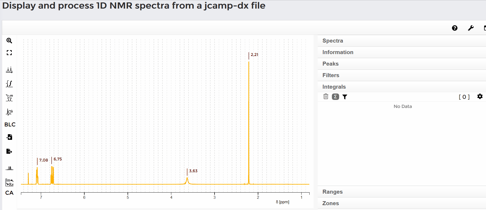
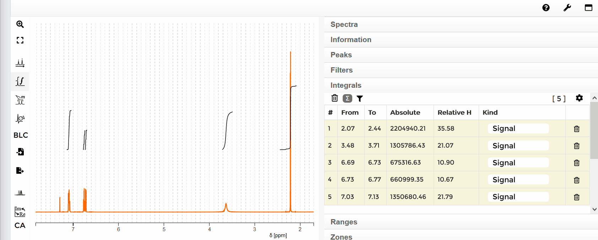
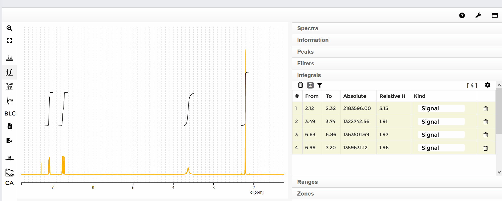
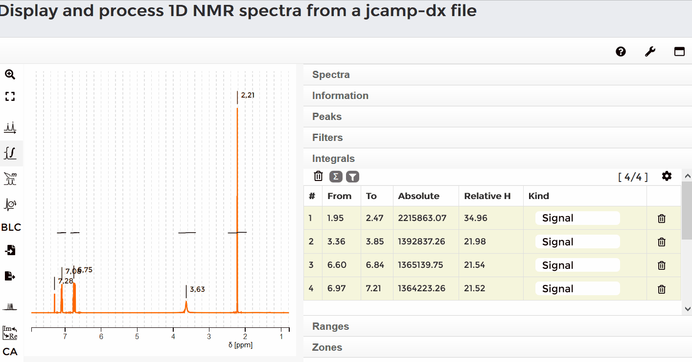

## Automatic integration

Mark a signal by holding down the <kbd>Shift</kbd> key and the left mouse button at the same time, then dragging over the range of the signal. When you release both, the integral of the signal appears. On the right side of the screen, under the **Integrals** tab, a list of all integrals is shown. Hovering over an integral in the spectrum highlights the corresponding row in the list, and vice versa.

## Delete all integrals

To delete all integrals, move the mouse to the **Integrals** list and click the trash button on the left side above the list. A red confirmation box appears. Click **Yes**, and all integrals are deleted.

## Delete a single integral

To delete one integral, move the mouse to the list and select an integral. Press the trash button on the right side of that row — the integral is deleted.

An alternative way to delete a single integral is to move the mouse over an integral in the spectrum. A red ring appears; click it to delete the integral.

## Change integral sum

The default sum of all integrated protons is 100. To change this sum, click on the sum symbol. A grey box appears. Enter the total number of integrated protons and click "Set". In the list on the right side, the relative number of protons for the respective integral is indicated.

