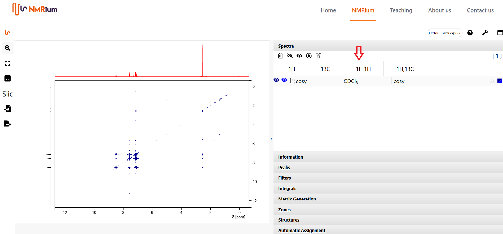
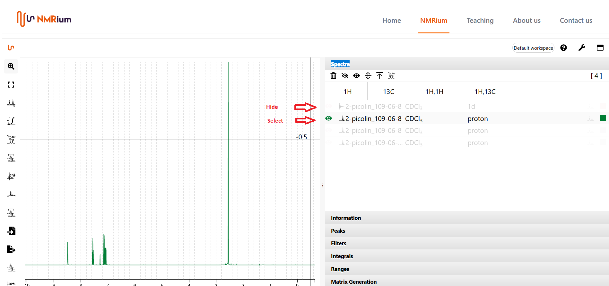

# Select spectra for 2D

The **Spectra** panel contains all loaded spectra, grouped by measured nucleus or nucleus pair. Open the panel and click the ¹H,¹³C or ¹H,¹H button to open the corresponding 2D spectrum.

If the set contains only one proton and one carbon spectrum, NMRium uses them automatically as the traces of the 2D spectrum. When several proton or carbon spectra are available, you choose which one to use: click the 1H button and select the desired spectrum, then click the corresponding button for ¹³C and do the same. Other spectra are hidden by clicking their corresponding button. When you open a 2D spectrum, the selected 1D spectra are shown as its side traces.

