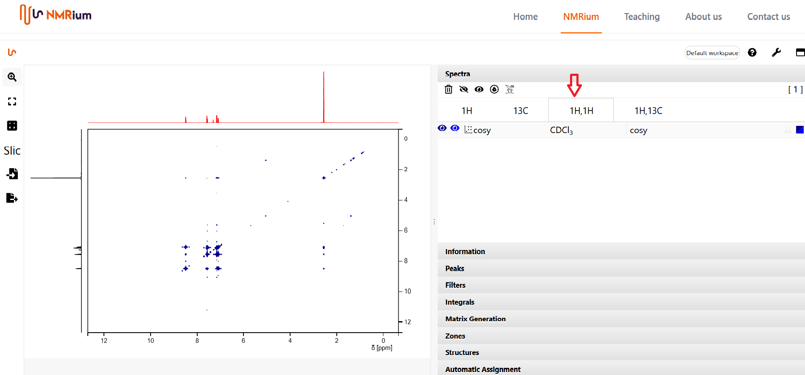
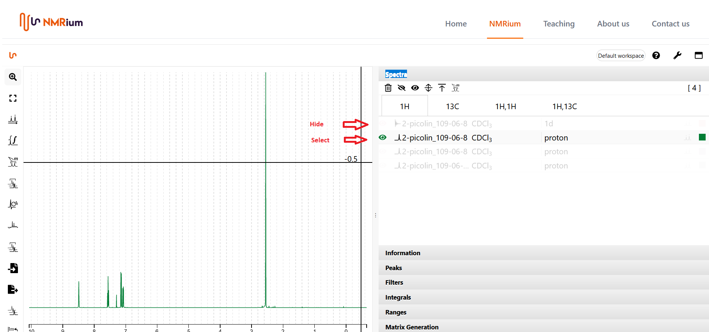

# Select spectra for 2D

The panel **Spectra** contains all spectra, listed according to the measured nuclei. Open the **Spectra** panel by clicking on it with the mouse. Open a 2D spectrum by clicking on the proton carbon button or on the proton proton button. 

If there is only one proton and one carbon spectrum in the spectra set, the system will automatically put the trace for the 2D spectrum. If the spectrum set contains several protons or several carbon spectra, you must select which spectrum is used for the corresponding 2D spectrum. To do this click on the 1H button and select the desired spectrum there. The remaining spectra are hidden by clicking on the corresponding button. Then select a 13C spectrum in the same way. If you click on a 2D spectrum, the selected spectra will be displayed there. 

